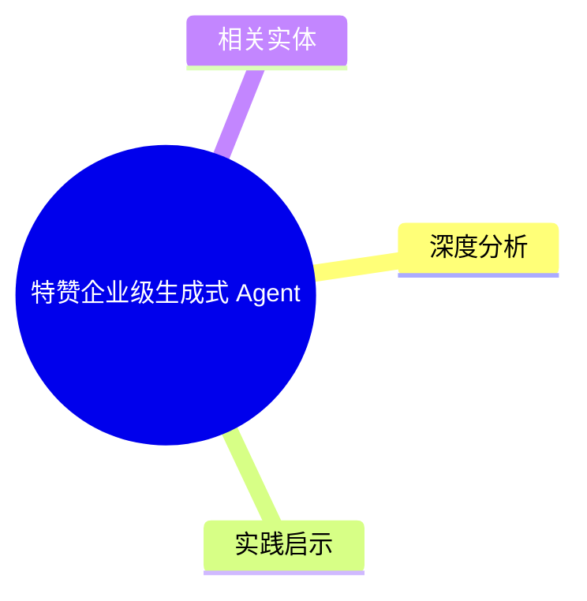
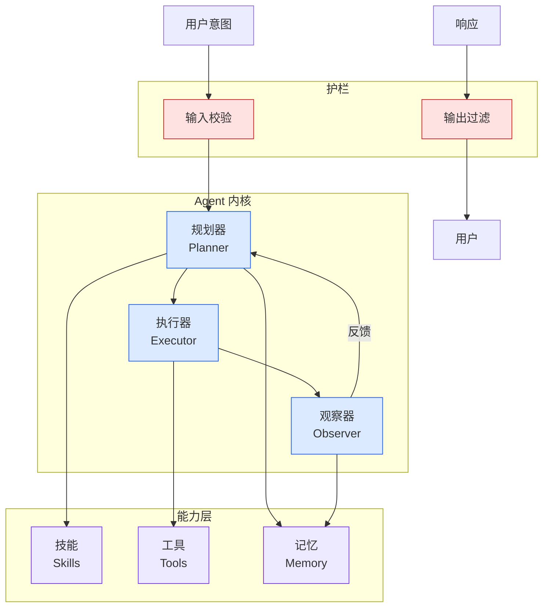

# 特赞企业级生成式 Agent

## Ch04.692 特赞企业级生成式 Agent

> 📊 Level ⭐⭐ | 1.8KB | `entities/tezign-generative-enterprise-agent.md`

# 特赞企业级生成式 Agent

特赞（Tezign）在企业场景的生成式 Agent 实践：将创意内容生产流程 Agent 化，涵盖素材理解、创意生成、合规审核、多渠道分发。

## 概念导图

## 深度分析

本页作为知识图谱锚点，连接了以下关键实体：[当公司变成Agent：AI 时代组织的 5 个反思 — 范凌访谈](../ch01/896-agent-ai.html)。 相关主题通过 [CUGA: IBM Research Enterprise Agent Harness](../ch05/058-agent-harness.html) 延伸。

> 本页内容将在入库相关溯源素材后进一步深化。

## 实践启示

1. 本领域系统性内容尚待采集——当前知识库在此方向的覆盖密度偏低
2. 建议优先采集 特赞企业级生成式 Agent 相关的一手来源（论文/官方文档/工程博客）
3. 通过交叉链接密度评估本领域的知识图谱成熟度

## 相关实体

- [当公司变成Agent：AI 时代组织的 5 个反思 — 范凌访谈](../ch01/896-agent-ai.html)
- [CUGA: IBM Research Enterprise Agent Harness](../ch05/058-agent-harness.html)
- [CLI、MCP 和 CLI+Skill，应该如何选？](ch04/271-skill.html)
- [The UI is dead, long live the agent: ServiceNow goes headless and opens its platform](ch04/315-the-ui-is-dead-long-live-the-agent-servicenow-goes-headles.html)
- [Claude Managed Agents 新更新\"专属云\"模式：把Agent的手放回企业内部](ch04/710-claude-managed-agents.html)

---

