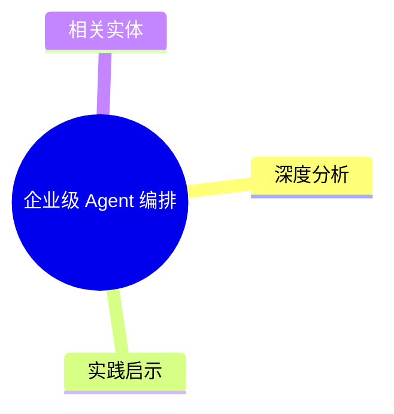
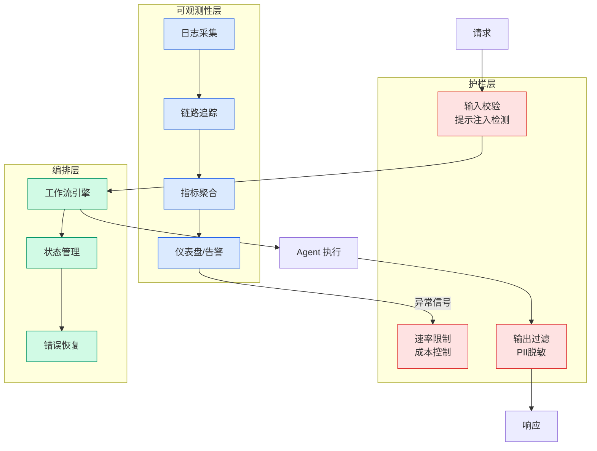

# 企业级 Agent 编排

## Ch04.693 企业级 Agent 编排

> 📊 Level ⭐⭐ | 1.7KB | `entities/enterprise-agent-orchestration.md`

# 企业级 Agent 编排

企业场景下的 Agent 编排挑战：权限隔离、审计合规、多租户、资源配额、故障隔离。与开源场景相比更强调可控性和可观测性。

## 概念导图

## 深度分析

本页作为知识图谱锚点，连接了以下关键实体：[CLI、MCP 和 CLI+Skill，应该如何选？](ch04/271-skill.html)。 相关主题通过 [在数据所在处构建 Agent: CrewAI + Snowflake 企业级 Agent 部署](../ch03/035-agent.html) 延伸。

> 本页内容将在入库相关溯源素材后进一步深化。

## 实践启示

1. 本领域系统性内容尚待采集——当前知识库在此方向的覆盖密度偏低
2. 建议优先采集 企业级 Agent 编排 相关的一手来源（论文/官方文档/工程博客）
3. 通过交叉链接密度评估本领域的知识图谱成熟度

## 相关实体

- [CLI、MCP 和 CLI+Skill，应该如何选？](ch04/271-skill.html)
- [在数据所在处构建 Agent: CrewAI + Snowflake 企业级 Agent 部署](../ch03/035-agent.html)
- [Enterprise AI Agent Development Tools (n8n Report 2026)](ch04/298-ai-agent.html)
- [AgentScope Java Harness Framework 2.0 — 企业级 Agent 分布式场景的 Harness 实现 (Java 2.0 重大升级)](../ch05/009-harness.html)
- [多 Agent 编排系统](ch04/518-agent-orchestration.html)

---

