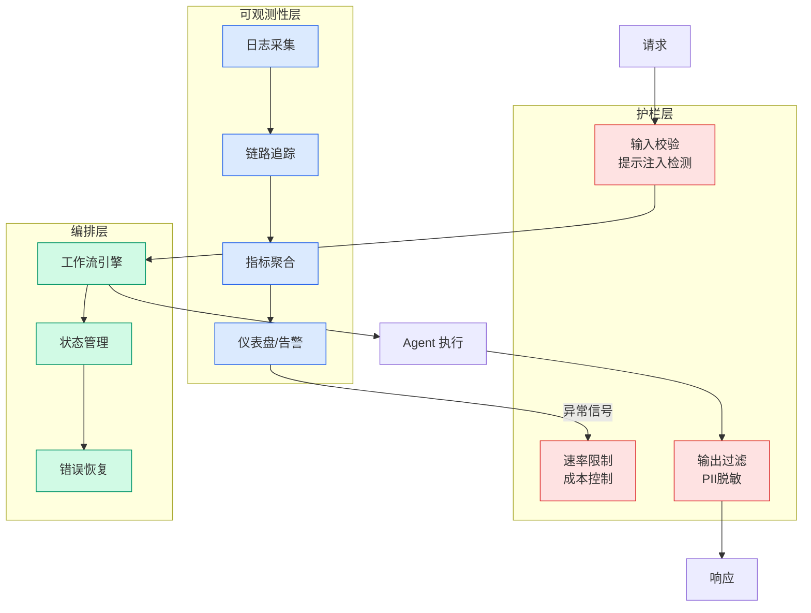

# Agent 后端架构

## Ch04.694 Agent 后端架构

> 📊 Level ⭐⭐ | 1.7KB | `entities/backend-for-agent.md`

# Agent 后端架构

面向 Agent 的后端架构设计：API 优先、结构化输出、状态机化、可回放。传统 BFF（Backend for Frontend）的进化——从服务人类 UI 到服务 Agent 的 Machine-to-Machine 接口。

## 深度分析

本页作为知识图谱锚点，连接了以下关键实体：[后端架构 AI Friendly 的标准与路径：面向无人值守开发时代的系统重构](../ch05/022-ai-friendly.html)。 相关主题通过 [Agent架构关键变化：Harness正在成为新后端](../ch05/009-harness.html) 延伸。

> 本页内容将在入库相关溯源素材后进一步深化。

## 实践启示

1. 本领域系统性内容尚待采集——当前知识库在此方向的覆盖密度偏低
2. 建议优先采集 Agent 后端架构 相关的一手来源（论文/官方文档/工程博客）
3. 通过交叉链接密度评估本领域的知识图谱成熟度

## 相关实体

- [后端架构 AI Friendly 的标准与路径：面向无人值守开发时代的系统重构](../ch05/022-ai-friendly.html)
- [Agent架构关键变化：Harness正在成为新后端](../ch05/009-harness.html)
- [AI 友好架构设计](../ch05/022-ai-friendly.html)
- [AI Agent 工程师能力地图](ch04/298-ai-agent.html)
- [Karpathy 最新访谈：从 Vibe Coding 到 Agentic Engineering](ch04/237-agentic.html)

---

