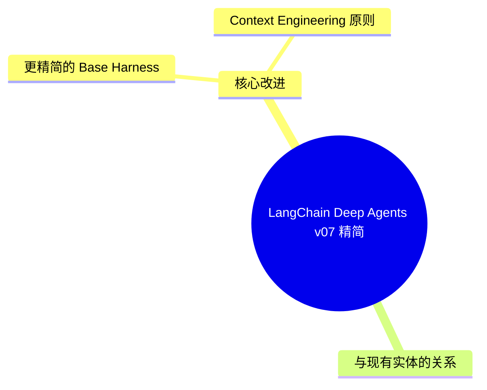
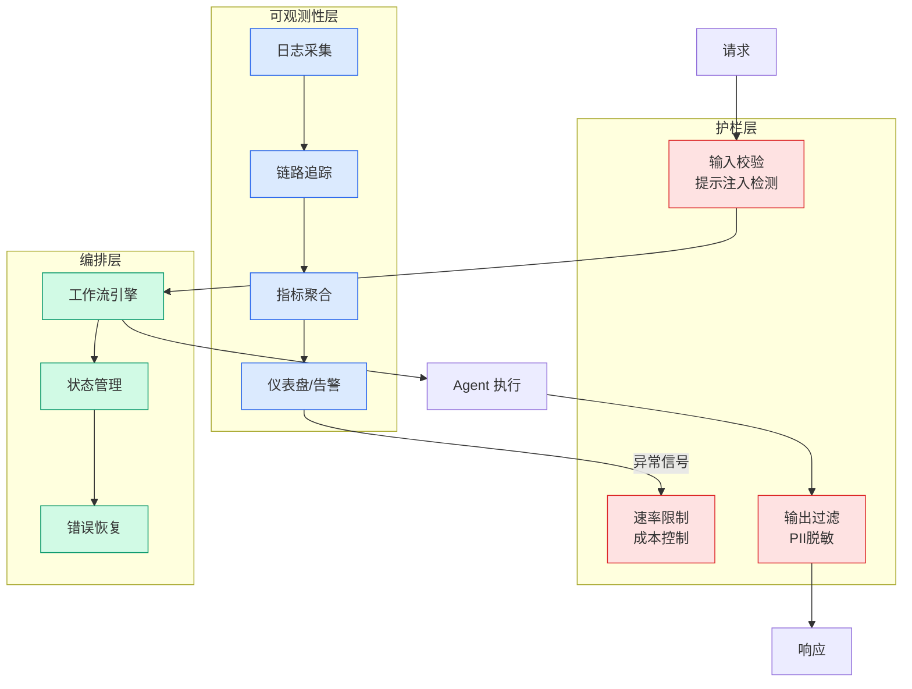

# LangChain Deep Agents v0.7: 精简 Agent Harness

## Ch04.695 LangChain Deep Agents v0.7: 精简 Agent Harness

> 📊 Level ⭐⭐ | 1.5KB | `entities/langchain-deep-agents-v0-7-2026-07-29.md`

# LangChain Deep Agents v0.7: 精简 Agent Harness

LangChain 发布 Deep Agents v0.7，简化了 base harness，在同等性能下减少了 65% 的 base input tokens。

## 概念导图

## 核心改进

### 更精简的 Base Harness

v0.7 的核心假设：从 base input prompt 中移除不必要的 token 可以提升 token 和成本效率。验证结果：65% 更少的 base input tokens，同等性能。

### Context Engineering 原则

受 Anthropic 最新 context engineering 指南启发（Claude Code 系统提示被削减 80%+），v0.7 遵循两条关键原则：

1. **Interfaces beat examples**：好的 tool schema 比曾经流行的 few-shot examples 更能教会模型使用工具
2. **Avoid repetition**：在 system prompt 和 tool description 中重复同一指令不会提供有意义的强化

## 与现有实体的关系

Deep Agents v0.7 的 context engineering 方向与 [Dynamic Subagents](../ch03/035-agent.html) 的编排思路互补，但聚焦于底层 harness 的 token 效率优化而非上层编排模式。

→ [原文存档](https://github.com/QianJinGuo/wiki-book/tree/main/docs/raw/articles/langchain-deep-agents-v0-7-2026-07-29.md)

---

