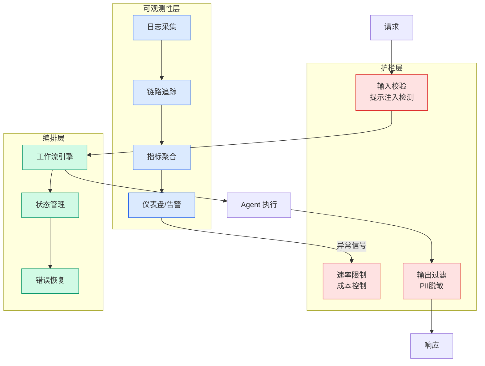

# SEAGym: 自进化Agent评测环境 — 清华大学

## Ch05.098 SEAGym: 自进化Agent评测环境 — 清华大学

> 📊 Level ⭐⭐ | 4.2KB | `entities/seagym-self-evolving-agent-evaluation-environment-tsinghua-2026.md`

# SEAGym: 自进化Agent评测环境 — 清华大学

> **Background**: 本文基于机器之心的报道，系统梳理了清华大学团队提出的 SEAGym 评测环境。该工作与翁荔关于 Harness Engineering for Self-Improvement 的论述相呼应，但聚焦于检测基础设施层面。

## 核心动机

现有 Agent benchmark 大多面向静态系统：给定一个固定 Agent，在一组独立任务上运行，然后报告最终成功率。这种评测方式无法回答 harness evolution 中更关键的问题：一次更新到底改进了什么？提升是否能迁移到未见任务？是否只是过拟合近期反馈？是否遗忘了旧能力？是否引入了更高成本或运行时不稳定？

## SEAGym 框架

SEAGym 将自进化 Agent 形式化为一个和强化学习算法训练过程对齐的评测过程。每个 Agent snapshot 表示为 (M, H)，其中 M 是固定的基础模型和不可变运行组件，H 是可更新的 harness state（包括 prompts、memories、skills、tools、middleware、runtime configuration 等）。

在每一步中，环境采样一批训练任务，Agent 在这些任务上执行，产生轨迹和反馈，然后根据自身的更新规则修改 harness：H' = update(H, trajectories, feedback)。SEAGym 不规定具体的更新算法，只需通过统一的 rollout/update interface 接入。

## 多视角评测体系

SEAGym 的关键设计是将传统数据 split 与评测 view 区分开来：

- **Train batch**：提供 Agent 更新所需的轨迹和反馈；
- **Update-validation**：冻结中间 snapshot，观察更新过程是否带来阶段性提升；
- **ID transfer**：测试更新是否能迁移到同分布但未见过的任务；
- **OOD transfer**：测试更新是否能迁移到分布外任务；
- **Replay**：回放旧任务，检查是否出现遗忘或回归；
- **Cost records**：记录 token、工具调用、运行时间和更新成本。

## 关键实验结果

AHE 在 validation、ID 和 OOD 三个视角上都取得了提升（validation 40.0 -> 57.1，ID 40.0 -> 49.1，OOD 22.5 -> 28.8），而 ACE 和 TF-GRPO 的提升更局部化。TF-GRPO 在 OOD 上甚至下降 0.1 个百分点——说明只在 validation 上提升是不够的。

Batch 多样性 > Batch 大小：10 diverse 任务在 ID 和 OOD 上均达到最佳，20 less diverse 表现更差。在自进化场景中，不是「练得越多就越好」，而是「练得越广越好」。

## 论文信息

- 论文：SEAGym: An Evaluation Environment for Self-Evolving LLM Agents
- 机构：清华大学
- arXiv：https://arxiv.org/abs/2606.17546
- 代码：https://github.com/antropy-research/SEAGym

## 相关实体

- [Lilian Weng Harness Engineering for Self-Improvement](ch05/120-harness-engineering.html)
- [Harness Engineering for Self-Improvement 研究全景](ch05/120-harness-engineering.html)
- [Agent Self-Improvement 六种机制](../ch03/035-agent.html)
- [AgentScope: 企业级自进化 Agent Harness](ch05/058-agent-harness.html)
- [AREAL-2: Agentic RL 在线学习与自进化](../ch04/327-agentic-rl.html)

→ [原文存档](https://github.com/QianJinGuo/wiki-book/tree/main/docs/raw/articles/seagym-self-evolving-agent-evaluation-environment-tsinghua-2026.md)

---

