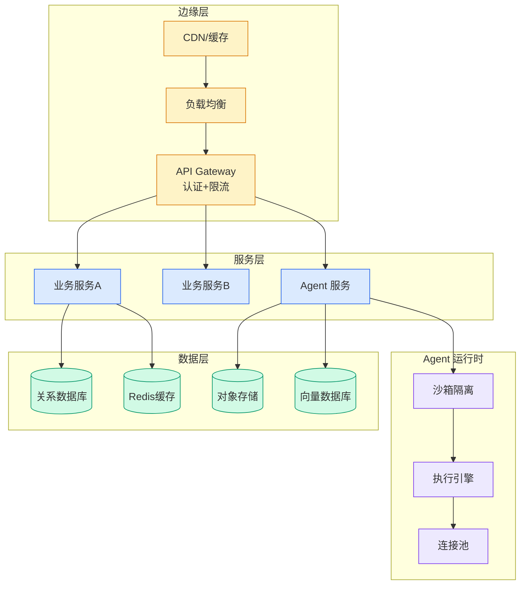

# Build a serverless image editing agent with Amazon Bedrock AgentCore harness

## Ch05.101 Build a serverless image editing agent with Amazon Bedrock AgentCore harness

> 📊 Level ⭐⭐ | 4.0KB | `entities/build-a-serverless-image-editing-agent-with-amazon-bedrock-a.md`

# Build a serverless image editing agent with Amazon Bedrock AgentCore harness

→ [原文存档](https://github.com/QianJinGuo/wiki-book/tree/main/docs/raw/articles/build-a-serverless-image-editing-agent-with-amazon-bedrock-a.md)

# Build a serverless image editing agent with Amazon Bedrock AgentCore harness

Building an AI agent that edits images based on natural language requires an orchestration loop, tool routing, memory management, and a compute environment to run it all. [Amazon Bedrock AgentCore harness](<https://docs.aws.amazon.com/bedrock-agentcore/latest/devguide/harness.html>) handles that entire stack with configuration. You declare what the agent does, and the harness runs it in a stateful, isolated microVM with built-in memory, tool routing, and observability.

This post walks through building a serverless image editor where users upload a photo, describe an edit in plain English, and receive the result in seconds. The agent runs on AgentCore harness without custom orchestration code. We deploy the full solution, including authentication, encrypted storage, three image editing tools, and a React frontend, with a single deployment command. The infrastructure is defined using [AWS Cloud Development Kit (AWS CDK)](<https://aws.amazon.com/cdk/>).

## Image editing application

The application accepts prompts like “change the car color to blue” or “extend the image 200 pixels to the right.” An agent powered by [Claude Sonnet 4.6](<https://docs.aws.amazon.com/bedrock/latest/userguide/model-card-anthropic-claude-sonnet-4-6.html>) breaks the requirement into a series of steps and orchestrates the tool calling, each associated with a different [Stability AI](<https://docs.aws.amazon.com/bedrock/latest/userguide/model-cards-stability-ai.html>) model. Then it executes the edit, applies a watermark using a shell command on the microVM (no token cost), and returns the result.

This application demonstrates the following AgentCore harness capabilities:

  * **Configuration-driven agent creation.** The agent is defined entirely through API parameters. No Python orchestration code, no framework, no container.
  * **Per-invocation model switching.** The frontend routes basic chat to [Claude Haiku 4.5](<https://docs.aws.amazon.com/bedrock/latest/userguide/model-card-anthropic-claude-haiku-4-5.html>) and edits to Claude Sonnet 4.6. The agent preserves conversation context across model switches.
  * **Per-invocation persona override.** Users select industry personas (Real Estate, Retail, Automotive) that inject domain-specific system prompts without redeploying.
  * AgentCore memory stores conversation history in the AgentCore service for 30 days. The agent retains full context across turns within a session, so it can reference prior edits without the frontend re-sending history. This sample persists the session ID in `localStorage`, so conversations survive browser refresh. Clearing browser data starts a new session on the frontend, but the conversation history remains available in AgentCore through the `ListEvents` API.
  * **[AgentCore Gateway](<https://docs.aws.amazon.com/bedrock-agentcore/latest/devguide/gateway.html>) with MCP.** Three AWS Lambda-backed tools are exposed t

---
## 关联

- 相关概念: [Harness Engineering](https://github.com/QianJinGuo/wiki/blob/main/concepts/harness-engineering-framework.md)

---

