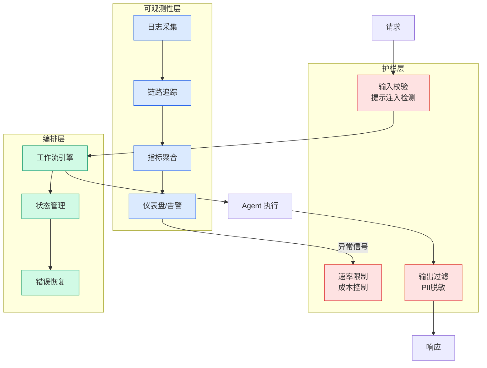

# Language Model Harnesses as Compositional Generalizers (Alex Zhang, 2026)

## Ch05.104 Language Model Harnesses as Compositional Generalizers (Alex Zhang, 2026)

> 📊 Level ⭐⭐ | 3.7KB | `entities/language-model-harnesses-compositional-generalizers-alex-zhang-2026.md`

# Language Model Harnesses as Compositional Generalizers (Alex Zhang, 2026)

> **Background**：本文档基于 Alex L. Zhang 和 Omar Khattab（MIT）的博客文章 "Language model harnesses are compositional generalizers" 建立。提出了 Harness 作为组合泛化（compositional generalization）的核心理论：一个好的 harness 能使每个 LLM 调用保持局部在分布内（locally in-distribution），从而将复杂问题分解为已有能力的组合。

## 核心论点

现代 post-training 已变成暴力范式——不断策划更多环境和更长训练 horizon。但 frontier Transformer 在**组合泛化**（compositional generalization）上仍然薄弱：无法通过组合已有经验解决未见问题。

作者主张：更好的泛化不是神经网络本身的任务，而是 **harness** 的任务。Harness 是一个位于外部世界与神经网络之间的程序，负责将外部状态编码为 LLM 输入格式并决定下一步动作。

一个好的 harness 的核心能力是提供一个高层归纳偏置（higher-level inductive bias），能将不熟悉且复杂的问题约简为更简单问题的组合。每个 Transformer 调用处理的 prompt 必须**局部在分布内**（locally in-distribution），即与其训练数据同分布。

## 实验结果

使用 Recursive Language Model（RLM）作为测试 harness，利用强化学习训练：

- 仅在短任务上训练，可泛化到 8–32x 更长的 held-out 任务
- 同等训练强度下，RLM 的 eval lift 比原生 Transformer 高约 10x
- 一个领域的训练以远超 vanilla Transformer 的比例迁移到其他领域

泛化效果的产生是因为 RLM harness 在具有潜在相似性的任务之间诱导出一个等价关系（equivalence relation），使训练中学到的子策略在域外也能适用。

## 意义

这一理论将 harness 从"工程基础设施"提升为"泛化机制的核心载体"。如果 harness 设计决定了泛化能力，那么 post-training 的权重需要从数据规模转向 harness 架构的创新。

## 相关实体

- [Reinforcing Recursive Language Models（RLM）](../ch01/878-reinforcing-recursive-language-models-alphaxiv.html) — RLM 的训练方法论
- [Agent Harness Engineering Survey](ch05/120-harness-engineering.html) — AVS 的多层 harness 分类法
- [Harness Engineering 框架](https://github.com/QianJinGuo/wiki/blob/main/concepts/harness-engineering-framework.md) — Harness 工程的总体框架
- [Coding Harness Engineering](https://github.com/QianJinGuo/wiki/blob/main/concepts/coding-harness-engineering.md) — Coding 场景下的 harness 工程

→ [原文存档](https://github.com/QianJinGuo/wiki-book/tree/main/docs/raw/articles/language-model-harnesses-compositional-generalizers-alex-zhang-2026.md)

---

