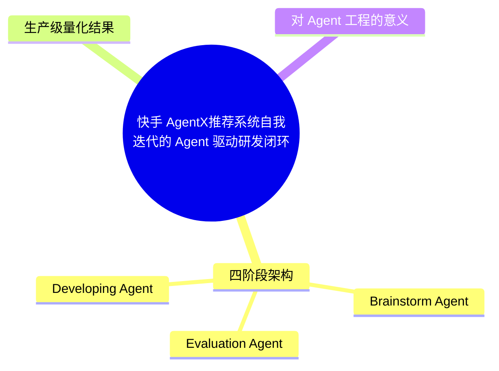
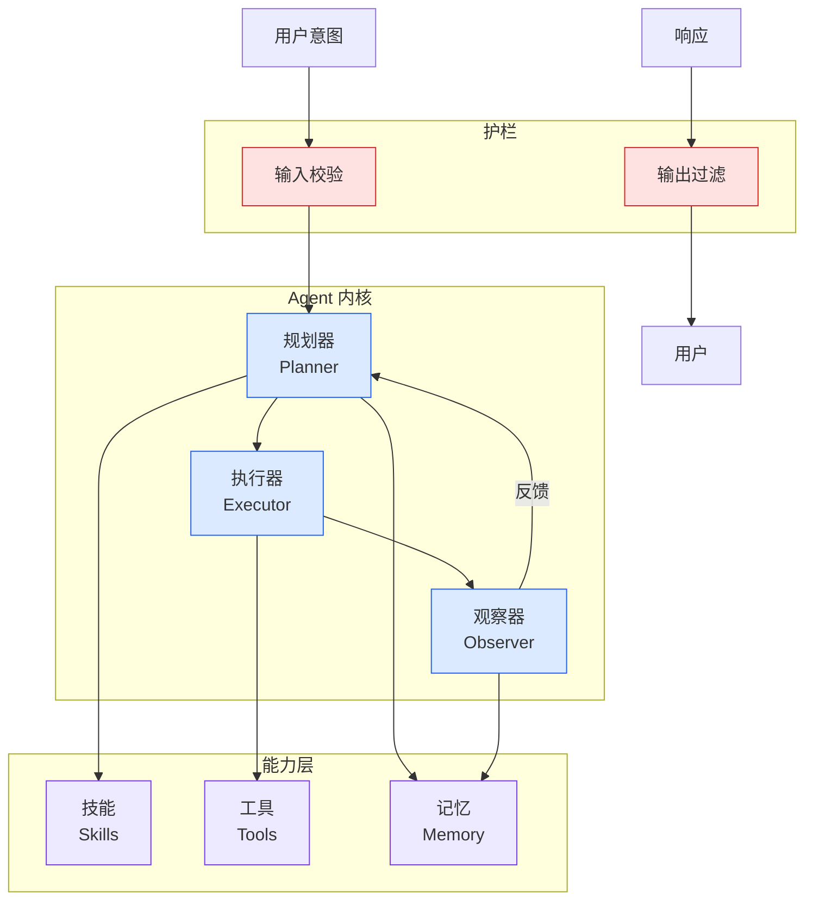

# 快手 AgentX——推荐系统自我迭代的 Agent 驱动研发闭环

## Ch05.105 快手 AgentX——推荐系统自我迭代的 Agent 驱动研发闭环

> 📊 Level ⭐⭐ | 3.7KB | `entities/kuaishou-agentx-self-iteration-recsys-2026.md`

# 快手 AgentX——推荐系统自我迭代的 Agent 驱动研发闭环

快手 AgentX 团队技术报告《AgentX: Towards Agent-Driven Self-Iteration of Industrial Recommender Systems》——让 Agent 不只是辅助写代码，而是成为推荐迭代的执行主体。

## 概念导图

## 四阶段架构

### 1. Brainstorm Agent
综合历史实验、系统架构、数据分析和外部论文，把目标收敛成有优先级、有证据、有边界的候选方案。每个方案说明目标指标、实现位置、所需信号、预期机制、风险和验证方式。

### 2. Developing Agent
通过仓库知识库、特征 schema 查询、DSL 检查、C++ 语法检查、dryrun 验证，把代码生成约束在真实仓库和平台规则内。支持论文复现、模块消融和跨论文结构组合。

### 3. Evaluation Agent
安全部署、流量分桶、参数冲突检查、指标读取和 guardrail veto。成功和失败都资产化——成功成为后续 playbook，失败沉淀为反例、约束和剪枝规则。

### 4. Harness Evolution（SGPO）
Semantic-Gradient-based Prompt Optimization——从历史轨迹中找出 Agent 工作方式的缺陷（遗漏约束、证据不足、反复犯同类错误），转化为子 Agent 的局部 harness 更新，通过旧版与新版在同批 replay 任务上的配对评估决定是否接纳。

## 生产级量化结果

3 个 AgentX worker 在主站推荐 + 生活服务场景：

| 指标 | 人工 | AgentX | 提升 |
|------|------|--------|------|
| 并发实验数/worker | 1.5 | 12 | **8x** |
| 可发布结果/worker/周 | 0.08 | 1.1 | **13.8x** |
| 单位人力业务价值 | 1x | 3.7x | **3.7x** |
| 周并发实验数（窗口内） | 15→60 | — | **自加速** |
| Idea 通过率 | 15%→45% | — | **自加速** |

业务结果：主站 App 消费时长 **+0.561%**，生活服务年化超 **1 亿元**。

实验漏斗：374 想法 → 106 通过审核 (28.34%) → 100 上线 (94.3%) → 10 可发布 (9.9%)

## 对 Agent 工程的意义

AgentX 是**目前公开可见的最完整的工业级 Agent 驱动研发闭环实证**。与 [生产级 Harness 架构设计](ch05/058-agent-harness.html) 互补——Harness 讨论通用架构，AgentX 提供推荐系统垂直领域的完整实现 + 真实 ROI 数据。

SGPO 自进化机制（将失败轨迹转化为 harness 更新）是独特的闭环设计，在现有 Harness 实体中未覆盖。

→ [原文存档](https://github.com/QianJinGuo/wiki-book/tree/main/docs/raw/articles/kuaishou-agentx-self-iteration-recsys-2026.md)

---
## 关联
- 相关概念: [Harness Engineering](https://github.com/QianJinGuo/wiki/blob/main/concepts/harness-engineering-framework.md)

---

