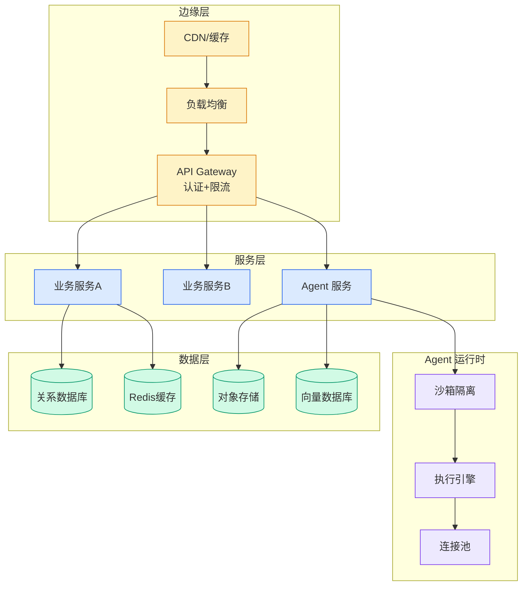

# MIT CSAIL RLM: Harness-Driven Length Generalization — 64K to 2M Tokens

## Ch05.108 MIT CSAIL RLM: Harness-Driven Length Generalization — 64K to 2M Tokens

> 📊 Level ⭐⭐ | 3.6KB | `entities/mit-csail-rlm-harness-length-generalization.md`

# MIT CSAIL RLM: Harness-Driven Length Generalization

MIT CSAIL researchers propose using the **`harness`** as an explicit variable for compositional generalization in recursive language models (RLMs). By training only on **64K-token tasks**, the system generalizes to **~2M token evaluations** — a **32× length extrapolation** — outperforming transformer baselines by approximately 10× in long-task evaluation gains.

## Core Insight: Harness as a Generalization Variable

The key innovation is repositioning the harness from a peripheral engineering framework to a carrier of **high-level inductive biases**. When tasks share similar decomposition structures (even with different domains and text surfaces), the harness can produce approximately isomorphic model trajectories — the root model learns reusable organizational strategies across tasks. This is formalized through the concept of **task equivalence classes**.

## Locally In-Distribution (LID) Design

The core architectural principle is **Locally In-Distribution** (LID): while the overall long task may be out-of-distribution, each individual model call is kept close to the training input distribution through two mechanisms:

1. **Context Unloading** — Task data is stored as variables in the external program environment. The root model first encounters the task structure, while domain-specific content remains external.
2. **Programmatic Sub-Agent Calls** — Sub-agents and tools are treated as function calls in a code environment. Results, intermediate calculations, and tool outputs are stored in variables rather than accumulating in the main context.

## Results

| Task | Training Length | Eval Length | Extrapolation |
|---|---|---|---|
| MRCRv2 | 64K | ~2M tokens | ~32× |
| GraphWalks | <128K | >1M tokens | ~8× |

Using a Qwen3-30B-A3B base with RL training (only updating the root language model), the RLM system approaches or exceeds GPT-5.5 reference results on four long-task benchmarks. Transformer baselines (including YaRN-extended) show improved training rewards on short tasks but limited long-task improvement — confirming that without harness-level generalization design, length extrapolation remains fundamentally constrained.

## Implications for Agent Systems

This work elevates the harness from a deployment concern to a **first-class generalization variable** in agent system design. It suggests that agent architectures capable of decomposing long tasks into locally in-distribution calls — through well-designed harnesses — can achieve length generalization impossible through model architecture alone. This aligns with the broader `harness engineering` movement in agent development.

→ [原文存档](https://github.com/QianJinGuo/wiki-book/tree/main/docs/raw/articles/mit团队把泛化写进harness短任务训练解锁32倍长度外推.md)

---

