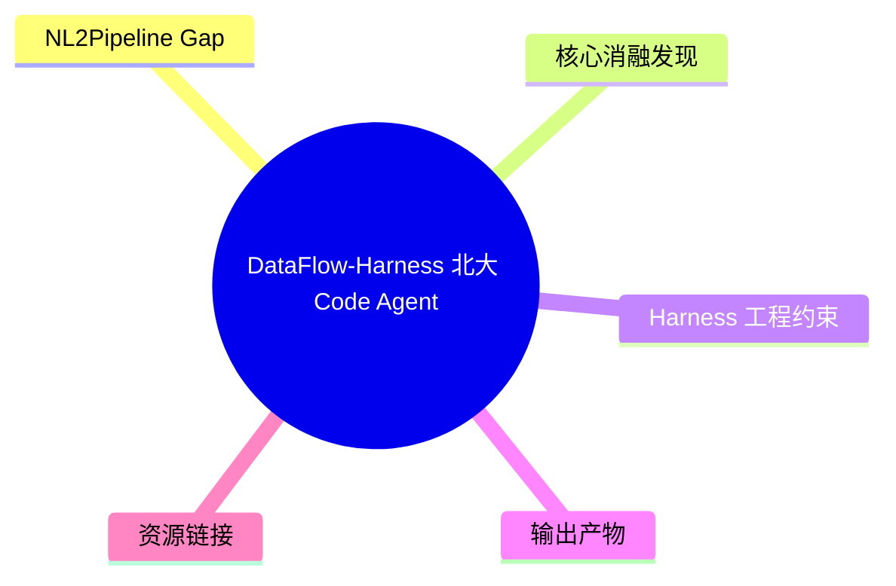
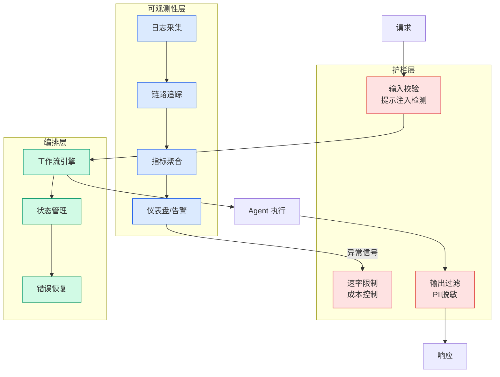

# DataFlow-Harness — 北大 Code Agent 数据处理管线 Harness

## Ch05.110 DataFlow-Harness — 北大 Code Agent 数据处理管线 Harness

> 📊 Level ⭐⭐ | 3.5KB | `entities/dataflow-harness-pku-code-agent-data-pipeline.md`

# DataFlow-Harness — 北大 Code Agent 数据处理管线 Harness

北京大学 DCAI 团队联合上海算法创新研究院、北京中关村学院于 2026 年 7 月发布 DataFlow-Harness（arXiv 2607.16617），上线后登上 HuggingFace Papers 当日榜第 2。DataFlow-Harness 建立在 DataFlow 开源生态之上（7000+ Stars），通过 Harness 工程约束让 Code Agent 在真实平台的能力边界内完成数据处理流水线构建。

## 概念导图

## NL2Pipeline Gap

DataFlow-Harness 论文将用户自然语言意图到生产平台原生流水线之间的距离定义为 **NL2Pipeline gap**：用户口头描述的工作流意图需要转换成一条可检查、可编辑、可复用的平台原生 DAG 流水线。

## 核心消融发现

| 配置 | 端到端通过率 | 成本 | 延迟 |
|------|:----------:|:----:|:----:|
| Free Script（自由脚本） | 91.7% | — | — |
| MCP-only（只给工具，不给 Skills） | 83.3% ↓ | — | — |
| MCP + Skills + Typed Mutations + RVC | **93.3%** | **$0.261** (-72.5%) | **95.5s** (-49.9%) |

最反直觉的发现：**只给 Code Agent MCP 工具、却不给程序性知识（Skills）时，端到端通过率反而从自由脚本的 91.7% 降到 83.3%**。加入 Skills、typed mutations 和 Request-Validate-Commit 机制后，通过率回升到 93.3%，成本同时下降 72.5%。

## Harness 工程约束

DataFlow-Harness 通过在以下三个层面施加约束来桥接 NL2Pipeline gap：

1. **Skills（程序性知识）**：告诉 Agent 算子应该按什么顺序连接、哪些步骤不能交换、哪些检查不能省略
2. **Typed Mutations（类型化变更）**：确保修改操作的类型安全，防止参数类型错误等低级失误
3. **Request-Validate-Commit（请求-验证-提交，RVC）**：三段式流水线变更协议，每次修改都经过验证才生效

## 输出产物

最终交付物不再是传统的一次性 Python 脚本，而是一条可持久化、可继续编辑的 **Native DAG**，可在 DataFlow-WebUI 中查看、编辑和复用。

## 资源链接

- 论文：https://huggingface.co/papers/2607.16617
- 开源仓库（DataFlow-Harness 工程交互入口）：https://github.com/OpenDCAI/DataFlow-WebUI
- 开源仓库（DataFlow 主库）：https://github.com/OpenDCAI/DataFlow

## 相关实体

- [Skill 安全评估](../ch01/844-skill-issues-compromising-claude-code-with-malicious-skills.html)
- [Claude Code Harness 深度解析](ch05/073-claude-code-harness.html)
- [阿里 Skill-Up Agent 技能评估](../ch04/312-alibaba-skill-up-agent-skill.html)
- [CLAW SWE-bench Harness 评估](ch05/009-harness.html)

→ [原文存档](https://github.com/QianJinGuo/wiki-book/tree/main/docs/raw/articles/dataflow-harness-pku-code-agent-data-pipeline-arxiv-2607-16617.md)

---

