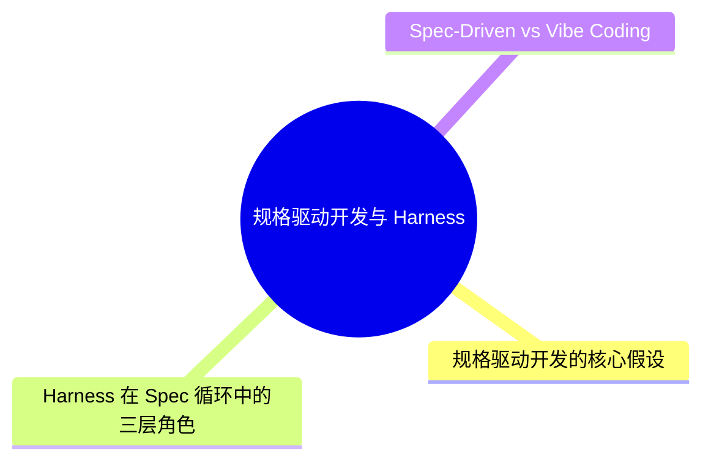
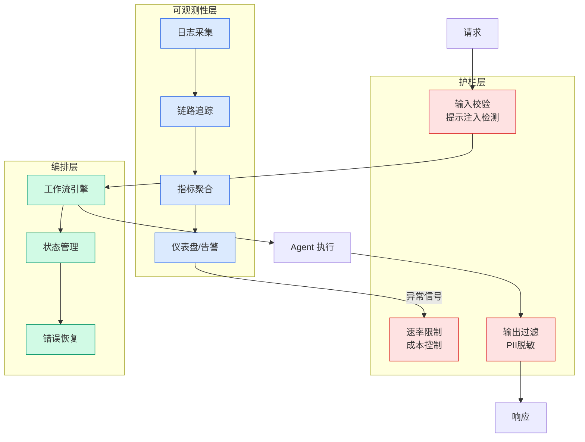

# 规格驱动开发与 Harness

## Ch05.114 规格驱动开发与 Harness

> 📊 Level ⭐⭐ | 2.8KB | `entities/spec-driven-development-harness.md`

# 规格驱动开发与 Harness

规格驱动开发（Spec-Driven Development）与 Harness 工程的结合：以结构化规格为 Agent 的输入源，Harness 负责规格解析、任务分解、执行验证。减少 Vibe Coding 的不确定性。

## 概念导图

## 深度分析

### 规格驱动开发的核心假设

两个核心假设：其一，用自然语言书写的结构化规格比隐式的任务描述更精确、更可验证；其二，规格可以作为 Agent 的"契约"——Harness 在规格-执行-验证循环中保证输出的可预测性。这两个假设分别对应 AI 辅助编程中的"意图捕获"和"结果验证"两大挑战。

### Harness 在 Spec 循环中的三层角色

第一层，规格解析层——将自然语言规格分解为可执行的任务单元，提取约束条件和验收标准。第二层，任务编排层——将分解后的任务单元分配给适当的 Agent 或工具，管理执行顺序和依赖关系。第三层，验证反馈层——将执行结果与规格中的验收标准进行比对，生成差异报告并触发修正循环。

### Spec-Driven vs Vibe Coding：不确定性的来源与控制

Vibe Coding 的不确定性来源于意图到代码的"单步映射"。Spec-Driven 通过在意图和代码之间插入"规格-执行-验证"的三阶段循环，将不确定性分散到每个阶段分别处理。这种分散化策略的本质是"降低单步映射的复杂度"。

## 实践启示

1. **Spec 是契约不是文档**：规格的价值不在于记录需求，而在于作为 Agent 执行的可验证边界——每个规格条目都应对应明确的验收测试。
2. **三层角色分步实施**：先实现规格解析层（让 Agent 能读懂结构化 spec），再添加验证反馈层（自动比对结果），最后才需要完整的任务编排层。
3. **从高不确定性场景切入**：Spec-Driven 比 Vibe Coding 更适合需求明确但实现复杂的任务。

## 相关实体

- [场景营销前端 AI Coding — 从问题到方案](ch05/111-ai-coding.html)
- [Karpathy 最新访谈：从 Vibe Coding 到 Agentic Engineering](../ch04/237-agentic.html)
- [AI Coding 入门指南：如何更好地让 AI 真正帮你干活](ch05/111-ai-coding.html)
- [Harness Engineering 详解：如何将 AI Coding 率提升至 90%](ch05/120-harness-engineering.html)
- [一文带你弄懂 AI 圈爆火的新概念：Harness Engineering](ch05/120-harness-engineering.html)

---

