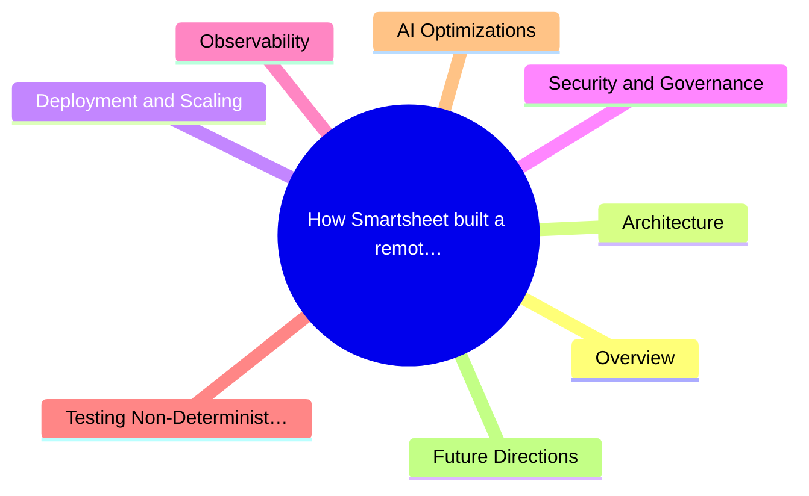
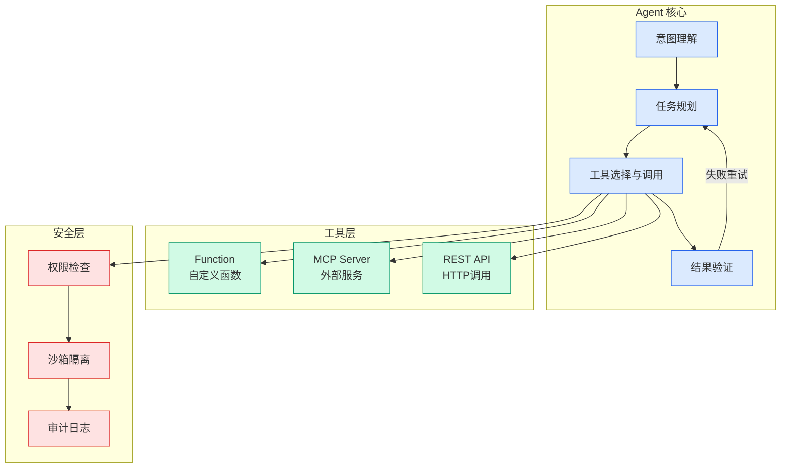

# How Smartsheet built a remote MCP server on AWS

## Ch07.055 How Smartsheet built a remote MCP server on AWS

> 📊 Level ⭐⭐ | 7.6KB | `entities/smartsheet-remote-mcp-server-aws-architecture.md`

# How Smartsheet built a remote MCP server on AWS

> → [原文存档](https://github.com/QianJinGuo/wiki-book/tree/main/docs/raw/articles/how-smartsheet-built-a-remote-mcp-server-on-aws.md)

## 概念导图

## Overview

Smartsheet, an enterprise work management platform, built a remote `Model Context Protocol (MCP)` server on AWS to give AI agents structured access to enterprise Smartsheet data. The server connects AI assistants like Amazon Quick and Claude Desktop to Smartsheet's capabilities through natural language, enabling analysis, task updates, sheet creation, workspace management, and autonomous agent workflows. Since launch, Smartsheet has saved over 3 billion tokens through AI-specific optimizations.

## Architecture

One MCP layer serves both internal and external agents — Smartsheet's own Smart Assist and externally connected AI clients run on the same infrastructure with the same tools, optimizations, and intelligence stack. The key AWS services in the data path are:

- **AWS Fargate for Amazon ECS** — stateless server containers for the MCP server
- **Amazon Kinesis Data Streams + Amazon Managed Service for Apache Flink** — change-event ingestion into Amazon S3
- **Amazon Bedrock + Amazon Neptune** — LLM inference and knowledge graph for cross-project insights

The architecture flow is: AI clients → API gateway layer (AWS WAF, AWS Shield, ALB, OAuth validation) → MCP Server on AWS Fargate → Domain Services (transactional APIs) → Intelligence Layer (Amazon Neptune, Databricks) with change events streaming through Kinesis and Apache Flink into S3 following the medallion architecture.

## Deployment and Scaling

AI traffic differs from conventional request patterns — agents autonomously orchestrate bursts of tool calls followed by quiet reasoning periods. Smartsheet uses **AWS Fargate for ECS** with target-tracking Auto Scaling policies combining traffic volume and compute utilization. Compute-aware scaling is critical because each request involves server-side LLM-optimized serialization.

Deployments use **Amazon ECR** with CI/CD pipeline safety nets. ECS deployment circuit breakers detect failing containers and auto-revert. Rollouts follow the AWS Well-Architected principle of reducing impact radius (smallest region first), with automated end-to-end tests and canary tests every 15 minutes. The pattern follows the `AWS Guidance for Deploying MCP Servers`.

## Security & Governance

**Governance** is built into the tool framework itself — access control, error handling, and audit trails ship with every tool by default. Access is tiered per organization (global AI access, non-destructive only, or full write/destructive). Tools carry MCP annotations like `readOnlyHint` and `destructiveHint` for automatic confirmation flows.

**Security** follows defense-in-depth: AWS WAF and AWS Shield at the edge, private subnets in a VPC, mutual TLS (mTLS) for service-to-service calls, and an OAuth2 proxy rejecting unauthenticated requests. Layered rate limiting through AWS WAF provides blanket protection, per-user metering via identity headers, and path-specific controls for expensive operations — following the three most important AWS WAF rate-based rules pattern.

## Observability

The server emits OpenTelemetry signals (logs, traces, metrics) across the full request lifecycle, capturing user, organization, tool name, and outcome per invocation. Logs stream through Amazon Kinesis into Amazon OpenSearch Service, with infrastructure metrics in Amazon CloudWatch. Datadog provides per-tool APM visibility, and PagerDuty handles incident routing. Every invocation emits structured analytics through Amazon SQS into the Intelligence Layer for continuous optimization feedback.

## Testing Non-Deterministic AI Workflows

MCP tool responses pass through an LLM before reaching the user, introducing a non-determinism layer that changes what "correct" means for testing. Smartsheet invests heavily in end-to-end workflow tests that include the LLM in the loop, simulating realistic business scenarios (creating workspaces, writing data, querying results). These run in the CI/CD pipeline (GitLab CI on AWS) and continuously as canary tests against each production AWS Region.

## AI Optimizations

Smartsheet optimizes at three levels for AI consumption, saving 3+ billion tokens:

1. **Progressive disclosure** — Each tool response targets a token budget. The server dynamically calculates how many rows fit based on column count and data density. Metadata fields (`is_sampled`, `rows_in_sheet`, `rows_actual`, `filters_applied`) tell the model whether it has the full picture or needs to narrow with filters.

2. **Schema-driven tool contracts** — Each tool publishes strict JSON Schema through MCP's tool discovery, generated from Pydantic models. Parameters are constrained to valid enums, column names validated against actual sheets before execution, and mismatches return structured errors with valid options. This prevents hallucinated parameters at the boundary.

3. **Token-efficient serialization** — A proprietary serialization format that reduces token count by 35–47% on data-heavy responses. Key names appear once instead of repeating per row, and structural syntax is replaced by delimiters that tokenize more efficiently. On a 33-item filtered query: ~3,900 tokens vs ~6,000 for equivalent JSON. At 1,000 rows the gap widens further.

## Future Directions

In the first four weeks after GA, Smartsheet saw over 87% week-over-week user growth. Future plans include resources that shape themselves to users, autonomous agents on workflows, and a routing layer for specialist reasoning handoffs. The team continues to adopt AWS capabilities like `Amazon Bedrock AgentCore` as the protocol evolves toward elicitations, MCP Apps, and Tasks.

## Key Takeaways

- One MCP infrastructure serves both internal (Smart Assist) and external (Amazon Quick, Claude Desktop) AI agents
- Enterprise governance (tiered access, audit trails, readOnlyHint/destructiveHint) is built into the tool framework
- 3+ billion tokens saved through progressive disclosure, schema validation, and optimized serialization (35-47% reduction)
- AI traffic requires burst-aware scaling (target-tracking on compute + traffic) and layered rate limiting (edge + per-user + path-specific)
- Testing must include the LLM in the loop due to non-deterministic interpretation layers

---

