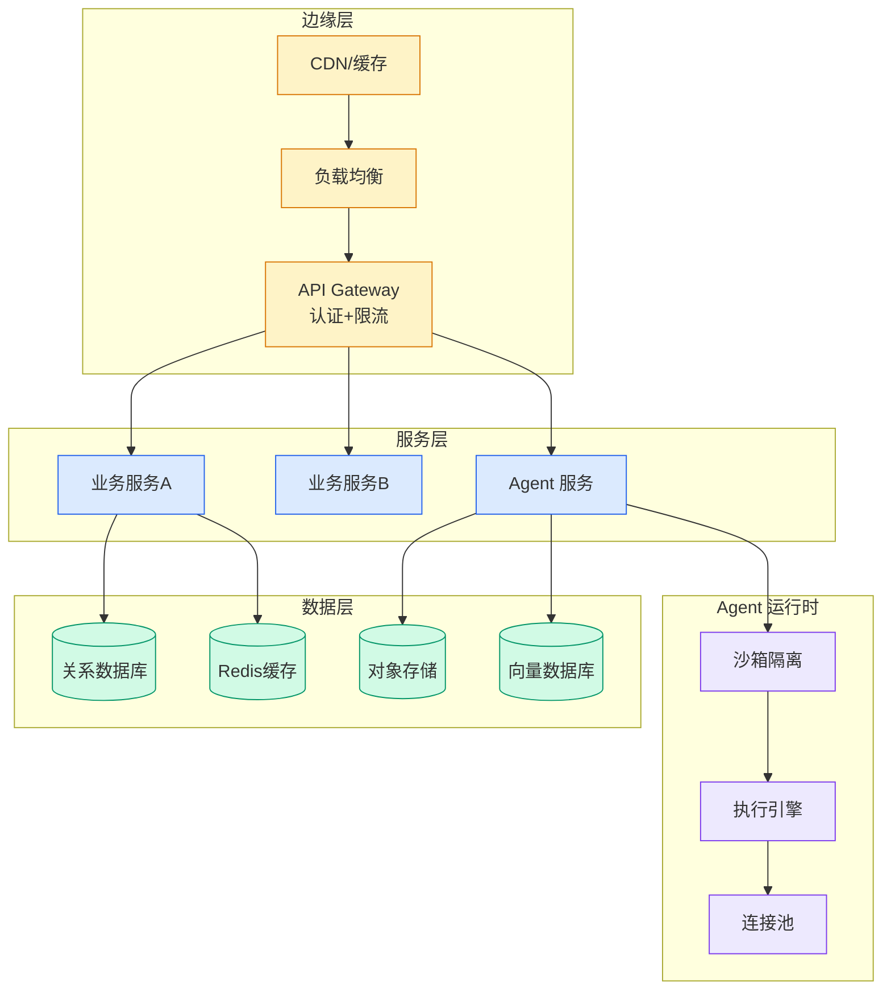

# Building and connecting a production-ready ecommerce MCP server using Amazon Bedrock AgentCore and Mistral AI Studio

## Ch07.078 Building and connecting a production-ready ecommerce MCP server using Amazon Bedrock AgentCore and Mistral AI Studio

> 📊 Level ⭐⭐ | 4.2KB | `entities/building-and-connecting-a-production-ready-ecommerce-mcp-ser.md`

# Building and connecting a production-ready ecommerce MCP server using Amazon Bedrock AgentCore and Mistral AI Studio

→ [原文存档](https://github.com/QianJinGuo/wiki-book/tree/main/docs/raw/articles/building-and-connecting-a-production-ready-ecommerce-mcp-ser.md)

# Building and connecting a production-ready ecommerce MCP server using Amazon Bedrock AgentCore and Mistral AI Studio

When ecommerce teams need faster time-to-market for AI-powered customer experiences, they face weeks of custom integration work that delays launches and increases security risks. Building and connecting a production-ready AI assistant typically requires custom API code for each client, container infrastructure management, and complex authentication. Amazon Bedrock AgentCore and Mistral AI Studio streamline this process. A production-ready ecommerce Model Context Protocol (MCP) server on Amazon Bedrock AgentCore, connected to Mistral AI Studio, streamlines development. The MCP provides standardized integration protocols, AgentCore Runtime manages containers and validates tokens, and Amazon Cognito handles identity.

In this post, you build and connect that server end to end. You will implement MCP tools, set up two-layer JSON Web Token (JWT) authentication, deploy with AWS Cloud Development Kit (AWS CDK), and connect the result to [Mistral AI’s Vibe](<https://mistral.ai/products/vibe/>). The post also covers prerequisites, solution architecture, best practices for MCP servers and Vibe connectors, and resource cleanup. The ecommerce server that you build supports product search, order placement, review submission, and returns processing using Amazon DynamoDB for data and Amazon Cognito for identity management.

Amazon Bedrock AgentCore is a platform to build, connect, and optimize AI agents at scale. Within it, AgentCore Runtime is the fully managed serverless component for hosting agent and MCP workloads, with session isolation, long-running request support, built-in JWT validation, and observability, so you don’t manage containers, load balancers, or auth middleware. In this post, you build the MCP server with Python and FastMCP, then deploy it to Runtime for managed hosting. Amazon Cognito manages user identity through OAuth 2.1, keeping each customer’s data isolated. With MCP, you write one server that multiple AI clients connect to, rather than building a separate integration for each client. Mistral AI’s Vibe gives users a conversational interface to the server on web, iOS, and Android.

By the end, you will have a working ecommerce MCP server that authenticates users through Amazon Cognito, scopes data access per customer, and responds to natural language queries from Vibe. Because the server uses the MCP standard, other MCP-compatible clients can also connect to it.

To see the solution in action, watch the following demo. Then, explore the full post for a detailed guide on implementing your own production-ready MCP server and querying it from Vibe.

## Prerequisites

You need an [AWS account](<https://aws.amazon.com/account/>) with permissions to create [Amazon DynamoDB](<https://aws.amazon.com/dynamodb/>) tables (NoSQL database), [Amazon Cognito](<https://aws.amazon.com/cognito/>) user pools (user identity, OAuth 2.1), A

---
## 关联

- 相关概念: [Harness Engineering](https://github.com/QianJinGuo/wiki/blob/main/concepts/harness-engineering-framework.md)

---

