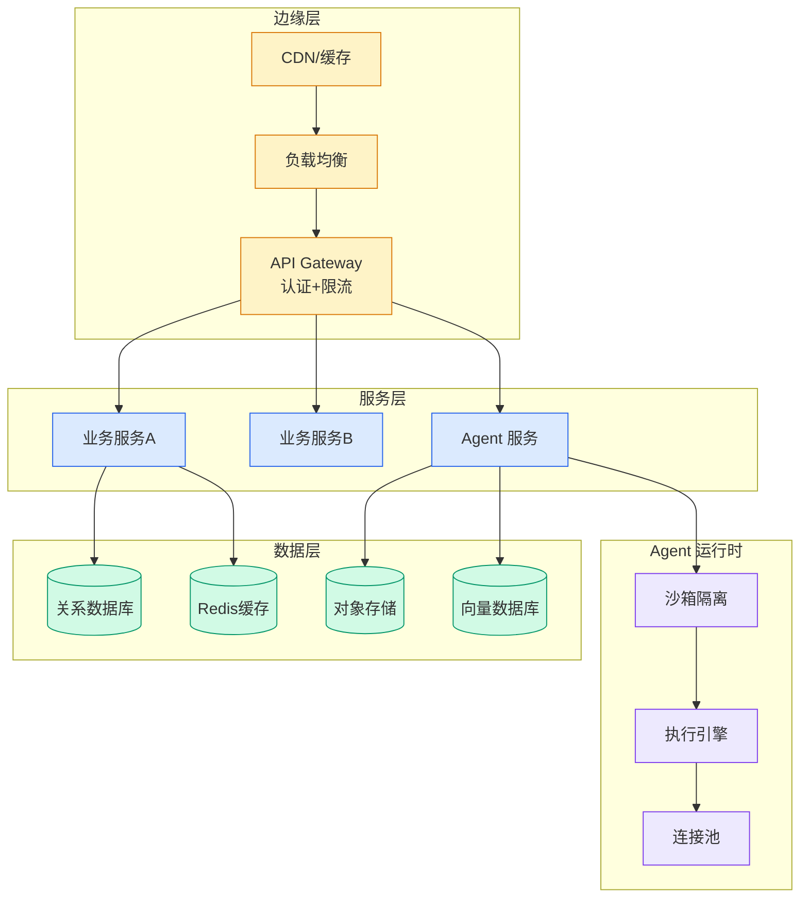

# 25个Skills详解：从生产力清单到AI工作流资产

## Ch07.084 25个Skills详解：从生产力清单到AI工作流资产

> 📊 Level ⭐⭐ | 3.4KB | `entities/nico-25-skills-workflow-asset-ruofei-analysis.md`

# 25个Skills详解：从生产力清单到AI工作流资产

→ [原文存档](https://github.com/QianJinGuo/wiki-book/tree/main/docs/raw/articles/nico-25-skills-workflow-asset-ruofei-analysis.md)

## 深度分析

25个Skills详解：从生产力清单到AI工作流资产 涉及agent领域的核心技术议题。
### 核心观点
1. # 25个Skills详解：从生产力清单到AI工作流资产
> 来源：架构师（若飞）| 2026-05-28 | 分析 Nico 整理的25个生产力 Skills
## 核心命题

Skill 不是提示词合集，而是轻量级 Runbook——可保存、可复查、可迭代的工作规程。
2. 它把隐性经验变成 Agent 可以读取和执行的工作流程。
3. ## 三层视角
### 个人视角
Skill 把顺手的方法留下来。
4. 下次遇到同类任务，不必重新组织语言。
5. ### 技术团队视角
Skill 把工程规范、上下文、检查点和失败经验，放进 Agent 每次工作的路径里。

### 内容结构
- 25个Skills详解：从生产力清单到AI工作流资产
- 核心命题
- 三层视角
- 个人视角
- 技术团队视角
- 管理层视角
- Skill 在 Agent Runtime 里的位置
- 六维评判标准

### 技术要点

- **agent架构**: 本文在agent方向提出的设计理念与实现路径
- **工程挑战**: 实际落地中面临的关键问题与应对策略
- **architecture趋势**: 相关技术演进方向与新兴范式
### 关联实体

- [你不知道的 Agent原理架构与工程实践 V2](../ch03/035-agent.html)
- [Openclaw 完全指南这可能是全网最新最全的系统化教程了32W字建议收藏 V2](../ch11/235-openclaw.html)
- [Karpathy 最新访谈从 Vibe Coding 到 Agentic Engineering](../ch04/237-agentic.html)
- [Openclaw 完全指南这可能是全网最新最全的系统化教程了32W字建议收藏](../ch11/235-openclaw.html)
- [Ethan He Cosmos Grok Imagine Latent Space Video Agent 20260606](../ch03/035-agent.html)
- [一文带你弄懂 Ai 圈爆火的新概念Harness Engineering](../ch05/120-harness-engineering.html)

## 实践启示
1. **工程落地**: agent领域方案需关注可观测性、可维护性和成本效率
2. **技术选型**: 根据场景选择合适的技术栈，避免过度设计或盲目追新
3. **持续迭代**: 建立数据驱动的反馈闭环，持续优化系统表现
4. **风险管控**: 引入新技术需评估对现有系统稳定性的影响，做好降级预案

---

