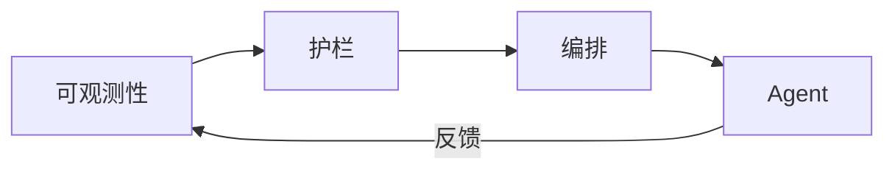

# Amazon EKS MCP Server

## Ch07.089 Amazon EKS MCP Server

> 📊 Level ⭐⭐ | 0.4KB | `entities/amazon-eks-mcp-server.md`

# Amazon EKS MCP Server

> 🚧 占位页面 — 内容待补充

工具/产品/团队实体页面，待从相关 raw 文章中提取详细信息。

---
## 关联

- 相关概念: [Harness Engineering](https://github.com/QianJinGuo/wiki/blob/main/concepts/harness-engineering-framework.md)

---

