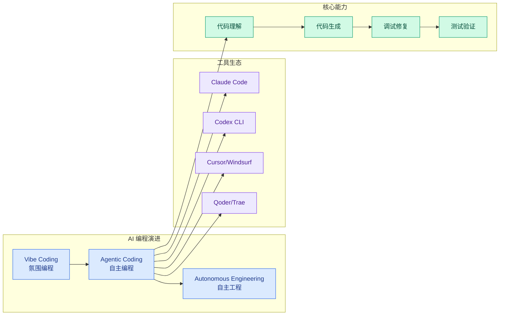

# Ch09 AI 编程与代码生成

> 最成熟的 Agent 品类：Claude Code、OpenClaw、Codex 深度拆解

> 本章收录 **183 篇**实体，按深度递增排列。

---

## 本章导航

| Level | 含义 | 篇数 |
|-------|------|------|
| ⭐ 入门 | 零基础可读 | 7 |
| ⭐⭐ 工程师 | 需编程基础 | 170 |
| ⭐⭐⭐ 专家 | 需ML基础 | 5 |
| ⭐⭐⭐⭐ 科学家 | 需研究背景 | 1 |

---

## 导读

AI 编程是 Agent 最早成熟的品类，也是理解 Agent 工程的最佳窗口。

本章深度拆解三个标杆产品：Claude Code（Anthropic 的终端编程 Agent，2 万字源码分析）、OpenClaw（开源多 Agent 编程框架，32K 字完全指南）、以及 Codex（OpenAI 的云端编程 Agent，/goal 源码解析）。

你还会看到 Hooks 如何做安全门禁、Token 成本如何控制、以及从 Demo 到产线的 8 道关卡——这些都是从实战中提炼的血泪教训。

如果你想理解 Agent 工程，从 AI 编程开始是最好的切入点。

---

---

## 架构图

## 本章内容

- [001. 视觉还原 AI 技术](ch09/001-ai)
- [002. 淘宝前端 AI 实践](ch09/002-ai)
- [003. Claude Code Agent View](ch09/003-claude-code-agent-view)
- [004. Claude Code 个人学习系统：从答案机到学习工作台的 5 步法](ch09/004-claude-code-5)
- [005. 场景营销前端 AI Coding — AI Native 的视觉稿还原](ch09/005-ai-coding-ai-native)
- [006. Hardwood 1.0: A Fast, Lightweight Apache Parquet Reader for the JVM](ch09/006-hardwood-1-0-a-fast-lightweight-apache-parquet-reader-for)
- [007. 设计稿转代码（Design to Code）](ch09/007-design-to-code)
- [008. Anthropic 内部 95% 数据分析自动化：分析 Agent 技术栈 + Skill 框架（21%→95% 准确率）](ch09/008-anthropic-95-agent-skill-21-95)
- [009. AI Coding 入门指南 - 如何更好地让AI真正帮你干活](ch09/009-ai-coding-ai)
- [010. 让 Coding Agent 从黑盒到透明：阿里云 Agent 观测审计数据采集实践（LoongSuite Pilot 端侧平台 + 3 类 Agent 形态 + 4 大观测审计能力）](ch09/010-coding-agent-agent-loongsuite-pilot-3-agent)
- [011. Claude Code 在大型代码库中的实战经验：从哪里入手？怎么做对？](ch09/011-claude-code)
- [012. 小米 MiMo Code — 长程编程 Agent 三大主线（计算/记忆/进化）+ 与 Claude Code 工程分化](ch09/012-mimo-code-agent-claude-code)
- [013. 业务 Agent 增强层架构：复用通用 Agent 基座，把业务能力做成可验证增强层](ch09/013-agent-agent)
- [014. Claude Code 一周年回顾：Boris Cherny + Cat Wu 的完整时间线](ch09/014-claude-code-boris-cherny-cat-wu)
- [015. AI 驱动的跨云网络搭建：用 Claude Code 和 Kiro CLI 实现 AWS-腾讯云 IPSec VPN 双隧道互联 | 亚马逊AWS官方博客](ch09/015-ai-claude-code-kiro-cli-aws-ipsec-vpn-aws)
- [016. Gene/GEP — EvoMap×清华 提出的「策略基因」经验对象框架（arXiv 2604.15097）](ch09/016-gene-gep-evomap-arxiv-2604-15097)
- [017. AI Coding Guide Tmall Deep Dive](ch09/017-ai-coding-guide-tmall-deep-dive)
- [018. How Claude Code works in large codebases: Best practices and where to start](ch09/018-how-claude-code-works-in-large-codebases-best-practices-and)
- [019. Claude Code 从 Demo 到产线 · 企业 Harness 工程化的 8 道关卡（黄佳/咖哥 CSDN）](ch09/019-claude-code-demo-harness-8-csdn)
- [020. OpenAI Symphony：Linear 即 Codex Agent 控制平面](ch09/020-openai-symphony-linear-codex-agent)
- [021. AI 编程智能体的质量防线：5 个代码质量控制机制（反馈传感器 / 语义评估 / 重构边界 / 来源追溯 / 智能体攻击面清单）](ch09/021-ai-5)
- [022. Ethan Mollick: Claude Code and What Comes Next (Practitioner View)](ch09/022-ethan-mollick-claude-code-and-what-comes-next-practitioner)
- [023. 采用 AI 编码智能体的六条经验](ch09/023-ai)
- [024. Karpathy 最新访谈：从 Vibe Coding 到 Agentic Engineering](ch09/024-karpathy-vibe-coding-agentic-engineering)
- [025. 基于浏览器请求录制与AI代码生成的E2E接口自动化测试实践](ch09/025-ai-e2e)
- [026. Claude Code 一周年回顾：Boris Cherny + Cat Wu 对话](ch09/026-claude-code-boris-cherny-cat-wu)
- [027. Prompt Caching 工程实践 — Anthropic Claude Code 经验总结](ch09/027-prompt-caching-anthropic-claude-code)
- [028. 使用 Kiro AI IDE 开发 基于Amazon EMR 的Flink 智能监控系统实践 | 亚马逊AWS官方博客](ch09/028-kiro-ai-ide-amazon-emr-flink-aws)
- [029. 使用Claude Code：session管理与1M上下文](ch09/029-claude-code-session-1m)
- [030. Cheap code means formal verification is reasonable now — Antfly Blog](ch09/030-cheap-code-means-formal-verification-is-reasonable-now-ant)
- [031. Thought-Aligner：智能体行为安全新范式——可插拔思维校正层（ICML 2026）](ch09/031-thought-aligner-icml-2026)
- [032. It’s safe to close your laptop now: Hosting coding agents on Amazon Bedrock AgentCore](ch09/032-it-s-safe-to-close-your-laptop-now-hosting-coding-agents-on)
- [033. Claude Code Openclaw Usage Ettin](ch09/033-claude-code-openclaw-usage-ettin)
- [034. 天猫新品营销技术团队AI编码实战指南（上）](ch09/034-ai)
- [035. AutoResearch：多 Agent 自动化软件开发](ch09/035-autoresearch-agent)
- [036. Claude Code 性能基准评测](ch09/036-claude-code)
- [037. HTTP/2 HPACK Bomb — Codex Discovered AI-Discovered DoS](ch09/037-http-2-hpack-bomb-codex-discovered-ai-discovered-dos)
- [038. gpt-54-烧完额度后我把七家国产-ai-公司-coding-plan-对比了一遍想不到最应该买的竟然是这家](ch09/038-gpt-54-ai-coding-plan)
- [039. AgentMemory：Coding Agent 本地记忆系统](ch09/039-agentmemory-coding-agent)
- [040. Matt Van Horn 的 22 个 Claude Code 黑客技巧：让 AI 写 plan.md 但不读 plan.md](ch09/040-matt-van-horn-22-claude-code-ai-plan-md-plan-md)
- [041. CLAUDE.md 规则从 Karpathy 的 4 条增加到 12 条](ch09/041-claude-md-karpathy-4-12)
- [042. Anthropic Coding Agent 社会科学家采用调查](ch09/042-anthropic-coding-agent)
- [043. Claude Code 18个隐藏设置](ch09/043-claude-code-18)
- [044. CLAUDE.md 12 条规则：Karpathy 扩展模板](ch09/044-claude-md-12-karpathy)
- [045. DeepSeek V4 DS4C Antirez 本地推理实践](ch09/045-deepseek-v4-ds4c-antirez)
- [046. Codex /goal 源码深度解析：状态表 + 续跑条件 + 预算账本](ch09/046-codex-goal)
- [047. Coding Agent在百度的落地实践：从反馈闭环到工程范式重构](ch09/047-coding-agent)
- [048. Cat Wu: Anthropic Claude Code/Cowork 产品负责人访谈](ch09/048-cat-wu-anthropic-claude-code-cowork)
- [049. 从Cursor返聘归来，90后华裔女高管带Claude开启日更模式](ch09/049-cursor-90-claude)
- [050. Claude Code 黑客松：技艺数字化六项目](ch09/050-claude-code)
- [051. Code as Agent Harness 综述](ch09/051-code-as-agent-harness)
- [052. Meta Muse Spark 1.1 — 匹敌 Opus 4.8 的 Agentic/Coding 模型](ch09/052-meta-muse-spark-1-1-opus-4-8-agentic-coding)
- [053. Claude Code Agent Teams 架构分析](ch09/053-claude-code-agent-teams)
- [054. OpenAI models and Codex on Amazon Bedrock are now generally available](ch09/054-openai-models-and-codex-on-amazon-bedrock-are-now-generally)
- [055. Claw-SWE-Bench：首个独立测量Harness对编程Agent影响的基准](ch09/055-claw-swe-bench-harness-agent)
- [056. 1-Click GitHub Token Stealing via a VSCode Bug — ammaraskar 2026](ch09/056-1-click-github-token-stealing-via-a-vscode-bug-ammaraskar)
- [057. Chromium AI Coding 开发体系](ch09/057-chromium-ai-coding)
- [058. QoderWork Skills 开发实践：从传统数科到 AI 数科的转型探索](ch09/058-qoderwork-skills-ai)
- [059. Codex Goal Six Hour Run](ch09/059-codex-goal-six-hour-run)
- [060. Claude Code 大型代码库最佳实践 — Anthropic 企业级部署指南](ch09/060-claude-code-anthropic)
- [061. 【图解】Claude Code 源码解析 ｜Prompt 提示词模块](ch09/061-claude-code-prompt)
- [062. Claude Code 身世：从安全对齐到开发工具的革命](ch09/062-claude-code)
- [063. Claude Code 七种自定义方法：官方全景指南](ch09/063-claude-code)
- [064. Codex AGENTS.md 项目说明书完整指南](ch09/064-codex-agents-md)
- [065. Claude Code Routines：从工具到队友的主动 Agent 模式](ch09/065-claude-code-routines-agent)
- [066. Open Code Review：阿里开源的 AI 代码评审 CLI 工具](ch09/066-open-code-review-ai-cli)
- [067. Qoder 企业版全球发布：让 AI Coding 从"个人工具"长出"组织能力](ch09/067-qoder-ai-coding)
- [068. 两万字详解Claude Code源码核心机制](ch09/068-claude-code)
- [069. Claude Code 集成其他工具指南](ch09/069-claude-code)
- [070. 阿里重磅开源！Open Code Review：一周 5k star，为你的代码保驾护航](ch09/070-open-code-review-5k-star)
- [071. Agent Browser 僵尸进程排查与定时清理（Claude Code + QoderWork 实战）](ch09/071-agent-browser-claude-code-qoderwork)
- [072. Kimi K3 实测：半天复刻录屏工具](ch09/072-kimi-k3)
- [073. Codex 五层架构：记忆/知识/护栏/委派/分发](ch09/073-codex)
- [074. Claude官方教你用 Loop：如何让Claude Code上夜班的四个交接点](ch09/074-claude-loop-claude-code)
- [075. OpenAI秘密矩阵曝光：Codex将所有设备连成超级电脑](ch09/075-openai-codex)
- [076. claude-apprentice v1.0：32 文件设计取舍与 5 层架构工程实现](ch09/076-claude-apprentice-v1-0-32-5)
- [077. Hacker News 热帖：AI 会写代码了，为啥还要用 Python？](ch09/077-hacker-news-ai-python)
- [078. Claw Chain: Cyera Research Unveil Four Chainable Vulnerabilities in OpenClaw](ch09/078-claw-chain-cyera-research-unveil-four-chainable-vulnerabili)
- [079. Claude Code 静默识别中国 API 路由](ch09/079-claude-code-api)
- [080. 老代码克星：36k Star的 AI 神器，跑一条命令就把项目结构整明白了！](ch09/080-36k-star-ai)
- [081. MiniMax M3 开源 Frontier 模型](ch09/081-minimax-m3-frontier)
- [082. Code is cheap. Don't write any.——AI Native，程序员如何提升五倍coding效率](ch09/082-code-is-cheap-don-t-write-any-ai-native-coding)
- [083. Claude Code团队10个使用技巧（Boris二刷）](ch09/083-claude-code-10-boris)
- [084. Claude Code 官方插件系统 (claude-plugins-official)](ch09/084-claude-code-claude-plugins-official)
- [085. 从提需求到部署发布，全AI全自动化后，研发效能全面跃升](ch09/085-ai)
- [086. 阿里开源 Open Code Review：一周揽下 5k star，更专业的代码评审 CLI](ch09/086-open-code-review-5k-star-cli)
- [087. Thariq（Claude Code工程师）的Fable 5使用心法：地图≠领土，用未知消除法突破模型瓶颈](ch09/087-thariq-claude-code-fable-5)
- [088. Claude Code /checkup 功能：清理 Skills/MCP 提升性能](ch09/088-claude-code-checkup-skills-mcp)
- [089. Claude Code 前 1% 用户指南：系统级架构与全栈工程化实践](ch09/089-claude-code-1)
- [090. Agnes-2.5-Flash：免费AI Coding模型杀入全球第一梯队](ch09/090-agnes-2-5-flash-ai-coding)
- [091. Claude Code 可控性：软规则无法变成硬约束](ch09/091-claude-code)
- [092. DeepSeek Code Harness](ch09/092-deepseek-code-harness)
- [093. Claude Code 接入自建开源模型：企业私有化与降本实践 | 亚马逊AWS官方博客](ch09/093-claude-code-aws)
- [094. Claude Code Dynamic Workflows 实战模式与构建技巧](ch09/094-claude-code-dynamic-workflows)
- [095. 我把Seed 2.1 Pro塞进Claude Code，让它修我自己产品的bug](ch09/095-seed-2-1-pro-claude-code-bug)
- [096. 一年吃掉一块固态硬盘，Codex日志bug被骂「劣质软件](ch09/096-codex-bug)
- [097. 百度网盘主端 FE AICR：AI Code Review 准入实践](ch09/097-fe-aicr-ai-code-review)
- [098. An Opinionated Guide to Using AI Right Now](ch09/098-an-opinionated-guide-to-using-ai-right-now)
- [099. 停止编码的那天，就是失去架构判断力的开始：一位 30 年架构师的 AI 生存指南](ch09/099-30-ai)
- [100. Anthropic 8x 产出复盘：从代码吞吐到验证协作接口](ch09/100-anthropic-8x)
- [101. Claude Code 27 条技巧：从工具清单到工程升级路径](ch09/101-claude-code-27)
- [102. Codex 5.21 更新：AI 编程助手开始变成电脑工作代理](ch09/102-codex-5-21-ai)
- [103. 吴恩达最新思考：从分钟到天，AI产品如何靠三层Loop迭代](ch09/103-ai-loop)
- [104. 云效 AI Code Review — GitLab Integration for Private-Network Code Review](ch09/104-ai-code-review-gitlab-integration-for-private-network-co)
- [105. CoDA-Bench：Code Agent 数据智能基准](ch09/105-coda-bench-code-agent)
- [106. Codex Discovered a Hidden HTTP/2 Bomb](ch09/106-codex-discovered-a-hidden-http-2-bomb)
- [107. Engineering roles shift from developing code to managing AI | CIO Dive](ch09/107-engineering-roles-shift-from-developing-code-to-managing-ai)
- [108. Harness Engineering - 让 Coding Agent 可靠完成长程任务](ch09/108-harness-engineering-coding-agent)
- [109. Claude Dispatch + 接口力量：AI 从 Chatbot 到 Agent Interface 的转变](ch09/109-claude-dispatch-ai-chatbot-agent-interface)
- [110. Peter Steinberger / OpenClaw — 100个AI程序员案例](ch09/110-peter-steinberger-openclaw-100-ai)
- [111. AI Coding 入门指南：如何更好地让 AI 真正帮你干活](ch09/111-ai-coding-ai)
- [112. Notes Inside China AI Labs Lambert](ch09/112-notes-inside-china-ai-labs-lambert)
- [113. GPT-5.6 Sol：Workhorse vs Architect — Zvi 深度对比分析](ch09/113-gpt-5-6-sol-workhorse-vs-architect-zvi)
- [114. Anthropic 的 Harness 没管住 Claude Code？软规则 vs 硬约束](ch09/114-anthropic-harness-claude-code-vs)
- [115. When I reject AI code even if it works](ch09/115-when-i-reject-ai-code-even-if-it-works)
- [116. Sakana Fugu 发布：Claude 禁令后的多 Agent 编排 API，LiveCodeBench 93.2](ch09/116-sakana-fugu-claude-agent-api-livecodebench-93-2)
- [117. 天猫新品营销技术团队 AI 编码实战指南](ch09/117-ai)
- [118. Codex 48小时两次被迫重置Token额度——消耗太快的真相来了](ch09/118-codex-48-token)
- [119. Skill Issues: Compromising Claude Code with malicious skills & agents — Part 1](ch09/119-skill-issues-compromising-claude-code-with-malicious-skills)
- [120. AI can write code, but the CIOs still owns the operating model](ch09/120-ai-can-write-code-but-the-cios-still-owns-the-operating-mod)
- [121. 小米零售研发团队 AI 工程化三层实践：VAF + VKF + eight-claw](ch09/121-ai-vaf-vkf-eight-claw)
- [122. 7个月，234次提交，1690行代码：AI编程大型翻车现场：我决定全部作废，手动重写！](ch09/122-7-234-1690-ai)
- [123. How to Avoid AI Code Slop](ch09/123-how-to-avoid-ai-code-slop)
- [124. Superpowers 深度解读（2）：Rule/Gate/Hook 与 Iron Law 方法论](ch09/124-superpowers-2-rule-gate-hook-iron-law)
- [125. Reward hacking is swamping model intelligence gains](ch09/125-reward-hacking-is-swamping-model-intelligence-gains)
- [126. PostHog 用 Claude Code 重写 SQL 解析器：PBT + 影子模式的生产级 AI 重写实践](ch09/126-posthog-claude-code-sql-pbt-ai)
- [127. 复制这套神仙配置，让Claude Code全自动修Bug！告别每天重复教AI写代码](ch09/127-claude-code-bug-ai)
- [128. Development environments for your cloud agents](ch09/128-development-environments-for-your-cloud-agents)
- [129. The text in Claude Code’s “Extended Thinking” output is not authentic. – blog](ch09/129-the-text-in-claude-code-s-extended-thinking-output-is-not)
- [130. Hermes Agent自我进化机制与OpenClaw对比](ch09/130-hermes-agent-openclaw)
- [131. 让 Kiro 和 Claude Code 响应 IM 消息：用 ACP Bridge 打造异步 AI 编程工作流 | 亚马逊AWS官方博客](ch09/131-kiro-claude-code-im-acp-bridge-ai-aws)
- [132. 华为云码道（CodeArts）重构图形编程项目实践 — Py4OH-Flow 2.0 SDD 案例](ch09/132-codearts-py4oh-flow-2-0-sdd)
- [133. Notes From Inside Chinas AI Labs](ch09/133-notes-from-inside-chinas-ai-labs)
- [134. Claude Code 命令使用指南](ch09/134-claude-code)
- [135. 2 小时，0 行手写代码，我用 Claude 做了一个生产级 VSCode 插件](ch09/135-2-0-claude-vscode)
- [136. AI Coding 的底层框架：一切优化都是在对抗熵增——信息论视角](ch09/136-ai-coding)
- [137. Poolside Laguna XS 2.1: 33B MoE Coding Agent Model](ch09/137-poolside-laguna-xs-2-1-33b-moe-coding-agent-model)
- [138. Prompt Caching Engineering — Earendil Coding Agent Architecture](ch09/138-prompt-caching-engineering-earendil-coding-agent-architect)
- [139. Claude Code Loop Types — 官方四种循环模式分类法](ch09/139-claude-code-loop-types)
- [140. Obsidian Claude Code Integration Guide](ch09/140-obsidian-claude-code-integration-guide)
- [141. Vibe Coding in Production — Erik Schluntz / Anthropic](ch09/141-vibe-coding-in-production-erik-schluntz-anthropic)
- [142. Cursor AI 蜂群：规划器+Worker 架构与多模型经济学的突破](ch09/142-cursor-ai-worker)
- [143. Codex can now control other desktop devices via Computer Use](ch09/143-codex-can-now-control-other-desktop-devices-via-computer-use)
- [144. Code is the easy part, or how we refactored half the business to fix a janky script | Swizec Teller](ch09/144-code-is-the-easy-part-or-how-we-refactored-half-the-busines)
- [145. Claude Code Loop Engineering 完整攻略](ch09/145-claude-code-loop-engineering)
- [146. Linn Fritz looks at the lighter side of life](ch09/146-linn-fritz-looks-at-the-lighter-side-of-life)
- [147. Claude Code 为什么会忽略指令：四类失效原因 + 五层规则框架](ch09/147-claude-code)
- [148. 无障碍设计师 vibe coding：当所有同事都在用 AI 写代码时](ch09/148-vibe-coding-ai)
- [149. 逆了个大天！负责人亲自下场，教大家反代Codex](ch09/149-codex)
- [150. Tether launches developer grants program for local AI payments](ch09/150-tether-launches-developer-grants-program-for-local-ai-paymen)
- [151. We have Mythos at Home: GLM 5.2 beats Claude in our Cyber Benchmarks](ch09/151-we-have-mythos-at-home-glm-5-2-beats-claude-in-our-cyber-be)
- [152. 百度 AI Coding 质量关卡实践](ch09/152-ai-coding)
- [153. Introducing deepsec: The security harness for finding vulnerabilities in your codebase](ch09/153-introducing-deepsec-the-security-harness-for-finding-vulner)
- [154. 从需求到原型：50 个设计师与产品经理值得掌握的 AI 智能体技能](ch09/154-50-ai)
- [155. 天猫新品营销技术团队AI编码实战指南（上）](ch09/155-ai)
- [156. Using Local Coding Agents](ch09/156-using-local-coding-agents)
- [157. State of CLI Coding Agents, Mid-2026](ch09/157-state-of-cli-coding-agents-mid-2026)
- [158. 打造 Claude Code 可持续推进的工作流：Loop Engineering 完整上手攻略](ch09/158-claude-code-loop-engineering)
- [159. The New Bottleneck: Theory of Constraints in the Age of AI Coding](ch09/159-the-new-bottleneck-theory-of-constraints-in-the-age-of-ai-c)
- [160. 从需求到原型：50 个设计师与产品经理的 AI 智能体技能](ch09/160-50-ai)
- [161. 天猫新品团队AI编码实战指南（下）](ch09/161-ai)
- [162. Automate progressive rollouts with Vercel Flags - Vercel](ch09/162-automate-progressive-rollouts-with-vercel-flags-vercel)
- [163. Loop 的产品视角——项目中心从人挪到 Agent 系统](ch09/163-loop-agent)
- [164. Spec-Driven AI 编程半年实战 — 有损管道、三工具比较与三大认知陷阱](ch09/164-spec-driven-ai)
- [165. AI 写前端 ≠ 设计 —— Anomaly 创始人对 Vibe Coding 哲学批判](ch09/165-ai-anomaly-vibe-coding)
- [166. Unlocking AI flexibility in Europe: A guide to cross-region inference for EU data processing and model access](ch09/166-unlocking-ai-flexibility-in-europe-a-guide-to-cross-region)
- [167. Claude code创始人最新揭秘：Claude Tag如何在团队内部「大杀四方」](ch09/167-claude-code-claude-tag)
- [168. Dynamically Splitting Wide Partitions in Cassandra for Time Series Workloads](ch09/168-dynamically-splitting-wide-partitions-in-cassandra-for-time)
- [169. How Baz improved its AI Agent Code Review accuracy using Amazon Bedrock AgentCore](ch09/169-how-baz-improved-its-ai-agent-code-review-accuracy-using-ama)
- [170. Claude Code Loop 四档控制权：自检→目标→定时→工作域](ch09/170-claude-code-loop)
- [171. OpenAI大神教你如何榨干Codex](ch09/171-openai-codex)
- [172. Device Code Phishing Forensics: What We Learned from BEC Investigations in the Wild](ch09/172-device-code-phishing-forensics-what-we-learned-from-bec-inv)
- [173. 用 Kiro 构建行业专业软件：Spec vs Vibe Coding 的分层结论](ch09/173-kiro-spec-vs-vibe-coding)
- [174. AI 原生开发工作流](ch09/174-ai)
- [175. Vibe Coding 与 AI 软件工程](ch09/175-vibe-coding-ai)
- [176. 腾讯 AI 编码实践](ch09/176-ai)
- [177. AI 编码效率分析方法论](ch09/177-ai)
- [178. FastContext（微软开源 Coding Agent 仓库探索子代理）](ch09/178-fastcontext-coding-agent)
- [179. DeepSeek Visual Primitives：视觉原语作为思考媒介](ch09/179-deepseek-visual-primitives)
- [180. AI Coding Agent Token 成本控制五层模型](ch09/180-ai-coding-agent-token)
- [181. Dockerless: 免环境补丁验证器](ch09/181-dockerless)
- [182. 用好 Qoder Credits：优化的不是花费多少，而是单位 Credits 的产出](ch09/182-qoder-credits-credits)
- [183. GLM-5 Scaling Pain 推理复盘](ch09/183-glm-5-scaling-pain)
