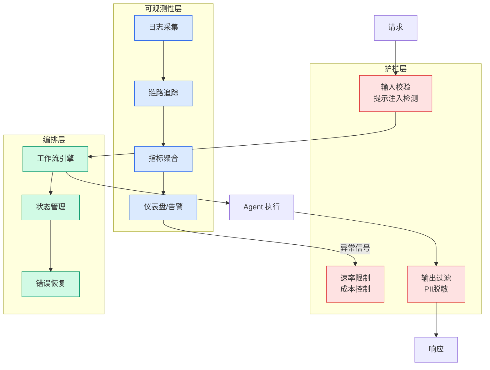

# 设计稿转代码（Design to Code）

## Ch09.007 设计稿转代码（Design to Code）

> 📊 Level ⭐ | 1.7KB | `entities/design-to-code.md`

# 设计稿转代码（Design to Code）

设计稿到代码的 AI 转化：从 Figma/截图到可运行前端代码。关键技术包括视觉理解、组件识别、布局推理、样式映射。淘宝前端团队的实践是该领域的代表。

## 深度分析

本页作为知识图谱锚点，连接了以下关键实体：[场景营销前端 AI Coding — AI Native 的视觉稿还原](../ch05/018-ai-native.html)。 相关主题通过 [场景营销前端 AI Coding — 从问题到方案](../ch05/111-ai-coding.html) 延伸。

> 本页内容将在入库相关溯源素材后进一步深化。

## 实践启示

1. 本领域系统性内容尚待采集——当前知识库在此方向的覆盖密度偏低
2. 建议优先采集 设计稿转代码（Design to Code） 相关的一手来源（论文/官方文档/工程博客）
3. 通过交叉链接密度评估本领域的知识图谱成熟度

## 相关实体

- [场景营销前端 AI Coding — AI Native 的视觉稿还原](../ch05/018-ai-native.html)
- [场景营销前端 AI Coding — 从问题到方案](../ch05/111-ai-coding.html)
- [视觉还原 AI 技术](../ch05/094-ai.html)
- [淘宝前端 AI 实践](https://github.com/QianJinGuo/wiki/blob/main/entities/taobao-frontend-practices.md)
- [Vibe Design ≠ Vibe Coding —— 资深设计师对 AI 前端工作流的哲学批判](../ch05/001-impeccable.html)

---

