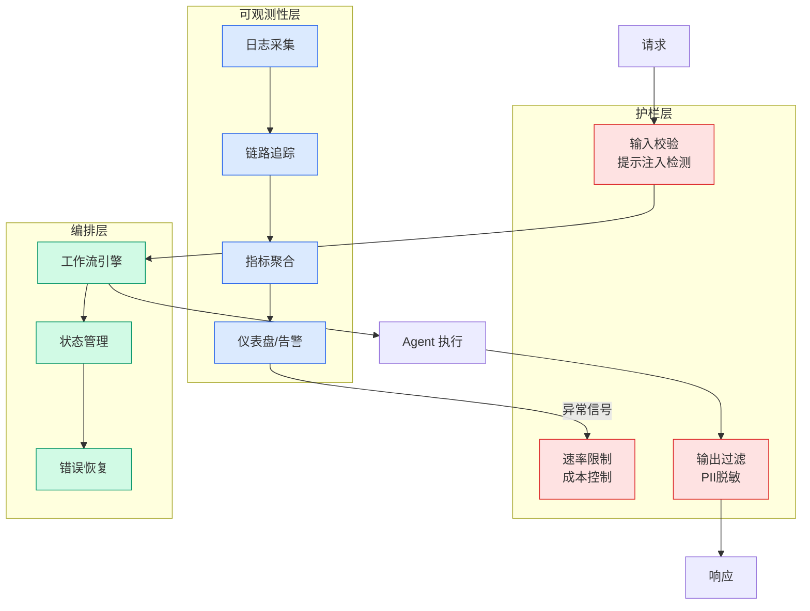

# Code is the easy part, or how we refactored half the business to fix a janky script | Swizec Teller

## Ch09.144 Code is the easy part, or how we refactored half the business to fix a janky script | Swizec Teller

> 📊 Level ⭐⭐ | 5.0KB | `entities/code-is-the-easy-part-or-how-we-refactored-half-the-business.md`

# Code is the easy part, or how we refactored half the business to fix a janky script | Swizec Teller

> Source: [Code is the easy part, or how we refactored half the business to fix a janky script | Swizec Teller](https://swizec.com/blog/code-is-the-easy-part-or-how-we-refactored-half-the-business-to-fix-a-janky-script) | Score: v*c=56

## Overview

Markdown Content:
This is a war story. The kind that puts timezones to shame. I think timezones are pretty easy, honestly. They're just the first time many of us deal with arbitrary capricious business rules.

Classic startup engineering story: Someone had built a leaky rowboat. It worked! Then we started flying the rowboat as a Cessna. What we needed was an aircraft carrier.

I love this shit 😈

## [[Some context](http://swizec.com/blog/code-is-the-easy-part-or-how-we-refactored-half-the-business-to-fix-a-janky-script#some-context)](http://swizec.com/blog/code-is-the-easy-part-or-how-we-refactored-half-the-business-to-fix-a-janky-script#some-context)

Plasmidsaurus has grown _very_ quickly. I [joined in August 2024](https://swizec.com/blog/some-personal-news/) and it felt like jumping on a galloping unicorn. The business was closing in on 20mil annual revenue and growing fast.

June 2026, we can see 100mil within reach. Huge milestone for a startup because it makes you a unicorn (1bil valuation). That's 5x growth in cold hard revenue over two years! Not bad.

But our billing system was built for a much smaller scale.

A creaky python script issued every invoice, customers called support to make billing changes and update their info, we granted every exception and weird rule you can think of. Anything to make customers happy.

After a few years our wonderful [ball of mud](https://swizec.com/blog/big-ball-of-mud-the-worlds-most-popular-software-architecture/) agglomerated so much tech and product debt it takes a whole team to keep running. The finance team even knows hundreds of customers by name! We have business rules that were never written down or put into code. Someone just knows what to do.

Month-end invoicing was always ... stressful. Sometimes it took an all-nighter or two to get everything invoiced in time! We maybe [let this small fire burn](https://swizec.com/blog/let-small-fires-burn/) too long 😅

Earlier this year my team started fixing the situation. This is the [spinning plates part of a startup](https://swizec.com/blog/yes-its-like-spinning-plates/), you hop problem to problem. The fix took a few months, we're not done, but end of May we ran invoicing with zero stress. It was wonderful.

Well okay I was pretty stressed. You only get to test this once a month and it was our first time running in automated mode end-to-end. It took 2 days instead of a whole week and I had a couple long evenings to fix UX problems we found during a test run.

## [[First make the problem simple, then solve the simple problem](http://swizec.com/blog/code-is-the-easy-part-or-how-we-refactored-half-the-business-to-fix-a-janky-script#first-make-the-problem-simple-then-solve-the-simple-problem)](http://swizec.com/blog/code-is-the-easy-part-or-how-we-refactored-half-the-business-to-fix-a-janky-script#first-make-the-problem-simple-then-solve-the-simple-problem)

Ok so, you have a billing system that runs in production and supports all your revenue. You know

→ [原文存档](https://github.com/QianJinGuo/wiki-book/tree/main/docs/raw/articles/code-is-the-easy-part-or-how-we-refactored-half-the-business.md)

---

