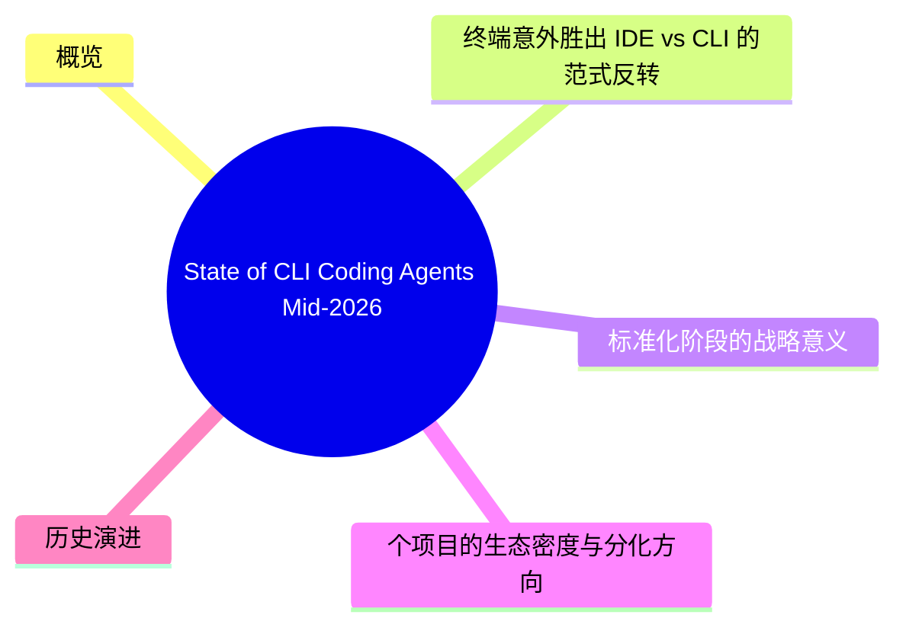
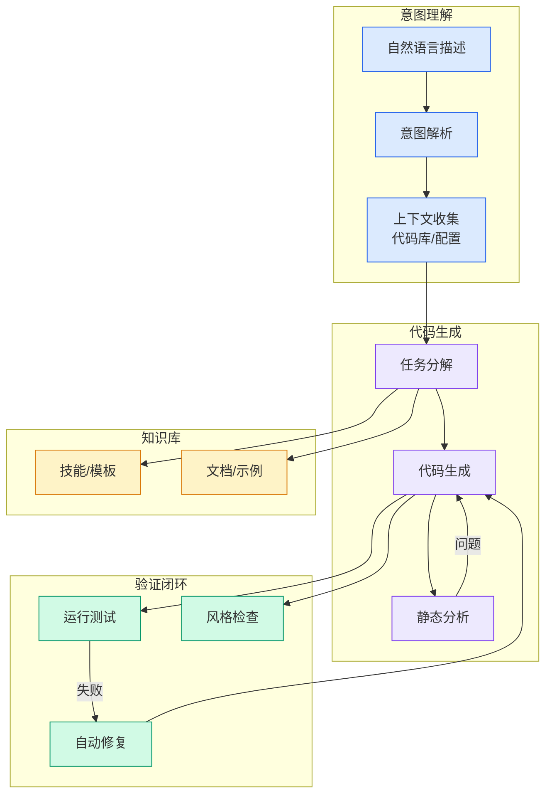

# State of CLI Coding Agents, Mid-2026

## Ch09.157 State of CLI Coding Agents, Mid-2026

> 📊 Level ⭐⭐ | 4.3KB | `entities/state-of-cli-coding-agents-mid-2026.md`

> **Background**: 本文基于社区博客对 2026 年中 CLI 编码代理生态系统的全面调查，涵盖 35 个活跃维护的 CLI 编码代理以及市场格局分析。

## 概念导图

## 概览

截至 2026 年 7 月，已有 35 个活跃维护的 CLI 编码代理（CLI coding agents）。终端（terminal）成为了意外的赢家——2024 年的赌注在 IDE（Copilot、Cursor），但到 2026 年中，重度使用场景从 CI、SSH 和无 GUI 的机器上运行。

## 深度分析

### 终端意外胜出：IDE vs CLI 的范式反转

2024 年行业共识押注 IDE 内嵌代理（Copilot、Cursor），认为编码代理的最佳交互界面是编辑器。到 2026 年中，现实却是 CLI 代理从 CI/CD 管道、SSH 会话、无 GUI 环境中爆发——终端成为了重型使用场景的事实标准。这一反转揭示了编码代理的真实使用模式：**自动化优先于交互**。CI 中的批量代码修改、远程服务器的故障排查、脚本化的工作流程都不需要 IDE 的 GUI 层。CLI 代理的可脚本性（scriptable）、可管道化（pipeable）特性使其与现有 DevOps 工作流无缝融合，而 IDE 代理始终被困在"开发者手动触发"的使用模式中。

### 标准化阶段的战略意义

Linux Foundation 在 2025 年 12 月成立 Agentic AI Foundation（AAIF）并接受 Anthropic 捐赠 MCP 协议，标志着 CLI 编码代理从"百花齐放"进入"标准化收敛"阶段。AAIF 的存在意味着：工具调用协议（MCP）、代理间通信、安全权限模型等基础架构层将由社区标准驱动而非单一厂商锁定。这对生态的影响类似于 Kubernetes 对容器编排的作用——上层创新加速、下层基础设施趋同。

### 35 个项目的生态密度与分化方向

35 个活跃维护的 CLI 编码代理意味着市场已进入红海竞争。差异化方向逐渐清晰：Aider 坚持 git-centric 的原子提交模式、gptme 演化为守护进程形态、Claude Code 定义了"全能型"标准、Codex CLI 和 Gemini CLI 以 Rust 重写追求性能。生态密度本身也成为壁垒——新入场者不仅需要与成熟工具竞争功能，还需要与既有的 hooks 生态、memory file 格式、permission 模型兼容。

## 实践启示

1. **选择编码代理时优先考虑 CLI 优先（CLI-first）的工具**：IDE 插件虽然交互体验更好，但 CLI 代理在自动化、CI 集成、远程开发等重型场景中具有不可替代的优势。
2. **关注 MCP/AAIF 标准兼容性而非单一厂商生态**：2026 年的市场分化阶段意味着提前押注 MCP 兼容的工具将在标准化完成后获得更长的生命周期。
3. **AI 编码代理的选型应考虑团队现有工作流集成成本**：CLI 代理的脚本化能力使其适合 DevOps 文化成熟的团队，而 IDE 代理更适合面向个体开发者的交互式场景。
4. **生态密度意味着新工具的门槛大幅提高**：除非有显著的差异优势，新 CLI 编码代理项目应从兼容现有标准（MCP、AAIF）开始而非另起炉灶。

## 历史演进

- **第一波（2023年）**: gptme（2023年3月）、Aider（2023年中）、Open Interpreter（2023年7月）——在"agent"这个术语普及之前就已存在
- **定义时刻**: Anthropic 的 Claude Code 研究预览（2025年2月）设定了标准形态——agentic loop、文件与 shell 工具、project memory file、权限提示、plan mode、hooks、子代理
- **跟进者**: OpenAI 推出 Codex CLI（2025年4月，后用 Rust 重写）、Google 推出 Gemini CLI（2025年6月）
- **标准化阶段**: Linux Foundation 于 2025 年 12 月成立 Agentic AI Foundation（AAIF），Anthropic 捐赠了 MCP 协议

→ [原文存档](https://github.com/QianJinGuo/wiki-book/tree/main/docs/raw/articles/state-of-cli-coding-agents-mid-2026.md)

> **相关实体**: [Cline Agent SDK](../ch03/035-agent.html), [Agent 形式化验证](../ch03/035-agent.html)

---

