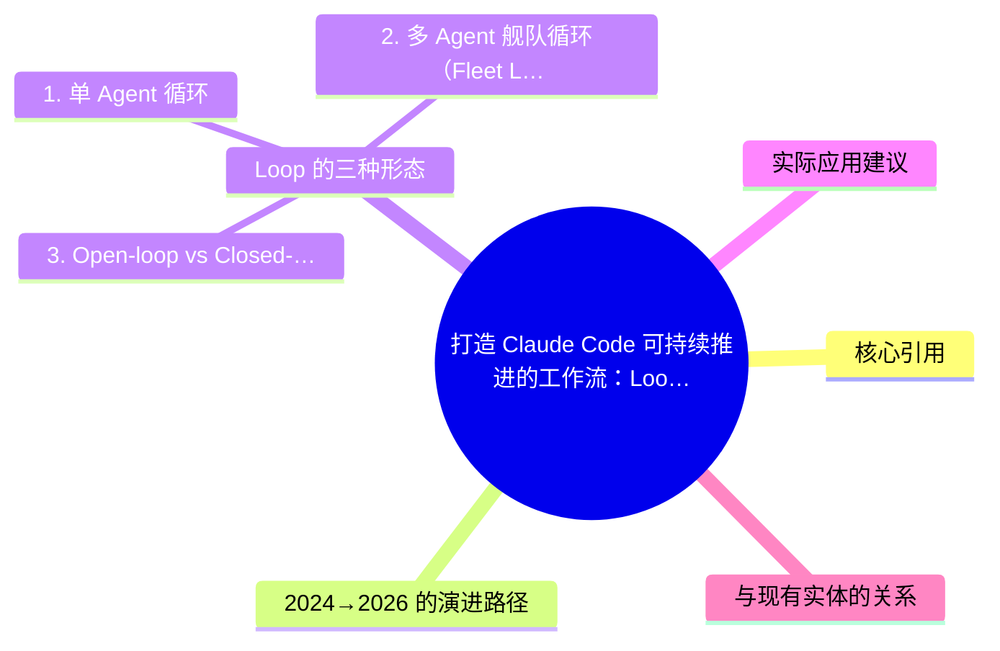
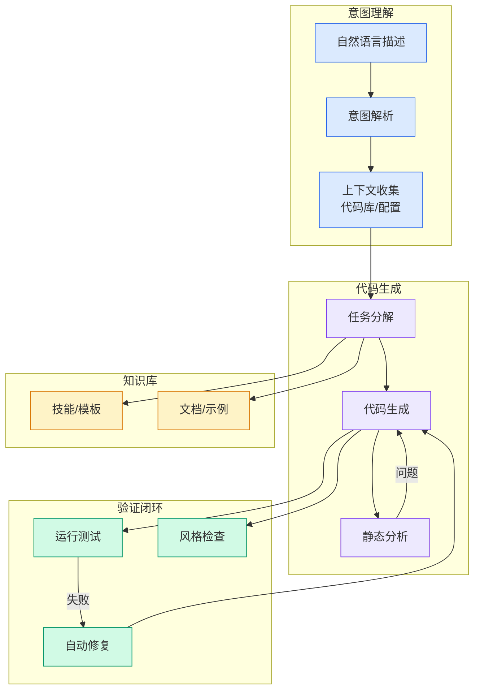

# 打造 Claude Code 可持续推进的工作流：Loop Engineering 完整上手攻略

## Ch09.158 打造 Claude Code 可持续推进的工作流：Loop Engineering 完整上手攻略

> 📊 Level ⭐⭐ | 4.2KB | `entities/loop-engineering-claude-code-sustainable-workflow.md`

# 打造 Claude Code 可持续推进的工作流：Loop Engineering 完整上手攻略

> **Background**<br>
> 本文来自技术极简主义公众号的深度整理，引用 Claude Code 负责人 Boris Cherny 的 Loop Engineering 理念，系统讲解了从 Prompt Engineering 到 Multi-Agent 再到 Loop Engineering 的演进路径、三种 Loop 形态以及 Open/Closed-loop 的核心区分。


## 概念导图



## 核心引用

Claude Code 负责人 Boris Cherny：

> "I'm no longer prompting Claude. I'm just running a loop that prompts him and then thinks about what to do next. My job is to write loops."
>
> 我不再亲自给 Claude 写提示词了。我只是在跑一个循环，让它自己给自己写提示词，自己思考下一步。我的工作是设计这个循环。

## 2024→2026 的演进路径




| 年份 | 范式 | 核心问题 |
|------|------|---------|
| **2024** | Prompt Engineering | 一句话怎么问得好 |
| **2025** | Multi-Agent Orchestration | 多个任务怎么分派得开 |
| **2026** | Loop Engineering | 整个流程怎么自己转得动 |

## Loop 的三种形态

### 1. 单 Agent 循环
最简单的形态：一个 Agent 自己在循环中反复迭代。

```
研究 → 起草初稿 → 对照目标检查 → 修复薄弱区域 → 重复，直到超出标准
```

### 2. 多 Agent 舰队循环（Fleet Loop）
更大规模的配置：一群 Agent 协同运转。

- **Orchestrator**（编排 Agent）：把大目标拆成多个碎片
- **Specialist**（专家 Agent）：处理特定领域任务
- **Sub-agent**（子代理）：执行更细粒度的任务

整个树状结构构成「发现 → 规划 → 执行 → 验证」的持续闭环。

### 3. Open-loop vs Closed-loop

| 维度 | Open-loop（开环） | Closed-loop（闭环） |
|------|------------------|------------------|
| 自由度 | 高，Agent 可自主探索多条路径 | 低，在人类预设的路径内运行 |
| Token 消耗 | 极高，自由探索吞掉大量 Token | 可控，路径受限所以预算可控 |
| 适用场景 | 探索性任务，创造未预先定义的结果 | 执行性任务，有明确目标和验收标准 |
| 当前成熟度 | 前景广阔，但成本是硬伤 | **这是当前真正产出成果的模式** |
| 核心风险 | 预算不设限的团队才玩得起 | 创造力被限制在框架内 |

## 实际应用建议

**Open-loop** 给 Agent 宽广的探索空间，让它可以尝试多条路径，创造出启动时没有完整定义的东西。方向是对的，但现实是——**90% 的人没有无限预算，Open-loop 在当下不现实**。

**Closed-loop** 是人预先设计端到端的 pass，Agent 在人类搭好的轨道上跑：

```
明确目标 
    ↓
定义好的步骤
    ↓
每步都有评估关卡
    ↓
到达停止条件，或交接给人（附带性能数据反馈）
```

每轮执行把学习传给下一轮，精度随执行次数递增。

## 与现有实体的关系

- 补充 [Agent Loop Engineering Handbook 8 Questions Chen Jin Tencent Self 2026](../ch05/004-loop-engineering.html) 的工程视角（本文更偏实操指南，陈进版更偏理论探讨）
- 与 [Agent Harness Architecture](../ch05/058-agent-harness.html) 形成架构+工程对照

---

→ [原文存档](https://github.com/QianJinGuo/wiki-book/tree/main/docs/raw/articles/loop-engineering-claude-code-sustainable-workflow.md)

---

