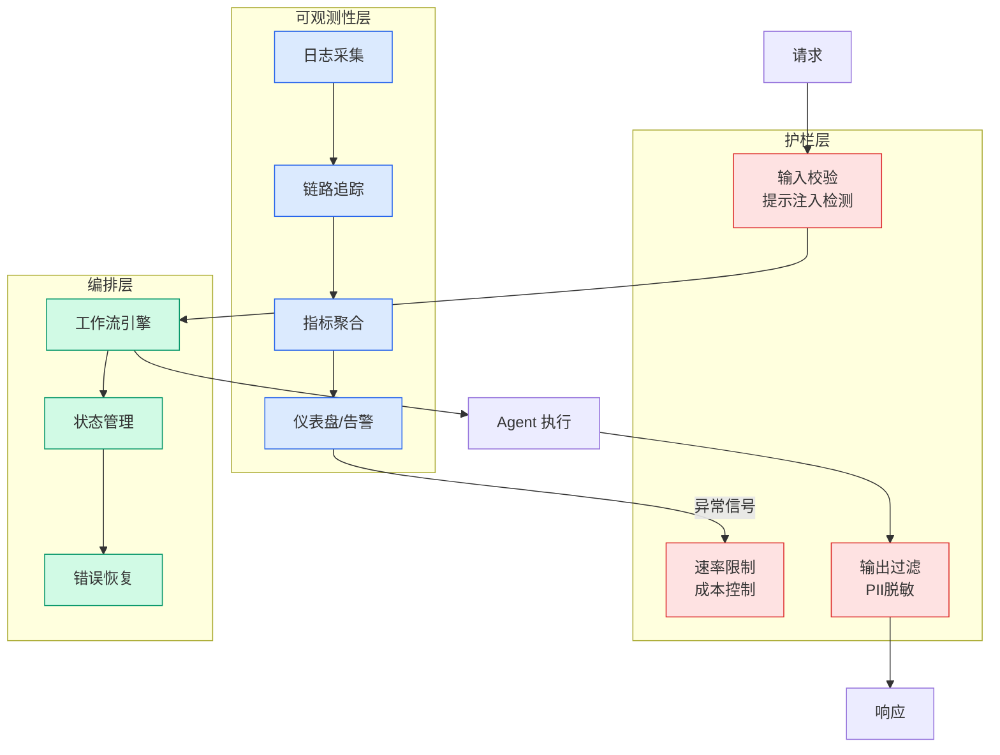

# The New Bottleneck: Theory of Constraints in the Age of AI Coding

## Ch09.159 The New Bottleneck: Theory of Constraints in the Age of AI Coding

> 📊 Level ⭐⭐ | 4.1KB | `entities/the-new-bottleneck-theory-of-constraints-ai-coding-tools.md`

# The New Bottleneck: Theory of Constraints in the Age of AI Coding

Stack Overflow 文章，将制造业的约束理论（Theory of Constraints）应用于 AI 编程工具时代。核心论点：当代码生成不再是瓶颈时，组织流程中的其他环节成为新的约束。

## 核心框架：从代码生成到流程瓶颈

**旧约束**：代码编写是软件开发的主要瓶颈。敏捷、冲刺、故事点、速度跟踪——所有这些组织基础设施都是为管理这一约束而设计的。

**新约束**：AI 编程工具释放了代码生成产能，但产能被以下四个新瓶颈吸收：

### 1. 需求与构思（Ideation & Requirements）

当代码廉价时，模糊或考虑不周的规格成本上升。AI Agent 会精确构建你描述的东西——如果描述不充分，返工不是 AI 的错。发现和需求的纪律性比以前更重要，而非更不重要。

### 2. 设计交接（Design Handoffs）

Intuit 工程总监 Eric Anderson 提出：当 UI 迭代成本几乎为零时，"设计完成"意味着什么？传统的设计交接模型——完整设计交给工程——在返工昂贵时有意义，但现在这个计算已经改变。等待完成的设计再开始构建只是增加延迟。

### 3. 审查与判断（Review & Judgment）

更多输出意味着更多审查面积。如果一位高级工程师现在监督的工作以前需要整个团队，代码审查和架构监督就成为瓶颈。当产出翻倍但审查能力不变时，必然要做出取舍。

### 4. 跨职能协调（Cross-functional Coordination）

工程团队的速度往往远超产品、设计、法务和安全团队的速度。这种不匹配会产生闲置的已完成工作——等待为更慢节奏设计的签字流程。

## 为什么流程变革如此困难

1. **跨职能性质**：可以强制工程师采用新工具，但不能强制产品组织重写发现流程
2. **旧流程的安全感**：敏捷已固化为它曾经替代的东西——提供舒适和可预测性
3. **没有人知道新流程长什么样**：Anderson 坦言"我们不知道如何做好这件事，我们在实验和学习"

## 实践建议

- **从问题出发而非框架**：对每个流程环节问"这个设计是为了解决什么约束？那个约束还存在吗？"
- **重新定义"可以开始构建"**：从完整规格+完成设计 → PM 和工程师实时共同开发
- **压缩想法到实验的距离**：AI 最大价值可能不是更快的代码生成，而是更快的学习——Intuit 从 2 个实验扩展到 900 个
- **将跨职能摩擦视为工程问题**：瓶颈在工程团队外部不意味着不是你的问题

## 与 Harness Engineering 的关联

本文的约束理论视角与 Harness Engineering 的核心理念高度一致：

- **Harness = 约束管理**：Agent Harness 的设计本质上是识别和管理 AI Agent 系统中的约束
- **代码生成不再是瓶颈**：当 LLM 可以生成代码时，真正的瓶颈转移到上下文管理、工具协调和质量验证
- **流程必须适应工具**：Agent Harness 不能只是"更好的工具"，必须伴随流程重新设计

## 相关实体

- [Harness Engineering 系统化框架](../ch05/120-harness-engineering.html) — 通用约束管理视角
- [Claude Code 大型代码库配置](../ch03/078-claude-code.html) — AI 编程工具的实际约束案例

---

