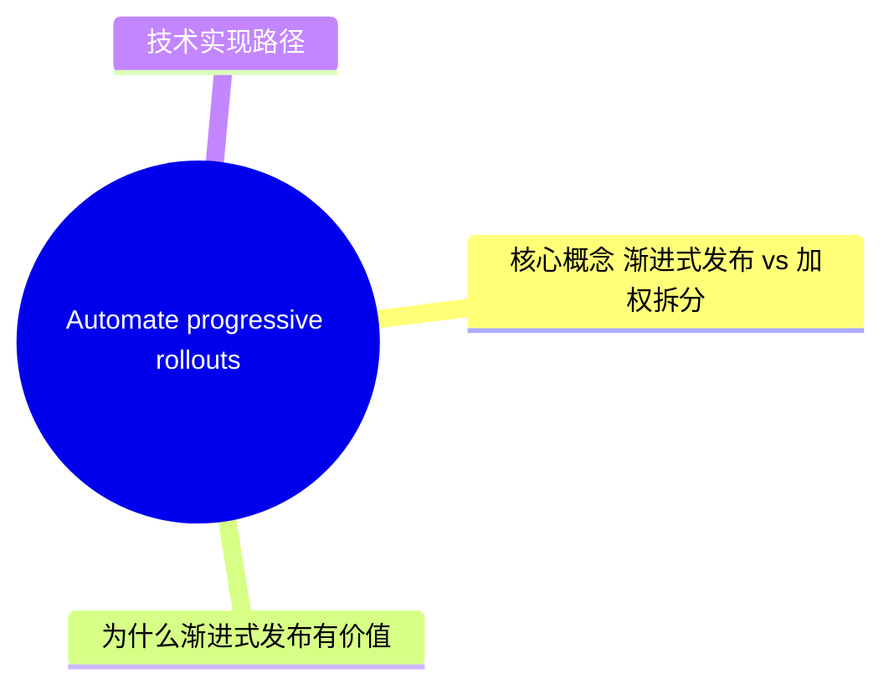
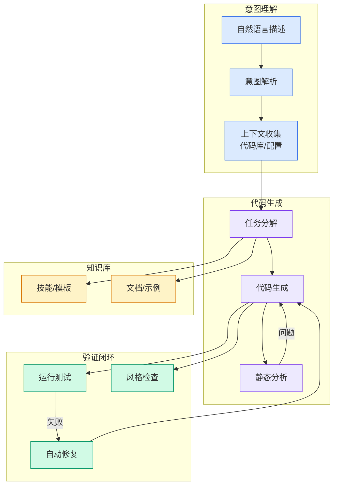

# Automate progressive rollouts with Vercel Flags - Vercel

## Ch09.162 Automate progressive rollouts with Vercel Flags - Vercel

> 📊 Level ⭐⭐ | 4.0KB | `entities/automate-progressive-rollouts-with-vercel-flags-vercel.md`

> -> [原文存档](https://github.com/QianJinGuo/wiki-book/tree/main/docs/raw/articles/automate-progressive-rollouts-with-vercel-flags-vercel.md)

## 概念导图

## 相关实体
> [主题导航](https://github.com/QianJinGuo/wiki/blob/main/moc/cloud-infrastructure.md)

## 深度分析

Vercel Flags 是 Vercel 平台推出的 Feature Flag 解决方案，本次更新新增 **渐进式发布（Progressive Rollouts）** 功能，属于 Feature Flag 策略中的「时间基权重」类型。

### 核心概念：渐进式发布 vs 加权拆分
传统加权拆分（如 A/B 测试）将流量固定分配，如始终保持 50/50 的分流比例。而渐进式发布则按照**预定义时间表**动态调整流量权重，每个阶段有目标百分比和持续时间。
这意味着：

- 初期：小比例流量（如 5%）进入新版本
- 中期：逐步提升至 50%
- 后期：接近 100%

### 为什么渐进式发布有价值
核心价值在于**降低回归风险**。当新版本有缺陷时，只影响当前阶段的小部分用户，而非全量用户。
典型场景：
1. **新功能灰度发布**：先覆盖内部用户，再逐步扩大
2. **配置变更验证**：数据库 schema 变更后，通过 flag 控制流量
3. **性能回归检测**：逐步增加流量便于观察监控指标

### 技术实现路径
文章提到两种使用方式：
1. **Dashboard 可视化配置**：通过 Vercel Flags 界面管理
2. **CLI 命令**：`vercel flags rollout` 命令，支持自动化管道集成
这意味着 CI/CD pipeline 中可以方便地编排渐进式发布，结合监控告警实现自动化回滚。

## 实践启示
1. **在 CI/CD 流程中集成渐进式发布**：结合监控指标（错误率、延迟）设置自动回滚阈值，当新版本指标恶化时自动降低流量比例。
2. **优先在高风险变更时使用**：数据库迁移、大幅重构、依赖升级等场景，建议通过渐进式发布逐步验证，而非全量上线。
3. **结合 Flags SDK 实现客户端感知**：Vercel 提供 Flags SDK，客户端代码可以据此条件渲染 UI，结合渐进式发布的百分比控制实现细粒度灰度。
4. **CLI 集成支持 GitOps 流程**：`vercel flags rollout` 适合在 GitOps 场景中使用，通过 Infrastructure as Code 管理发布策略，实现审计追溯。
> [!contradiction] 与传统 A/B 测试的权衡
> 渐进式发布侧重「时间维度」的风险控制，而加权拆分侧重「空间维度」的实验精确度。两者并非替代关系——渐进式发布适用于生产级变更，A/B 测试适用于产品决策验证。
## 相关实体
- [Nvidia Mcg Toolkit Model Documentation](https://github.com/QianJinGuo/wiki/blob/main/entities/nvidia-mcg-toolkit-model-documentation.md)

---

