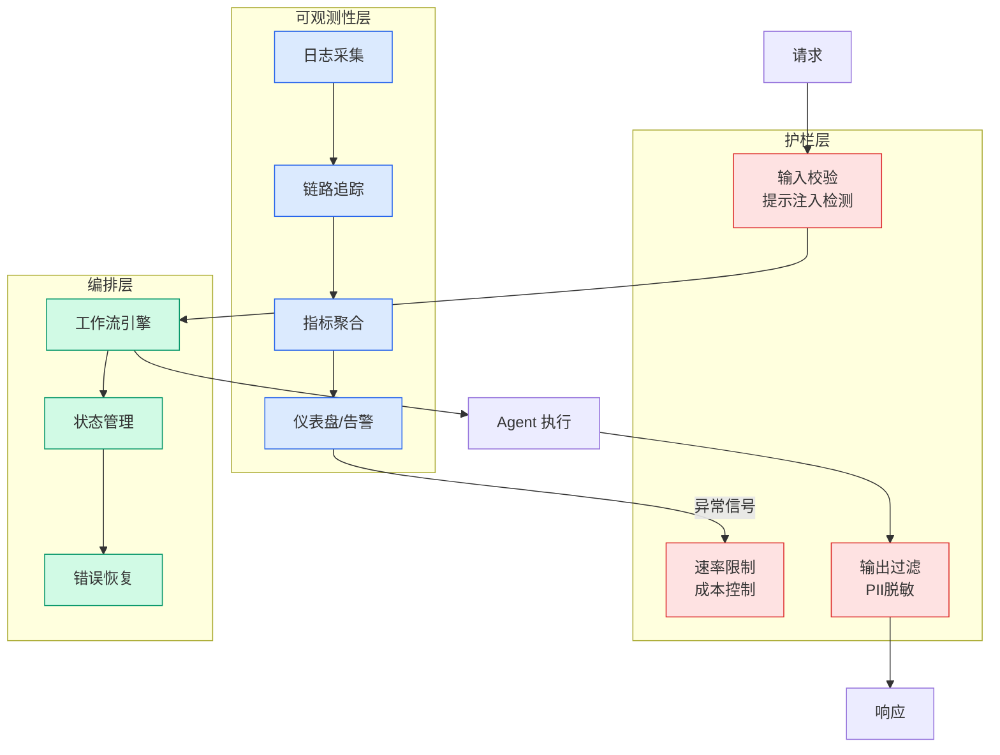

# AI 写前端 ≠ 设计 —— Anomaly 创始人对 Vibe Coding 哲学批判

## Ch09.165 AI 写前端 ≠ 设计 —— Anomaly 创始人对 Vibe Coding 哲学批判

> 📊 Level ⭐⭐ | 3.6KB | `entities/impeccable-anomaly-vibe-design-vs-vibe-coding.md`

# AI 写前端 ≠ 设计 —— Anomaly 创始人对 Vibe Coding 哲学批判

→ [原文存档](https://github.com/QianJinGuo/wiki-book/tree/main/docs/raw/articles/impeccable-anomaly-vibe-design-vs-vibe-coding.md)

## 深度分析

AI 写前端 ≠ 设计 —— Anomaly 创始人对 Vibe Coding 哲学批判 涉及agent领域的核心技术议题。
### 核心观点
1. # AI 写前端 ≠ 设计 —— Anomaly 创始人对 Vibe Coding 哲学批判
> 整理：Hermes Agent
> 原文：https://mp.
2. com/s/4_9q9TrkVyE5a4jCfTrNgg
## 一句话定位

**Anomaly Innovations 创始人（37 年设计 × AI 经验）公开撰文反驳 "vibe coding" 在前端的适用性**：代码能编译 ≠ 设计完成；vibe coding 适合软件工程，**不适合 design**——因为设计是定性的、主观的、上下文依赖的，AI 缺乏"判断"。
3. 6 个 AI 前端常见失败类别
1.
4. **色彩理论违反** —— 紫蓝渐变、对比度不足、品牌色胡乱搭配
2.
5. **可访问性问题** —— 颜色对比、键盘导航、ARIA 标签、screen reader 体验
3.

### 内容结构
- AI 写前端 ≠ 设计 —— Anomaly 创始人对 Vibe Coding 哲学批判
- 一句话定位
- 核心论点
- 1. "Vibe coding" 的边界
- 2. 6 个 AI 前端常见失败类别
- 3. 解决方案：Rule + Skill（不是 Rule-only）
- 4. 关于 Anomaly 的产品
- 哲学意义

### 技术要点

- **agent架构**: 本文在agent方向提出的设计理念与实现路径
- **工程挑战**: 实际落地中面临的关键问题与应对策略
- **ai-coding趋势**: 相关技术演进方向与新兴范式
### 关联实体

- [Karpathy 最新访谈从 Vibe Coding 到 Agentic Engineering](../ch04/237-agentic.html)
- [Ethan He Cosmos Grok Imagine Latent Space Video Agent 20260606](../ch03/035-agent.html)
- [Karpathy Vibe Coding Agentic Engineering](../ch04/126-karpathy-vibe-coding-agentic-engineering.html)
- [两万字详解Claude Code源码核心机制](../ch03/078-claude-code.html)
- [你不知道的 Agent原理架构与工程实践 V2](../ch03/035-agent.html)
- [龙虾装上了可以用来干啥分享下我的 Openclaw 多智能体团队搭建经验 V2](../ch11/235-openclaw.html)

## 实践启示
1. **工程落地**: agent领域方案需关注可观测性、可维护性和成本效率
2. **技术选型**: 根据场景选择合适的技术栈，避免过度设计或盲目追新
3. **持续迭代**: 建立数据驱动的反馈闭环，持续优化系统表现
4. **风险管控**: 引入新技术需评估对现有系统稳定性的影响，做好降级预案

## 相关实体

- [MOC](https://github.com/QianJinGuo/wiki/blob/main/moc/coding-agent-practice.md)

---

