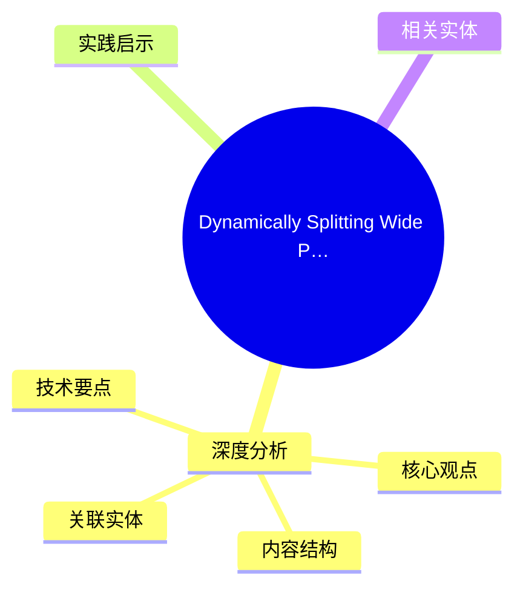
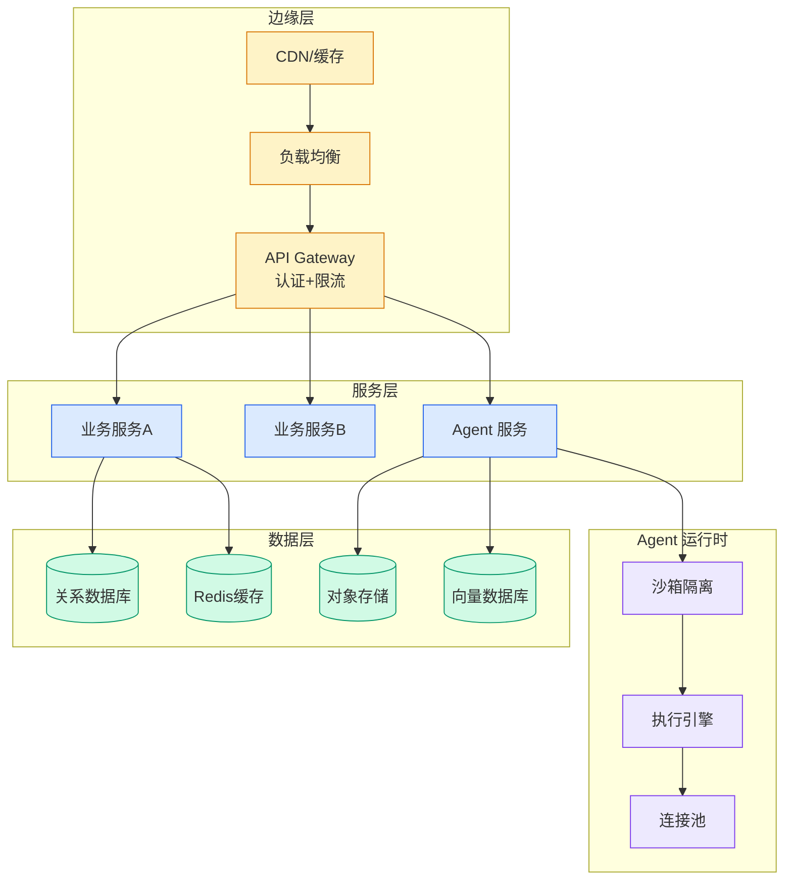

# Dynamically Splitting Wide Partitions in Cassandra for Time Series Workloads

## Ch09.168 Dynamically Splitting Wide Partitions in Cassandra for Time Series Workloads

> 📊 Level ⭐⭐ | 3.4KB | `entities/dynamically-splitting-wide-partitions-in-cassandra-for-time-.md`

# Dynamically Splitting Wide Partitions in Cassandra for Time Series Workloads

→ [原文存档](https://github.com/QianJinGuo/wiki-book/tree/main/docs/raw/articles/dynamically-splitting-wide-partitions-in-cassandra-for-time-.md)

## 概念导图

## 深度分析

Dynamically Splitting Wide Partitions in Cassandra for Time Series Workloads 涉及aws领域的核心技术议题。
### 核心观点
1. We use Apache Cassandra 4.
2. x as the underlying storage for these main reasons:
* **Throughput, latency, and cost** : Cassandra can handle millions of low‑latency reads and writes in a cost-effective manner.
3. * **Operational maturity** : Our data platform team has deep operational expertise running large Cassandra clusters in production.
4. However, using Cassandra at this scale introduces trade‑offs for TimeSeries workloads.
5. A key challenge is wide partitions, as TimeSeries dataset partitions can grow quite large with events accumulating over time.

### 内容结构
- Dynamically Splitting Wide Partitions in Cassandra for Time Series Workloads
- Introduction
- Impact of Wide Partitions
- TimeSeries Partitioning Strategy
- Picking the Partitioning Strategy
- The Problem with the Current Approach
- Solution 1: Time Slice Re-Partitioning
- Solution 2: Dynamic Partitioning per ID

### 技术要点

- **aws架构**: 本文在aws方向提出的设计理念与实现路径
- **工程挑战**: 实际落地中面临的关键问题与应对策略
- **code趋势**: 相关技术演进方向与新兴范式
### 关联实体

- [Scale Robot Reinforcement Learning With Nvidia Isaac Lab On ](../ch01/1170-scale-robot-reinforcement-learning-with-nvidia-isaac-lab-on.html)
- [Nvidia Isaac Lab Sagemaker Robot Rl Humanoid](https://github.com/QianJinGuo/wiki/blob/main/entities/nvidia-isaac-lab-sagemaker-robot-rl-humanoid.md)
- [存之有序治之有矩Agent 记忆系统的工程实践与演进](../ch03/035-agent.html)
- [Openclaw 完全指南这可能是全网最新最全的系统化教程了32W字建议收藏](../ch11/235-openclaw.html)
- [Agentops Operationalize Agentic Ai At Scale With Amazon Bedr](../ch04/299-agentops-operationalize-agentic-ai-at-scale-with-amazon-bed.html)
- [两万字详解Claude Code源码核心机制](../ch03/078-claude-code.html)

## 实践启示

1. **工程落地**: aws领域方案需关注可观测性、可维护性和成本效率
2. **技术选型**: 根据场景选择合适的技术栈，避免过度设计或盲目追新
3. **持续迭代**: 建立数据驱动的反馈闭环，持续优化系统表现
4. **风险管控**: 引入新技术需评估对现有系统稳定性的影响，做好降级预案

## 相关实体

- [MOC](https://github.com/QianJinGuo/wiki/blob/main/moc/observability-monitoring.md)

---

