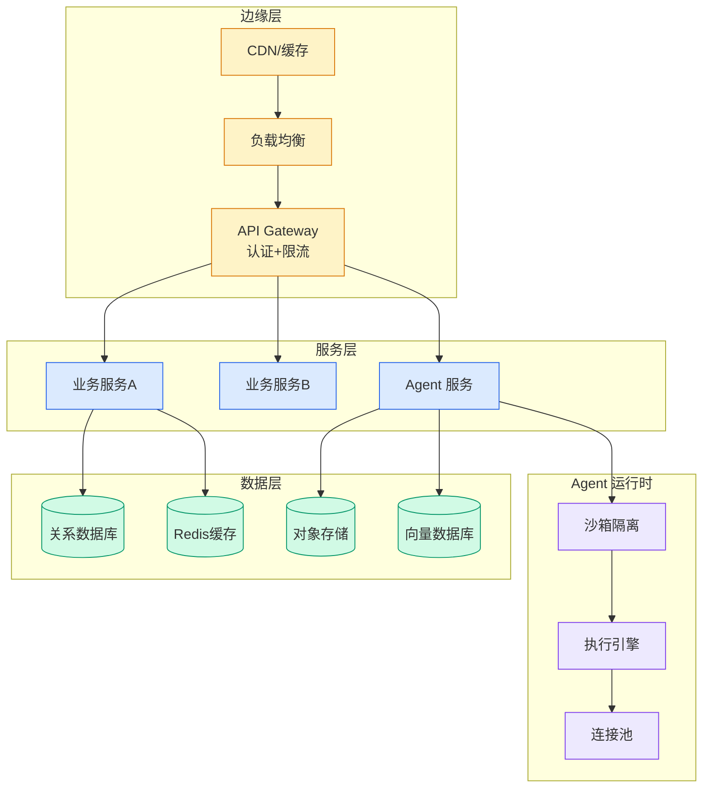

# How Baz improved its AI Agent Code Review accuracy using Amazon Bedrock AgentCore

## Ch09.169 How Baz improved its AI Agent Code Review accuracy using Amazon Bedrock AgentCore

> 📊 Level ⭐⭐ | 3.3KB | `entities/how-baz-improved-its-ai-agent-code-review-accuracy-using-ama.md`

# How Baz improved its AI Agent Code Review accuracy using Amazon Bedrock AgentCore

## 相关实体
- [linear code intelligence: controlled codebase access for lin](../ch01/913-20.html)
→ [原文存档](https://github.com/QianJinGuo/wiki-book/tree/main/docs/raw/articles/how-baz-improved-its-ai-agent-code-review-accuracy-using-ama.md)
- [aws bedrock agentcore equipment repair assistant — 农业机械 ai 诊](../ch11/272-aws-bedrock-agentcore-equipment-repair-assistant-ai.html)

- [MOC](https://github.com/QianJinGuo/wiki/blob/main/moc/data-infrastructure.md)
## 深度分析

How Baz improved its AI Agent Code Review accuracy using Amazon Bedrock AgentCore 涉及agent领域的核心技术议题。
### 核心观点
1. # How Baz improved its AI Agent Code Review accuracy using Amazon Bedrock AgentCore
Code review was always manual and ineffective because of the inherent disconnect between code and product.
2. Developers could review whether code compiled and worked, but not whether it fulfilled all functional and design requirements.
3. In the past, QA teams spent hours manually clicking through preview environments to ensure features behaved as expected, and even more time aligning implementations with design intent.
4. This manual validation slowed delivery, introduced inconsistency, and increased the likelihood of regressions.
5. With the increased velocity of development teams, Baz wanted to automate this missing layer of verification, bringing intent, behavior, and implementation into a single review workflow.

### 内容结构
- The key problems Baz is trying to solve
- Solution overview
- How Baz implemented Amazon Bedrock AgentCore to address these challenges
- Enabling intelligent code review with Amazon Bedrock
- Conclusion
- About the authors
- Guy Eisenkot
- Nimrod Kor

### 技术要点

- **agent架构**: 本文在agent方向提出的设计理念与实现路径
- **工程挑战**: 实际落地中面临的关键问题与应对策略
- **architecture趋势**: 相关技术演进方向与新兴范式
### 关联实体

- [Agentops Operationalize Agentic Ai At Scale With Amazon Bedr](../ch04/299-agentops-operationalize-agentic-ai-at-scale-with-amazon-bed.html)
- [存之有序治之有矩Agent 记忆系统的工程实践与演进](../ch03/035-agent.html)
- [Scale Robot Reinforcement Learning With Nvidia Isaac Lab On ](../ch01/1170-scale-robot-reinforcement-learning-with-nvidia-isaac-lab-on.html)
- [Nvidia Isaac Lab Sagemaker Robot Rl Humanoid](https://github.com/QianJinGuo/wiki/blob/main/entities/nvidia-isaac-lab-sagemaker-robot-rl-humanoid.md)
- [Openclaw 完全指南这可能是全网最新最全的系统化教程了32W字建议收藏](../ch11/235-openclaw.html)
- [Openclaw 完全指南这可能是全网最新最全的系统化教程了32W字建议收藏 V2](../ch11/235-openclaw.html)

## 实践启示
1. **工程落地**: agent领域方案需关注可观测性、可维护性和成本效率
2. **技术选型**: 根据场景选择合适的技术栈，避免过度设计或盲目追新
3. **持续迭代**: 建立数据驱动的反馈闭环，持续优化系统表现
4. **风险管控**: 引入新技术需评估对现有系统稳定性的影响，做好降级预案

---

