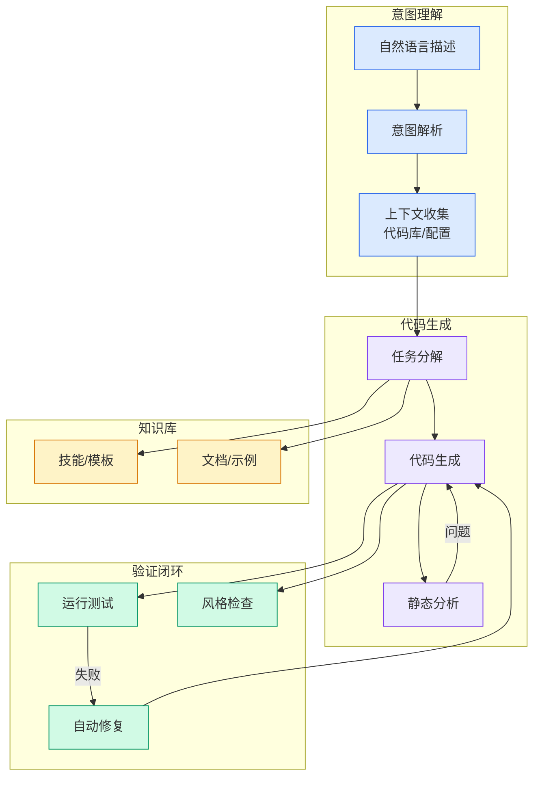

# OpenAI大神教你如何榨干Codex

## Ch09.171 OpenAI大神教你如何榨干Codex

> 📊 Level ⭐⭐ | 3.2KB | `entities/openai-codex-jasonliu-maxxing-playbook.md`

# OpenAI大神教你如何榨干Codex

→ [原文存档](https://github.com/QianJinGuo/wiki-book/tree/main/docs/raw/articles/openai-codex-jasonliu-maxxing-playbook.md)

## 深度分析

OpenAI大神教你如何榨干Codex 涉及agent领域的核心技术议题。
### 核心观点
1. "
案例：让 Codex 把 Python Rich 库迁移到 Rust——**硬性要求通过所有单元测试**。
2. 测试通过 = 任务完成；失败 = Agent 继续修。
3. ### Goal 模式（正式转正）
明确最终目标和验收标准 → Codex 自主持续推进（几小时到数天），中途可查进度/调方向/暂停。
4. ### Obsidian 本地记忆层
**核心思路**：个人工作记忆不应该托管在平台内部。
5. - 所有长期线程从 Obsidian vault 起步（TODO/people/projects/agent/notes）
- AGENTS.

### 内容结构
- OpenAI大神教你如何榨干Codex
- 核心心法
- 长期线程存活模式
- Heartbeats + @computer 组合拳
- 验证机制（最重要）
- Goal 模式（正式转正）
- Obsidian 本地记忆层
- Codex 侧边栏升级

### 技术要点

- **agent架构**: 本文在agent方向提出的设计理念与实现路径
- **工程挑战**: 实际落地中面临的关键问题与应对策略
- **code趋势**: 相关技术演进方向与新兴范式
### 关联实体

- [龙虾装上了可以用来干啥分享下我的 Openclaw 多智能体团队搭建经验 V2](../ch11/235-openclaw.html)
- [Openclaw 完全指南这可能是全网最新最全的系统化教程了32W字建议收藏 V2](../ch11/235-openclaw.html)
- [Openclaw 完全指南这可能是全网最新最全的系统化教程了32W字建议收藏](../ch11/235-openclaw.html)
- [Ethan He Cosmos Grok Imagine Latent Space Video Agent 20260606](../ch03/035-agent.html)
- [Agentops Operationalize Agentic Ai At Scale With Amazon Bedr](../ch04/299-agentops-operationalize-agentic-ai-at-scale-with-amazon-bed.html)
- [存之有序治之有矩Agent 记忆系统的工程实践与演进](../ch03/035-agent.html)

## 实践启示

1. **工程落地**: agent领域方案需关注可观测性、可维护性和成本效率
2. **技术选型**: 根据场景选择合适的技术栈，避免过度设计或盲目追新
3. **持续迭代**: 建立数据驱动的反馈闭环，持续优化系统表现
4. **风险管控**: 引入新技术需评估对现有系统稳定性的影响，做好降级预案

---

