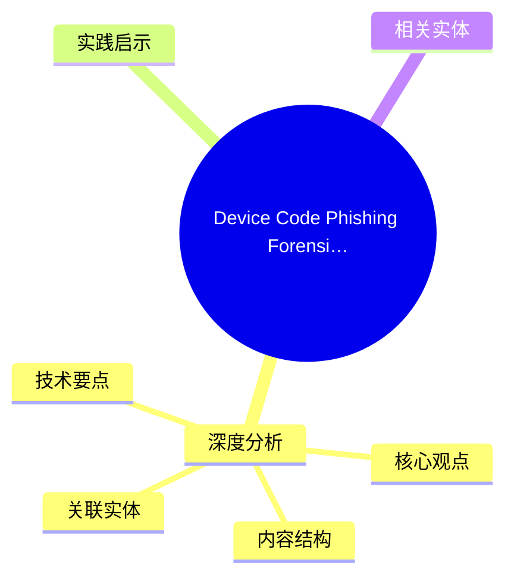
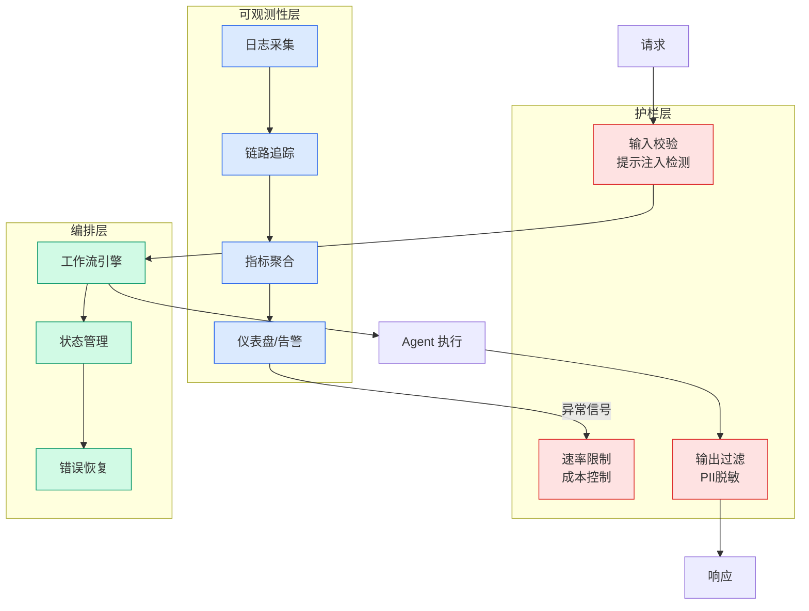

# Device Code Phishing Forensics: What We Learned from BEC Investigations in the Wild

## Ch09.172 Device Code Phishing Forensics: What We Learned from BEC Investigations in the Wild

> 📊 Level ⭐⭐ | 3.0KB | `entities/device-code-phishing-forensics-what-we-learned-from-bec-investigations-in-the-wi.md`

# Device Code Phishing Forensics: What We Learned from BEC Investigations in the Wild

→ [原文存档](https://github.com/QianJinGuo/wiki-book/tree/main/docs/raw/articles/device-code-phishing-forensics-what-we-learned-from-bec-investigations-in-the-wi.md)

## 概念导图

## 深度分析

Device Code Phishing Forensics: What We Learned from BEC Investigations in the Wild 涉及agent领域的核心技术议题。
### 核心观点
1. Over the years, attacks have evolved from simple pages that steal your password to full-blown attacker-in-the-middle proxies designed to bypass MFA and steal session tokens.
2. In this article, we explain how device code phishing is returning at scale, how users are tricked, and what defenders can do to prevent, detect, and investigate these attacks.
3. ## The return of device code phishing
April 1st started with the kind of phishing reports we receive all the time from customers.
4. While reviewing one of them that was clearly malicious, the initial analysis was “Oh yes, classic device code phishing”.
5. But more of them appeared, on the same day.

### 内容结构
- The return of device code phishing
- The forensics: why device code phishing is so hard to spot
- When the phishing page has no login form
- Stopping the attack at the source: browser-extension detection
- Catching static landing pages
- Catching single-page-application phishing kits
- Catching encrypted loaders (EvilTokens)
- Detecting device code phishing in Entra logs

### 技术要点

- **agent架构**: 本文在agent方向提出的设计理念与实现路径
- **工程挑战**: 实际落地中面临的关键问题与应对策略
- **code趋势**: 相关技术演进方向与新兴范式
### 关联实体

- [Karpathy 最新访谈从 Vibe Coding 到 Agentic Engineering](../ch04/237-agentic.html)
- [Karpathy Vibe Coding Agentic Engineering](../ch04/126-karpathy-vibe-coding-agentic-engineering.html)
- [存之有序治之有矩Agent 记忆系统的工程实践与演进](../ch03/035-agent.html)
- [两万字详解Claude Code源码核心机制](../ch03/078-claude-code.html)
- [Scale Robot Reinforcement Learning With Nvidia Isaac Lab On ](../ch01/1170-scale-robot-reinforcement-learning-with-nvidia-isaac-lab-on.html)
- [你不知道的 Agent原理架构与工程实践 V2](../ch03/035-agent.html)

## 实践启示

1. **工程落地**: agent领域方案需关注可观测性、可维护性和成本效率
2. **技术选型**: 根据场景选择合适的技术栈，避免过度设计或盲目追新
3. **持续迭代**: 建立数据驱动的反馈闭环，持续优化系统表现
4. **风险管控**: 引入新技术需评估对现有系统稳定性的影响，做好降级预案

## 相关实体

- [MOC](https://github.com/QianJinGuo/wiki/blob/main/moc/observability-monitoring.md)

---

