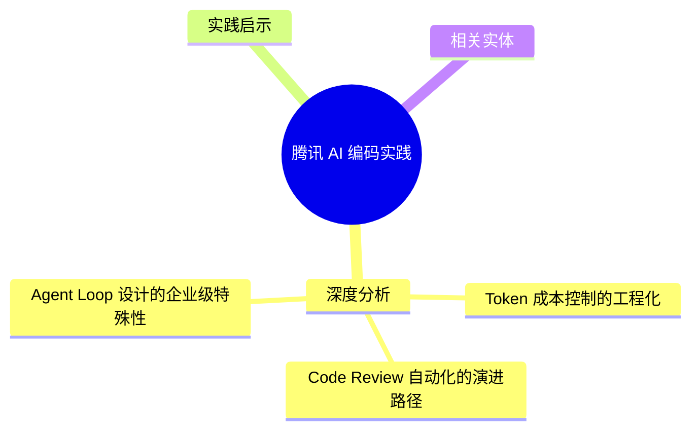
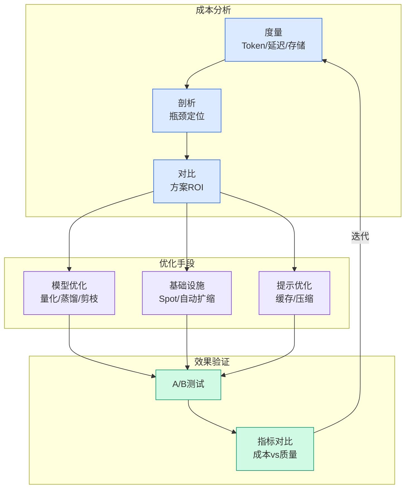

# 腾讯 AI 编码实践

## Ch09.176 腾讯 AI 编码实践

> 📊 Level ⭐⭐ | 2.7KB | `entities/tencent-ai-coding-practices.md`

# 腾讯 AI 编码实践

腾讯在 AI 编码方向的工程实践：涵盖 Token 成本控制、Code Review 自动化、Agent Loop 设计、Skill 工程化等多个维度。

## 概念导图

## 深度分析

### Token 成本控制的工程化

腾讯形成了完整的五层成本控制方法论：使用习惯（单 Session 单任务、及时 compact）→ 模型路由（按任务复杂度分档）→ 上下文工程（RTK、渐进式披露）→ 代码图谱（Graphify 预加载）→ Agent 架构（Subagent 隔离、Orchestrator-Worker）。形成一个"成本金字塔"：底层解决使用浪费，顶层解决架构效率。仅使用习惯优化可减少 30-50% 无效 Token，完整五层优化可降低 70-90% 总成本。

### Code Review 自动化的演进路径

腾讯采取"渐进式辅助"策略：初始阶段 AI 作为预审员（检测常见问题模式），进阶阶段 AI 作为协作者（理解业务逻辑上下文），最终形态 AI 作为仲裁者（在人类 Reviewer 分歧时提供第三方分析）。核心思想是在 AI Review 能力被充分验证之前，保持人工 Review 的最终决策权。

### Agent Loop 设计的企业级特殊性

企业级 Agent Loop 面临三大特有挑战：合规性——所有 Agent 行为必须可审计、可回溯；领域适配——通用 Loop 模式需与企业特有的工具链深度集成；团队协作——多开发者同时使用 Agent 时的工作隔离（Worktrees）和知识共享（Skills 沉淀）。腾讯的 SELF Protocol 正是在应对这些挑战中提出的实践方案。

## 实践启示

1. **成本优化从使用习惯开始**：单 Session 单任务、及时 compact 是最高性价比的成本控制手段，无需任何架构变更即可减少 30-50% Token 消耗。
2. **Code Review AI 化采用渐进策略**：先让 AI 做"预审员"（检测常见 bug 模式），再逐步升级为"协作者"。
3. **企业级部署内置审计**：所有 Agent 行为日志应从第一天开始设计，事后补审计日志是昂贵的重构。

## 相关实体

- [腾讯 AI Team 知识沉淀体系（Harness Engineering 实践）](../ch05/009-harness.html)
- [开启Harness Engineering探索之旅](../ch05/120-harness-engineering.html)
- [腾讯CDN LEGO Harness Engineering实战](../ch05/009-harness.html)
- [淘宝前端 AI 实践](https://github.com/QianJinGuo/wiki/blob/main/entities/taobao-frontend-practices.md)
- [World Knowledge：Agent推理前先探索环境生成可迁移知识](../ch04/289-world-knowledge-agent.html)

---

