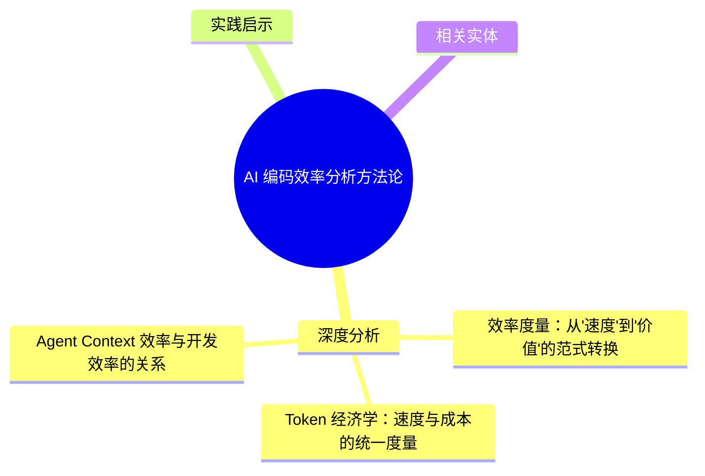
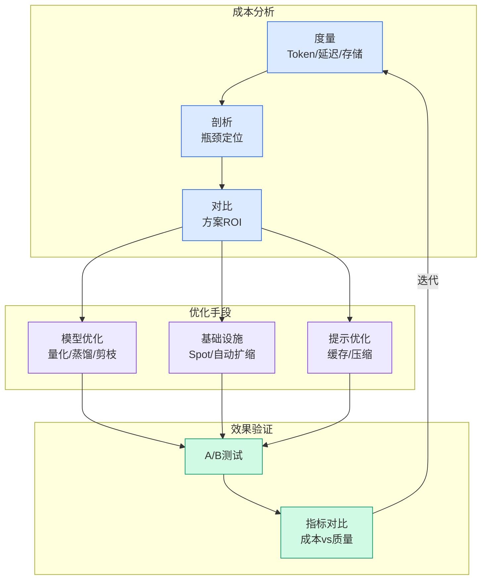

# AI 编码效率分析方法论

## Ch09.177 AI 编码效率分析方法论

> 📊 Level ⭐⭐ | 2.6KB | `entities/ai-coding-efficiency-analysis.md`

# AI 编码效率分析方法论

AI 编码效率的度量框架：不仅衡量代码生成速度，更需关注端到端交付周期、缺陷率、审查通过率、维护成本。Token 经济学与开发周期时间的平衡是关键。

## 概念导图

## 深度分析

### 效率度量：从"速度"到"价值"的范式转换

传统编码效率度量关注代码行数、功能点/人天等"产出速度"指标。AI 编码环境下，代码生成速度大幅提升，但生成不正确的代码比手工编写更快，修复成本更高。有效度量需要转向"端到端价值"：从需求提出到生产部署的完整周期、缺陷逃逸率、代码维护成本、审查通过率。

### Token 经济学：速度与成本的统一度量

Token 消耗是连接"开发速度"和"开发成本"的统一度量单位。在 AI 编码工作流中，"快"意味着更多 Token 消耗——但 Token 消耗有真实成本。有效分析必须将 Token 消耗与产出价值关联：每千 Token 产出的有效代码行、每百 Token 覆盖的代码路径数。这个视角帮助团队在成本-效率决策时有数据支撑。

### Agent Context 效率与开发效率的关系

Agent 上下文窗口的效率直接影响开发效率。当上下文被无关内容填充时（"上下文腐化"），代码生成质量系统性下降。因此上下文管理策略（渐进式披露、滑动窗口、检索增强）构成效率优化的前置条件。

## 实践启示

1. **放弃代码行数指标**：AI 编码环境下，代码行数是最具误导性的效率指标——应转向端到端交付周期和缺陷逃逸率。
2. **建立 Token 消耗基线**：为常见任务类型（新功能、bug 修复、重构）测量 Token 消耗基线，异常偏离是上下文腐化的早期信号。
3. **上下文管理先于效率优化**：在追求"生成更快"之前，先确保 Agent 看到的上下文是精确且相关的。

## 相关实体

- [How to Calculate the Inference Efficiency Ratio](https://github.com/QianJinGuo/wiki/blob/main/entities/how-to-calculate-the-inference-efficiency-ratio.md)
- [天猫新品营销技术团队AI编码实战指南（上）](../ch05/094-ai.html)
- [Karpathy 最新访谈：从 Vibe Coding 到 Agentic Engineering](../ch04/237-agentic.html)
- [ColaOS 与 AI 原生组织](https://github.com/QianJinGuo/wiki/blob/main/entities/colaos-listenhub-agency-native-organization-juzi.md)
- [规格驱动开发与 Harness](../ch05/009-harness.html)

---

