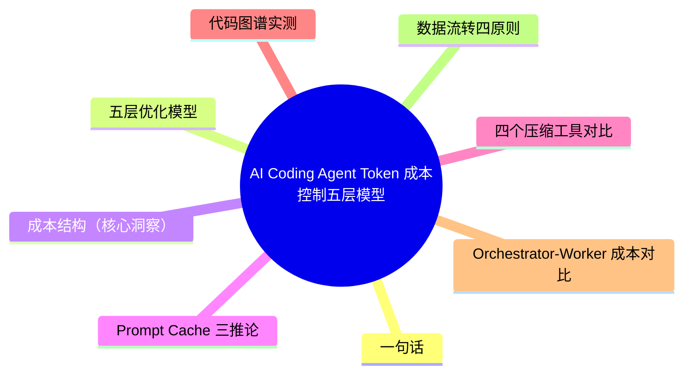
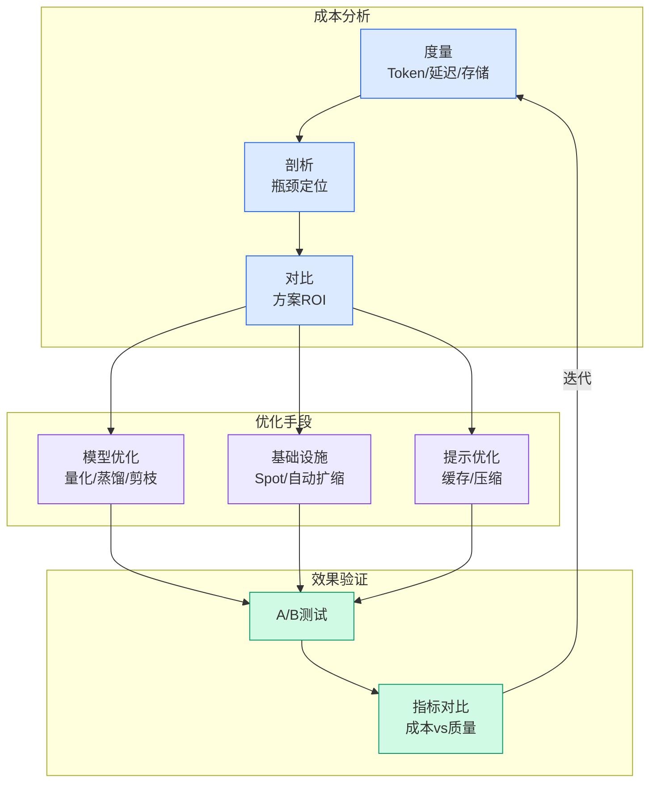

# AI Coding Agent Token 成本控制五层模型

## Ch09.180 AI Coding Agent Token 成本控制五层模型

> 📊 Level ⭐⭐⭐ | 4.9KB | `entities/token-cost-control-coding-agent-devinyzeng-tencent.md`

> 原文归档：[原文归档](https://github.com/QianJinGuo/wiki-book/tree/main/docs/raw/articles/token-cost-control-coding-agent-devinyzeng-tencent.md)

AI Coding Agent Token 成本优化的完整五层模型：使用习惯→模型路由→Context 工程→代码图谱→Agent 架构。devinyzeng/腾讯技术工程。

## 概念导图

## 一句话

**成本 = 重复上下文搬运，优化 = 减少重复 + 合理路由 + 精准检索 + 清晰分工。核心不是少问一句话，是让系统少重复做无效工作。**

## 五层优化模型

| 层级 | 解决什么 | 方法 |
|------|---------|------|
| 使用习惯 | 无意义历史和废 Token | 一 session 一事 / 及时 compact / 外置长期信息 / CLI 优先 |
| 模型路由 | 贵模型干便宜活 | 任务分档 / 升级链路 / 预算旋钮 / Skill 绑模型 |
| Context 工程 | 同样前缀重复发送 | RTK/Caveman/headroom/context-mode |
| 代码图谱 | 每次从零找代码 | Graphify/CodeGraph |
| Agent 架构 | 所有任务塞同一大上下文 | subagent 隔离 / Orchestrator-Worker |

## 成本结构（核心洞察）

典型请求分布：

- System Prompt 5K + 项目说明 10K + Skill 定义 20K + Tool/MCP 定义 30K + 历史会话 100K + 代码文件 50K + **用户问题 0.1K**
- **贵的是系统塞进去的东西，不是你写的那句话**

五种成本：输入 Token / 输出 Token / 推理 Token / **工具往返** / **重试**（后两项最易被低估）

## Prompt Cache 三推论

1. 省的是重复成本不是首次
2. 缓存是"写稳"不是"写短"
3. 缓存优化和上下文治理是一回事

## 四个压缩工具对比

| 工具 | 压缩什么 | 典型节省 |
|------|---------|---------|
| RTK | 终端命令输出 | 89%（vitest -99.6%） |
| Caveman | AI 回复输出 | 65-75% |
| headroom | 所有进上下文的内容 | 47-92%（可逆压缩） |
| context-mode | MCP 工具结果+会话连续性 | 98%（工具输出） |

## 代码图谱实测

- **Graphify**：Tree-sitter 知识图谱，-71.5× Token 消耗，22k stars
- **CodeGraph**：7 仓库 benchmark：-16pp 成本 / -47pp Token / -58pp Tool Call（vs 无 CodeGraph 基线）

## Orchestrator-Worker 成本对比

单 Agent 全程：215K tokens × N 轮 → Orchestrator 10K + Worker 14K + Worker 10K = **每轮压缩 5-10 倍**

端到端示例：Go API 重构，单 Agent 800K-1.2M → Orchestrator-Worker 100K-150K（**-70~85%**）

## 数据流转四原则

1. 输出格式结构化 JSON（自然语言跨 Agent 传递易歧义）
2. 进度文件追踪状态（.agent/progress.json）
3. Worker context 精心裁剪（Orchestrator 明确"只读哪些"）
4. 临时文件及时清理

## 六大误区

上下文越多越好 ✗ / MCP 越多越强 ✗ / 所有 Agent 上最强模型 ✗ / 聊天记录当长期记忆 ✗ / 只看单价不看总成本 ✗ / Prompt 越短越好 ✗

## 核心公式

更低成本 = 更少重复上下文 + 更合理模型路由 + 更精准代码检索 + 更清晰 Agent 分工

## 相关实体

- [Harness Engineering](../ch05/120-harness-engineering.html)
- [Claw-SWE-Bench](../ch05/009-harness.html) — Pareto 成本分析
- [快手 RCA Agent](../ch03/035-agent.html) — Workflow 快思考+Agent 慢思考
- [Skill 版本对比](../ch04/271-skill.html) — Token/时延门禁
- [12 Agent 设计模式](../ch03/035-agent.html) — 分层记忆+上下文隔离

---

