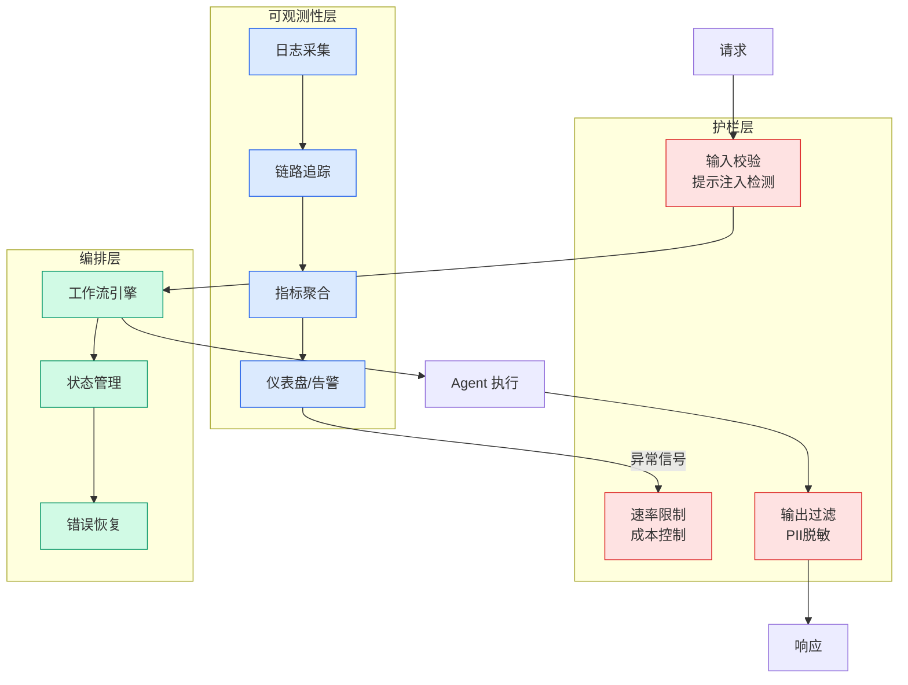

# Data Projects: Managing Data Assets at Netflix Scale

## Ch11.005 Data Projects: Managing Data Assets at Netflix Scale

> 📊 Level ⭐ | 3.9KB | `entities/data-projects-managing-data-assets-at-netflix-scale.md`

# Data Projects: Managing Data Assets at Netflix Scale

→ [原文存档](https://github.com/QianJinGuo/wiki-book/tree/main/docs/raw/articles/data-projects-managing-data-assets-at-netflix-scale.md)

# Data Projects: Managing Data Assets at Netflix Scale

#### _By_[ _Amer Hesson_](<https://www.linkedin.com/in/amer-hesson-0886a5a5/>) _,_[_Marcelo Mayworm_](<https://www.linkedin.com/in/mayworm/>) _,_[_James Mulcahy_](<https://www.linkedin.com/in/james-mulcahy-10493518/>) _, and_[ _Brittany Truong_](<https://www.linkedin.com/in/brittany-truong-a35b54bb/>)

### The Problem: Managing Assets at Netflix Scale

Netflix’s Data Platform is vast. We have millions of tables in our data warehouse and tens of thousands of scheduled workloads running across our orchestration systems. Behind each of these assets sits an engineer, a team, or an initiative — and behind each of those sits a set of decisions about _who_ can access _what_ , and _how_ those workloads execute day after day.

For years, the tools we used to manage access and identity for these assets operated at the granularity of the individual asset. Every table had its own Access Control List (ACL). Every workflow ran under the identity of the engineer who authored it. In a workforce that is fluid, where people change teams, change roles, and occasionally leave the company, this fine-grained model broke down in two persistent, painful ways.

### Problem 1: Permissions that can’t keep up with organizational changes

Imagine you’re on a team that owns a few hundred tables. Your org restructures, a neighboring team merges into yours, and you inherit another few hundred. Now you have to find every ACL on every table, figure out who should still have access, and update them one by one. Multiply that by every reorg across every team across the company. The result? Two failure modes:

  1. **The support team gets flooded.** A significant and outsized share of support threads were requests to update table permissions en masse in response to org changes. While self-service tooling and best practices are in place to manage this, adherence is inconsistent. Data Projects addresses this by promoting the solution from optional tooling to a foundational part of the data platform.
  2. **Access gets granted far too broadly.** Rather than maintain fine-grained ACLs, teams would often open up table access to the whole company. This defeated the purpose of having ACLs in the first place.

### Problem 2: Workloads tied to human identities

Scheduled and asynchronous workloads — [Maestro](<https://netflixtechblog.com/maestro-netflixs-workflow-orchestrator-ee13a06f9c78>) workflows, data movement jobs, Spark pipelines — need an identity to run as. Historically, that was a _human_ : whoever authored the workflow.

Human identities are not durable. People change teams, get new responsibilities, and leave the company. When they do, their permissions change, and the workflows running under their identity start to fail. The only fix was to swap in a colleague’s identity, which inevitably had _different_ permissions, kicking off a “permissions whack-a-mole” as each fix surfaced the next missing grant. And then, eventually,

---
## 关联

- 相关概念: [Harness Engineering](https://github.com/QianJinGuo/wiki/blob/main/concepts/harness-engineering-framework.md)

---

