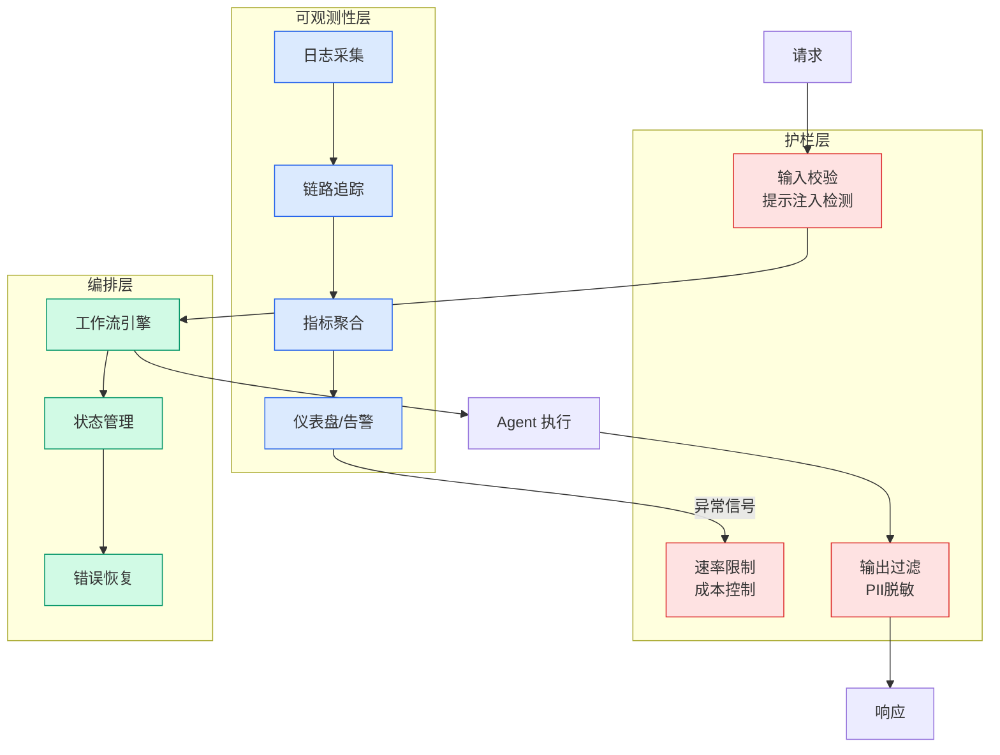

# Introducing Grok on Amazon Bedrock — Grok 4.3 GA with Mantle Inference Engine

## Ch11.235 Introducing Grok on Amazon Bedrock — Grok 4.3 GA with Mantle Inference Engine

> 📊 Level ⭐⭐ | 5.0KB | `entities/grok-43-ga-amazon-bedrock.md`

# Introducing Grok on Amazon Bedrock — Grok 4.3 GA with Mantle Inference Engine

xAI's Grok 4.3 is now generally available on Amazon Bedrock, marking xAI's entry as a model provider on the platform. Grok 4.3 runs on Mantle, Amazon Bedrock's next-generation inference engine, and uses OpenAI-compatible APIs.

## Key Capabilities

### Configurable Reasoning Effort
Grok 4.3 supports four effort levels controlled per-request via the `reasoning` parameter: `none` (disables reasoning), `low` (default), `medium`, and `high`. Higher effort improves accuracy on multi-step problems at the cost of more output tokens. Classification and extraction can run at `none` for low latency; contract analysis and case law tasks use `high` when depth matters.

### Model Parameters
- **Context window**: 1 million tokens (for long documents and multi-turn sessions)
- **Input**: Text and image (PNG/JPEG)
- **Output**: Text
- **Defaults**: `temperature` = 0.7, `top_p` = 0.95, `max_completion_tokens` = 131072
- **Model ID**: `xai.grok-4.3`

### Mantle Inference Engine
Grok 4.3 runs on Mantle, which uses OpenAI-compatible APIs. The endpoint URL is Region-specific (e.g., `https://bedrock-mantle.us-west-2.api.aws/openai/v1`). Authentication supports both long-term Amazon Bedrock API keys (for exploration) and short-term bearer tokens from IAM credentials (for production).

### Tool Calling & Structured Output
- Supports standard OpenAI tool-calling with JSON Schema parameter definitions
- `tool_choice: "auto"` lets the model decide when to call a tool
- Structured output via `json_schema` response format with strict mode (`additionalProperties: false`)
- One operational note: requests occasionally return 400 from automated content safety checks even on benign input — build a short retry into production calls

### Stateful Conversations
The Responses API supports server-side conversation state via `store=True` and `previous_response_id`. The service retains each turn's reasoning and feeds it back automatically. Encrypted reasoning is available for stateless use (`store=False`) with `include=["reasoning.encrypted_content"]`.

## Service Tiers & Regional Availability

| Tier | Description |
|------|-------------|
| Standard | Pay-per-token, no commitment |
| Priority | Preferential queue processing, higher per-token price |
| Flex | Lower-cost access, not time-sensitive |

Grok 4.3 uses in-Region inference only (no Geo or Global cross-Region inference at launch). Example Region: `us-west-2`.

## Comparison with Grok 4.5

Grok 4.3 is the predecessor to Grok 4.5. While Grok 4.3 offers a 1M token context window and runs on Bedrock via Mantle, Grok 4.5 uses a 500K context window with 1.5T parameters on the V9 base. Grok 4.3 is positioned for production workloads that need the full 1M context at lower pricing ($1.25/$2.50 per million input/output tokens vs Grok 4.5's $2/$6).

## Practical Guidance

1. **Match reasoning effort to task complexity**: Use `none` for classification/extraction, `low` for short factual lookups, `high` for planning steps and multi-step chains where early mistakes derail the task.
2. **Use short-term credentials in production**: Long-term API keys are convenient for exploration but should be deleted after testing. Short-term bearer tokens from IAM credentials keep access tied to your identity and expire automatically.
3. **Build retry logic for structured output**: The automated content safety check can return 400 on benign input — a short retry loop mitigates this in production.
4. **For image input, validate encoding**: Malformed or truncated base64 image payloads return a `validation_error` rather than a best-guess answer.
5. **Consider service tiers**: Standard for pay-per-token, Priority for guaranteed throughput, Flex for cost-sensitive batch workloads.

## Related Entities

- [Grok 4 5 Model Release Xai 2026 07](../ch05/092-ai.html) — Grok 4.5 model release (successor model)
- [Cursor让马斯克的Grok45咸鱼翻身追平Opus 48成本比Glm52还低](https://github.com/QianJinGuo/wiki/blob/main/entities/cursor让马斯克的grok45咸鱼翻身追平opus-48成本比glm52还低.md) — Cursor + Grok 4.5 depth analysis
- [Xai Dissolved Grok Colossus2 Analysis](../ch05/092-ai.html) — xAI Colossus cluster analysis
- [Openai Models Codex Amazon Bedrock Ga](ch11/291-amazon-bedrock.html) — OpenAI models on Bedrock GA
- [Gpt 56 Sol Terra Luna Tiered Pricing Codex Merge 2026](../ch01/519-codex.html) — GPT-5.6 on Bedrock

→ [原文存档](https://github.com/QianJinGuo/wiki-book/tree/main/docs/raw/articles/introducing-grok-on-amazon-bedrock.md)

---

