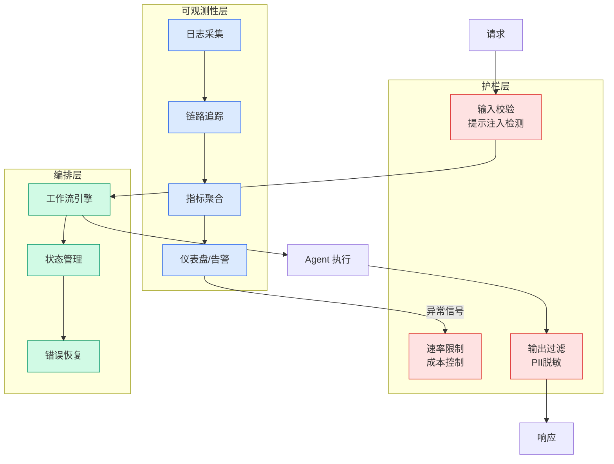

# The Data Canary: How Netflix Validates Catalog Metadata

## Ch11.236 The Data Canary: How Netflix Validates Catalog Metadata

> 📊 Level ⭐⭐ | 4.5KB | `entities/the-data-canary-how-netflix-validates-catalog-metadata.md`

# The Data Canary: How Netflix Validates Catalog Metadata

→ [原文存档](https://github.com/QianJinGuo/wiki-book/tree/main/docs/raw/articles/the-data-canary-how-netflix-validates-catalog-metadata.md)

# The Data Canary: How Netflix Validates Catalog Metadata

By [Celina Amados](<https://www.linkedin.com/in/celina-amados/>)

_At Netflix, our catalog metadata is crucial to our member experience, and a single corrupted data state can impact millions of viewers immediately. To protect streaming reliability, we built an automated data canary system that validates data transformations using production traffic. This canary detects issues in under 10 minutes, and blocks bad data from reaching our members._

### Intro

Catalog metadata is what makes Netflix functional. It defines what titles exist, where they’re available, whether they can be played, and more. This data gets transformed and distributed across our vast infrastructure near-continuously, powering everything that helps members find what they want to watch. Accurate catalog data delivers moments of joy. Corrupted catalog data breaks streaming.

### What Went Wrong

A production incident revealed a critical gap in our resilience strategy. No code had been deployed. No configuration had changed. But, a manual mitigation action taken during a previous incident had inadvertently corrupted a data feed, rendering it empty for a subset of titles.

The impact was immediate: missing metadata prevented manifest generation, causing failures in our catalog service and playback issues.

Engineers were alerted immediately, but identifying the root cause took time. After intense triaging, responders pinpointed the corrupted data feed and pinned services back to a known-good state, restoring playback.

The problem? **Our sophisticated code canary deployments had caught nothing.** No code had changed — the data had.

This incident exposed a fundamental gap in our resiliency capabilities: we can validate code deployments, but we had no equivalent for our high-velocity data pipelines. Our catalog metadata, consisting of titles, artwork, availability, and more, was continuously transformed from multiple upstream sources and published at a regular cadence. Each upstream source had its own validation, but these checks didn’t catch corruption in the final transformed output.

**We needed to treat data deployments with the same rigor as code deployments.**

### The Challenge: Validating Data at Short Intervals

Our catalog metadata service operates as a high-velocity data pipeline: it processes multiple input feeds, transforms them, and publishes the final catalog state that gets distributed across our infrastructure.

This creates unique validation challenges that our traditional canary analysis tools aren’t designed to handle:

**Time Constraints** : Our existing canary analysis tools require 30–60 minutes to reach statistical confidence. We had a much shorter window between data cycles; we needed to detect issues, make a decision, and block publishing all within a single cycle.

**Emergent Issues** : While each upstream data source has independent validation, problems often only manifest in the final transform

---

