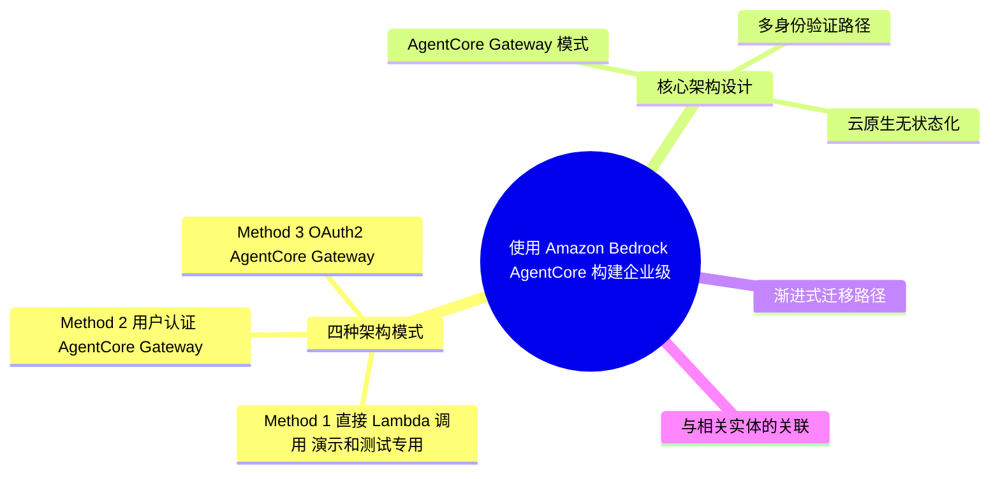
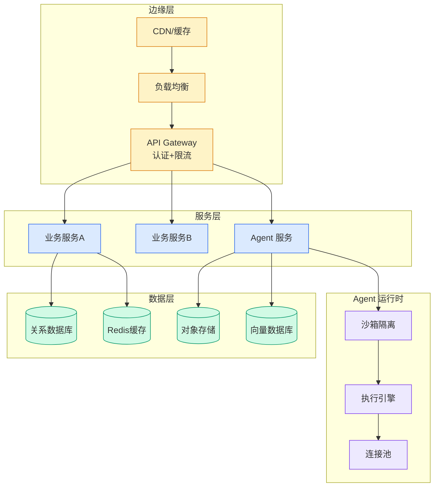

# 使用 Amazon Bedrock AgentCore 构建企业级 MCP 服务器：四种架构模式

## Ch11.237 使用 Amazon Bedrock AgentCore 构建企业级 MCP 服务器：四种架构模式

> 📊 Level ⭐⭐ | 5.0KB | `entities/使用-amazon-bedrock-agentcore-构建企业级-mcp-服务器四种架构模式.md`

# 使用 Amazon Bedrock AgentCore 构建企业级 MCP 服务器：四种架构模式的实践指南

AWS China Blog 2026-07-29 发布的深度技术文章，系统地介绍了使用 Amazon Bedrock AgentCore 构建企业级 MCP 服务器的四种架构模式及其渐进式迁移路径。

## 概念导图

## 四种架构模式

### Method 1：直接 Lambda 调用（演示和测试专用）
绕过所有中间层，MCP 客户端直接通过 AWS SDK 调用 Lambda 函数。最快上手，但不支持标准 MCP 客户端、多用户场景和公网暴露。仅用于 PoC 和开发调试。

### Method 2：用户认证 + AgentCore Gateway
利用 Amazon Bedrock AgentCore 的原生 MCP 协议支持。客户端通过 Amazon Cognito 用户池认证，获取 JWT 令牌后调用 AgentCore Gateway。支持用户级认证，完全兼容 MCP 协议，适合企业内部多团队使用。

### Method 3：OAuth2 + AgentCore Gateway
代表最高级别的企业安全实现。客户端通过 Cognito OAuth2 客户端凭证流获取令牌，使用 Bearer Token 调用 AgentCore Gateway。提供最高安全性和完整 MCP 协议兼容性。

### Method 4：API Key + API Gateway
通过 Amazon API Gateway + Lambda Proxy 架构向外部客户暴露 MCP 服务。Lambda Proxy 作为 API Gateway 和 AgentCore 之间的协议转换层，将 API Gateway 的标准 HTTP 请求转换为 AgentCore 可以理解的 MCP 协议。适合公网暴露的外部客户接入场景。

## 核心架构设计

### AgentCore Gateway 模式
通过引入 AgentCore Gateway 实现了从单点连接到中心化网关的架构演进，本质上是在探索 MCP-as-a-Service 的概念。网关层统一管理多个 MCP 服务端、实现协议版本透明升级、提供统一监控和日志、支持动态工具发现和路由。

### 多身份验证路径
项目区分 API Key、OAuth2 和直接调用三种认证方式，解决了"如何在公网安全地暴露 MCP 服务"的关键痛点。分层的认证设计让不同安全等级的应用都能找到合适的接入方式。

### 云原生无状态化
利用 AWS Lambda 处理 Tool 逻辑，将 MCP 这种基于长连接的有状态协议适配到无状态 Serverless 环境。实现自动扩缩容、按需付费、零运维成本。

## 渐进式迁移路径

| 阶段 | 架构 | 适用场景 |
|------|------|---------|
| 第一阶段：快速验证 | Method 1（直接 Lambda） | PoC 验证 MCP 工具可行性 |
| 第二阶段：内部部署 | Method 2（用户认证 + AgentCore） | 企业内部多团队使用 |
| 第三阶段：企业级安全 | Method 3（OAuth2 + AgentCore） | 敏感数据/严格安全要求 |
| 第四阶段：公网暴露 | Method 4（API Gateway + API Key） | 外部客户服务 |

关键优势：整个迁移过程中，MCP 工具本身不需要修改，只需更改客户端配置。

## 与相关实体的关联

→ [原文存档](https://github.com/QianJinGuo/wiki-book/tree/main/docs/raw/articles/使用-amazon-bedrock-agentcore-构建企业级-mcp-服务器四种架构模式.md)

这一架构设计与以下实体相关：
- [AgentCore Harness](../ch04/689-agentcore-harness.html) — AgentCore 基础能力
- [AgentCore Managed Harness](../ch04/224-agentcore-managed-harness.html) — 托管式 AgentCore
- [Bedrock AgentCore 质量评估与策略控制](../ch04/561-amazon-bedrock-agentcore.html) — AgentCore 的评估治理能力
- [Bedrock AgentCore Gateway MCP Extension](../ch04/561-amazon-bedrock-agentcore.html) — AgentCore Gateway MCP 扩展
- [Anthropic 12 MCP Production Patterns](../ch01/989-anthropic.html) — MCP 生产模式参考
- [AgentOps + Bedrock](ch11/295-amazon-bedrock.html) — Agent 运维
- [Smartsheet Remote MCP Server on AWS](https://github.com/QianJinGuo/wiki/blob/main/entities/smartsheet-remote-mcp-server-aws-architecture.md) — MCP 服务器架构参考

---

