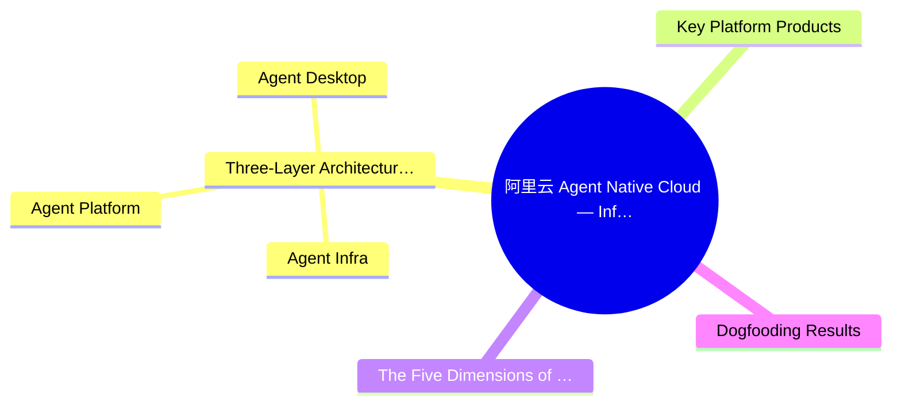
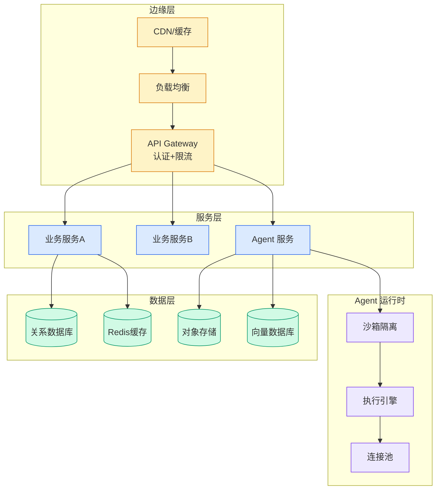

# 阿里云 Agent Native Cloud — Infra-Platform-Desktop Three-Layer Architecture

## Ch11.244 阿里云 Agent Native Cloud — Infra-Platform-Desktop Three-Layer Architecture

> 📊 Level ⭐⭐ | 4.4KB | `entities/aliyun-agent-native-cloud.md`

# 阿里云 Agent Native Cloud

阿里云 Agent Native Cloud is `Alibaba Cloud`'s three-layer architecture for making agents a native enterprise capability. Presented by Zhou Qi (简志), head of Alibaba Cloud's cloud-native application platform, at the World AI Conference, it defines how enterprises can evolve from building individual agent demos to operating agents as **controllable, reusable, collaborative, and evolving organizational assets**.

## 概念导图

## Three-Layer Architecture: Infra - Platform - Desktop

### Agent Infra
The runtime foundation providing secure, elastic, low-cost execution environments. Core component is **Agent Sandbox**, with four capabilities:
- **Ready-to-use templates** — Code Interpreter, Browser, AIO, OSWorld from open-source community images
- **Strong isolation** — MicroVM/VM-level compute isolation + network, storage, and session isolation
- **Low-cost long sessions** — Deep sleep, light sleep, and on-demand wake (scale to zero)
- **High-concurrency elasticity** — Sub-second startup for large-scale scheduling
- Covers both Function Compute (FC) and Container Compute (ACS) scenarios

### Agent Platform
A unified enterprise-grade Agent PaaS control plane with 7 modules:
1. **Identity** — Unique AgentID with authentication and permission control
2. **Gateway** — Credential management, zero-touch secrets, security guardrails
3. **Policy** — Business rule validation and intervention on dangerous operations
4. **Asset Registry** — Unified management of Agents, MCPs, Tools, and Skills
5. **Observability** — Call chain, tool chain, decision chain traces
6. **Evaluation & Optimization** — Drive continuous evolution
7. **Version Management** — Canary release, rollback, change tracking

### Agent Desktop
Powered by `Wuying Agentic Computer`, providing a 7×24 complete desktop environment covering 80% of enterprise white-collar work scenarios. Supports MCP, CLI, SDK, and OpenAPI for flexible integration.

## Key Platform Products

- **`AgentRun`** — High-code Agentic AI infrastructure platform managing runtime, sandbox, models, memory, knowledge bases, credentials, gateway, observability, and evaluation
- **`AgentTeams`** — Multi-agent governance and collaboration supporting Human-to-Agent and Agent-to-Agent workflows, with Leader/Worker agent organization
- **`AgentLoop`** — Full-stack observation, audit, evaluation, experimentation, and continuous optimization

## The Five Dimensions of Agent Native

Being "Agent Native" is more than connecting an agent — it's a new production relationship across five dimensions:
- **Business native** — Agents enter critical production workflows and deliver measurable results
- **Organization native** — Clear human-agent collaboration mechanisms
- **Engineering native** — Full lifecycle management of agent construction, release, and reuse
- **Operations native** — Agent observation, evaluation, and continuous optimization
- **Infrastructure native** — Runtime, data, identity, and reliability guarantees

## Dogfooding Results

Alibaba Cloud runs 15 agents 7×24 handling development, customer support, and operations — processing 85% of Q&A, reducing operational support time by 90%, and compressing release cycles to 1 day.

→ [原文存档](https://github.com/QianJinGuo/wiki-book/tree/main/docs/raw/articles/阿里云-agent-native-cloud让智能体成为企业原生的能力.md)

---

