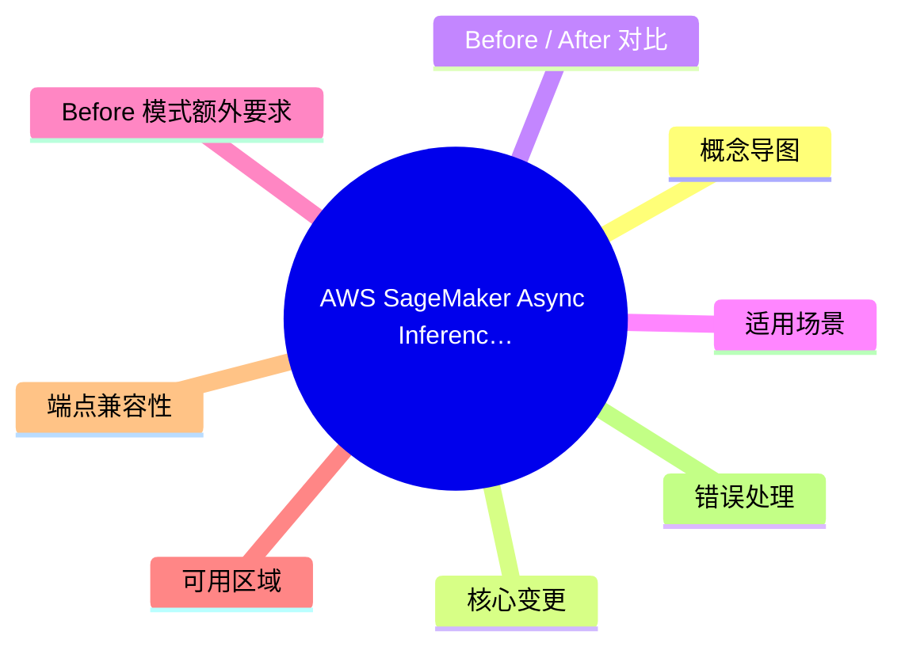
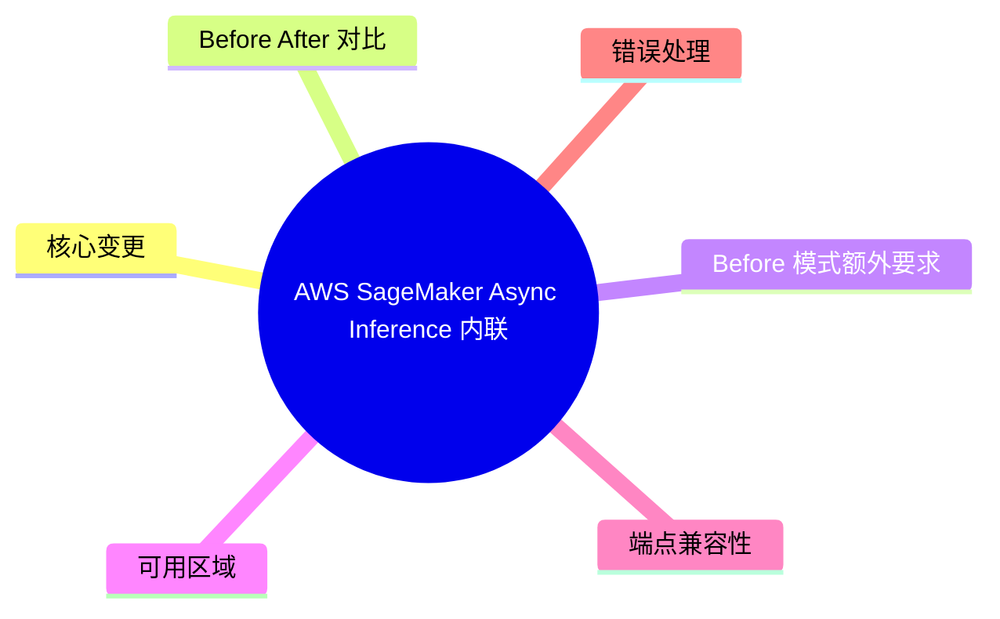
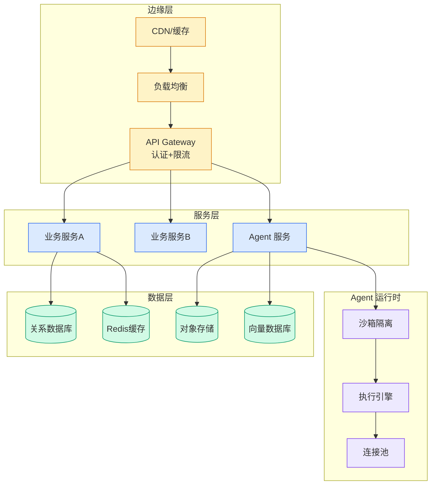

# AWS SageMaker Async Inference 内联 Payload 支持

> 📊 Level ⭐⭐ | 4.1KB | `entities/aws-sagemaker-async-inference-inline-payloads.md`

# AWS SageMaker Async Inference 内联 Payload 支持


## 概念导图



## 概念导图



## 核心变更




`InvokeEndpointAsync` API 新增 `Body` 参数，允许在 API 请求体内直接传入推理 payload，无需先上传到 S3。

**关键约束：**
- `Body` 和 `InputLocation` **互斥**，API 拒绝同时设置
- 最大内联大小：**128,000 bytes**（原始 payload）
- 超出限制或违反互斥规则 → **同步返回** `ValidationError`
- 输出行为不变：仍写入 S3 `OutputLocation`

## Before / After 对比

**Before（必须 S3 上传）：**
```python
import boto3, json, uuid

s3 = boto3.client("s3")
sagemaker_runtime = boto3.client("sagemaker-runtime")

payload = json.dumps({"inputs": "your prompt here"}).encode("utf-8")

# 1. Upload to S3
input_key = f"async-input/{uuid.uuid4()}.json"
s3.put_object(Bucket="my-async-bucket", Key=input_key, Body=payload)

# 2. Invoke with S3 URI
response = sagemaker_runtime.invoke_endpoint_async(
    EndpointName="my-async-endpoint",
    InputLocation=f"s3://my-async-bucket/{input_key}",
    ContentType="application/json",
)
```

**After（内联 Body）：**
```python
import boto3, json

sagemaker_runtime = boto3.client("sagemaker-runtime")
payload = json.dumps({"inputs": "your prompt here"}).encode("utf-8")

response = sagemaker_runtime.invoke_endpoint_async(
    EndpointName="my-async-endpoint",
    Body=payload,  # 直接内联
    ContentType="application/json",
)
```

## 适用场景

| 场景 | 推荐 |
|------|------|
| 小 payload（< 128KB）需要长处理时间 | **使用新 Body 参数** |
| 大 payload（图片、音频、多 MB 文档） | 继续用 S3 InputLocation |
| 突发/批处理工作负载 | 内联方式简化运维，移除 S3 依赖 |

## Before 模式额外要求

- S3 客户端 + 输入桶预置
- 调用方需 `s3:PutObject` IAM 权限
- UUID 或类似命名方案防 key 冲突
- 过期输入对象的清理策略

新 Body 模式**全部消除**这些运维负担。

## 可用区域

**31 个商业区域**（2026-06-17 发布时）：BOM, PDX, YUL, IAD, CMH, SFO, LHR, ICN, SYD, HKG, YYC, GRU, QRO, DUB, CDG, FRA, ZRH, ARN, ZAZ, NRT, KIX, SIN, CGK, MEL, KUL, BKK, HYD, TPE, CPT, MXP, TLV

## 端点兼容性

- 与现有 async 端点**完全兼容**，无需模型/容器变更
- 端点自动缩放到零、异步处理模型保持不变

## 错误处理

- **同步错误**（直接返回）：size 超出、Body+InputLocation 同时设置
- **异步错误**：通过 SNS notification 投递，与现有模式一致

## 与知识库的连接

- → [原文存档](https://github.com/QianJinGuo/wiki-book/tree/main/docs/raw/articles/amazon-sagemaker-ai-async-inference-now-supports-inline-requ.md)
- 异步推理架构参考：[SQS+Lambda 异步管道](ch11/009-aws-bedrock.html)
- SageMaker 工具链：[SageMaker SFT/DPO 工具调用](https://github.com/QianJinGuo/wiki/blob/main/entities/aws-sagemaker-sft-dpo-tool-calling.md)

---

