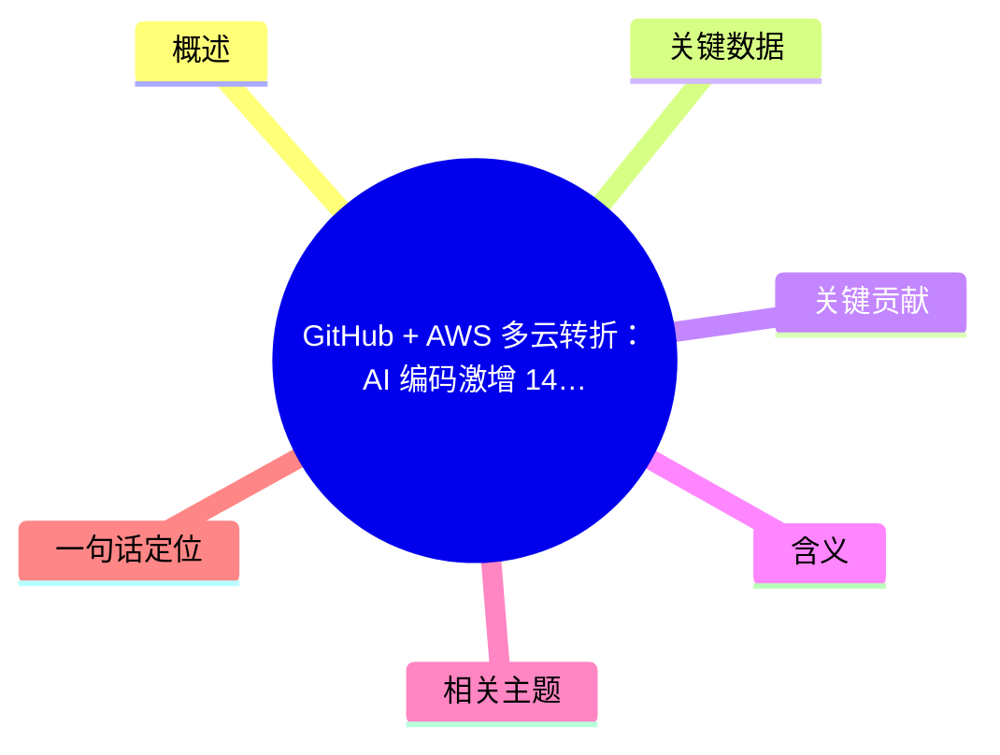
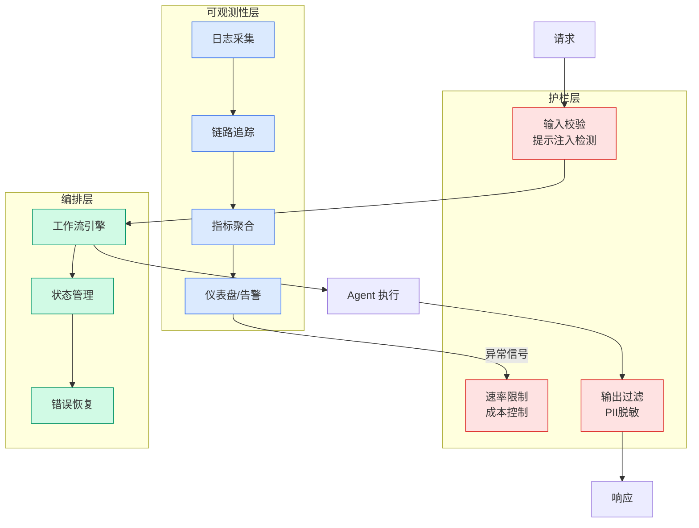

# GitHub + AWS 多云转折：AI 编码激增 14B commits 压垮 GitHub，Microsoft 跨云买 AWS 容量

## Ch11.247 GitHub + AWS 多云转折：AI 编码激增 14B commits 压垮 GitHub，Microsoft 跨云买 AWS 容量

> 📊 Level ⭐⭐ | 4.3KB | `entities/microsoft-github-aws-ai-capacity-crunch-2026-06.md`

# GitHub + AWS 多云转折：AI 编码激增 14B commits 压垮 GitHub，Microsoft 跨云买 AWS 容量

> 原文存档：[原文存档](https://github.com/QianJinGuo/wiki-book/tree/main/docs/raw/articles/microsoft-github-aws-ai-capacity-crunch.md)

## 概念导图

## 概述

2026-06-16 报道（基于 Business Insider 原始信息）：Microsoft 在 AI 编码激增压垮 GitHub 容量后，被迫向最大云对手 **Amazon Web Services** 加购容量以维持 GitHub 运行。这逆转了 2018 年 75 亿美元收购 GitHub 时"开发者平台归顺 Azure"的承诺。Microsoft 发言人确认了"多云策略"扩张，但拒绝点名 AWS。

核心信号：AI 编码代理（agentic coding）从 2025 年末开始呈指数增长，GitHub 平台本身的基础设施规划**完全跟不上**。

## 关键数据

| 指标 | 数值 | 时间 |
|------|------|------|
| GitHub commits | 14B (2026) vs 1B (2025) | 14× 增长 |
| 原计划扩容倍数 | 10× (2025-10 启动) | 已失败 |
| 重设计目标 | 30× | 2026-02 决策 |
| 原迁移完成时间 | 2027 | 已延期 |
| 收购价 | $7.5B | 2018-06 |

**数据来源**：GitHub COO Kyle Daigle 2026-04 公开数据 + Business Insider 内部人士消息 + GitHub CTO Vlad Fedorov 2026-04 可靠性更新。

## 关键贡献

1. **AI 代理对开发者平台的压力达到基础设施级别**：GitHub 14× commits 增长（2025→2026）不是普通扩容问题，而是 agentic coding 工作流在 2025-12 下半年加速、agent 在做 PR/auto-merge/automated testing，GitHub 的存储/检查/PR 处理/搜索索引/触发自动化/通知等所有底层设施同时承压。

2. **多云策略被"反竞争"倒逼执行**：Microsoft 原计划 2027 完成 GitHub → Azure 迁移，2018 收购时卖给开发者社区的"开放平台"承诺主要针对用户而非基础设施。如今被迫**向最大云对手**（AWS）买容量，**operational risk > 竞争 optics**。这是云厂商在 AI 时代被迫放弃单一云战略的标志性案例。

3. **"agentic development" 概念的官方确认**：Microsoft 发言人首次正式使用 "incredible spike in agentic development" 描述从 2025 末以来的现象，意味着 Microsoft 内部已经把"AI 写代码"视为**独立的基础设施需求类别**，而不是开发者的辅助工具。

## 含义

- **对开发者平台**：任何代码托管平台（GitLab、Bitbucket、SourceHut）都面临同样的 agentic coding 容量压力测试
- **对云厂商**：AI 工作负载的爆炸性增长正在让"单一云"战略变得不可持续
- **对 agentic AI 行业**：Coding Agent（Claude Code、Copilot、Cursor）的大规模使用已经产生**测量得到的基础设施需求**

## 相关主题

- [Multi-Agent AI Safety Research Funding Call](../ch01/889-agent-ai.html) — 同为 2026-06 agentic AI 相关的产业级响应
- AI Coding Agent 行业（概念待创建）

## 一句话定位

**AI 编码激增 → 14× commits → 30× 容量需求 → 微软被迫向 AWS 买容量** —— 2026 年最具体的"agentic AI 改变基础设施"案例

---
## 关联
- 相关概念: [Harness Engineering](https://github.com/QianJinGuo/wiki/blob/main/concepts/harness-engineering-framework.md)

---

