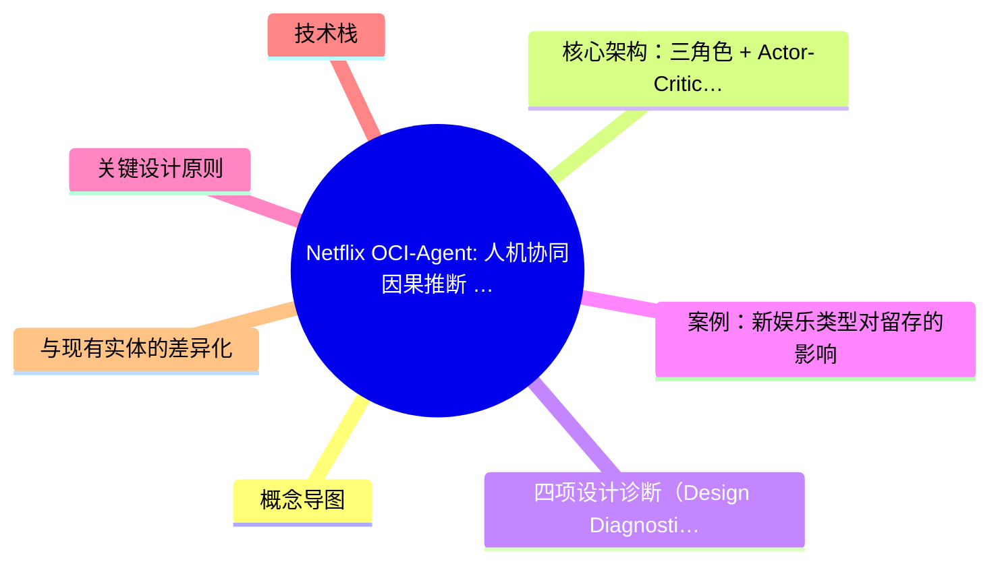
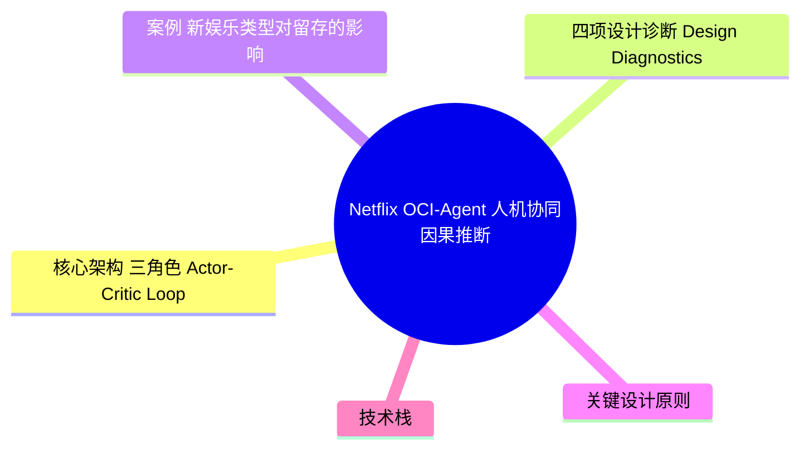
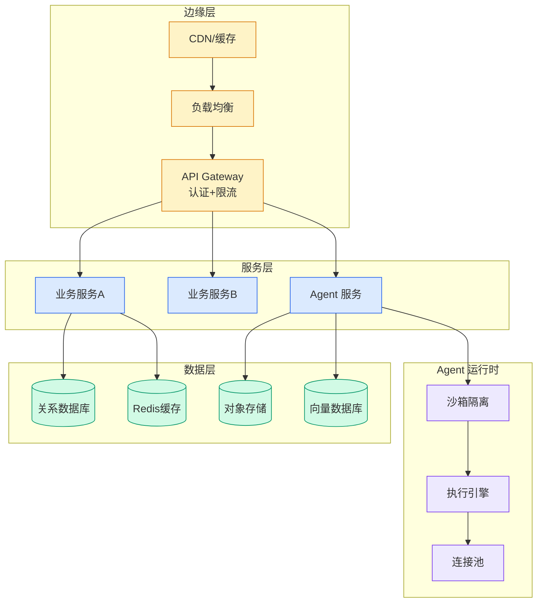

# Netflix OCI-Agent: 人机协同因果推断 Agentic Workflow

> 📊 Level ⭐⭐ | 4.0KB | `entities/netflix-oci-agent-human-augmenting-causal-inference.md`

# Netflix OCI-Agent: 人机协同因果推断 Agentic Workflow

Netflix 开源的 **oci-agent** 是一个面向观察性因果推断（Observational Causal Inference, OCI）的人机协同 Agentic Workflow。核心设计哲学：Agent 负责执行和诊断，人类负责判断和决策——不是替代而是增强（human-augmenting）。

→ [原文存档](https://github.com/QianJinGuo/wiki-book/tree/main/docs/raw/articles/a-human-augmenting-agentic-workflow-for-causal-inference.md)
→ [LLM 主题 ≠ 真实变量 — 因果推断方法论](../ch01/603-llm.html)

## 概念导图

## 概念导图

## 核心架构：三角色 + Actor-Critic Loop

| 角色 | 职责 |
|------|------|
| **Principal**（人类） | 提供分析计划、指定 confounders、指定工具和数据模型 |
| **Actor**（Agent） | 将计划细化为 spec、执行分析、执行四项设计诊断、报告 remediation |
| **Critic**（Agent） | 检查盲点、验证 plan↔spec↔execution 一致性、指定 credibility level、建议替代策略 |

Actor-Critic 循环：Actor 执行分析 → Critic 诊断缺陷 → Actor 修正 → 直到 Critic 满意。

## 四项设计诊断（Design Diagnostics）

基于 **target trial emulation** 哲学——"理想的 A/B 测试是什么？"

| 诊断 | 标准 |
|------|------|
| Covariate Balance | 加权后处理/控制组的标准化均值差 < 0.2 |
| Overlap | 倾向得分在 0.1–0.9 之间（排除极端值） |
| Placebo Outcome | 处理前变量的"处理效应"不显著异于零 |
| Sensitivity to Hidden Confounders | 对假设遗漏变量的敏感性分析 |

## 案例：新娱乐类型对留存的影响

- 基线（裸 Claude Sonnet 4.6）：线性回归 + 控制变量 → 偏大的处理效应估计
- OCI-Agent（同模型）：估计值仅为基线的 **25%**
- 原因：**早期采用者偏差**（early adopter bias）→ overlap 失败 + placebo 失败
- Critic Agent 自动识别了偏差来源并建议 remediation

## 关键设计原则

1. **透明可审计**：Agent 产出 plans、specs、plots、notebooks 供人类检查和重新执行
2. **无 ground truth 场景下的评估**：依赖 process audits + 人类监督，而非程序化 ground truth 比较
3. **模板化 notebook**：使用经过验证的非 Agentic OCI 工具包（doubly robust learning）
4. **版本控制**：Agent 版本化报告，上传执行后的 notebook 到文件存储

## 技术栈

- 基于 Netflix 内部 OCI 工具包（doubly robust learning for causal effect estimation）
- 开源：[Netflix-Skunkworks/oci-agent](https://github.com/Netflix-Skunkworks/oci-agent)
- 模型：Claude Sonnet 4.6
- 评估：2016 ACIC competition datasets

## 与现有实体的差异化

| 维度 | 本实体（Netflix OCI-Agent） | llm-themes-not-observations（William Gieng） |
|------|---------------------------|---------------------------------------------|
| 主题 | Agent 执行因果推断的工作流设计 | LLM 生成变量在因果推断中的测量陷阱 |
| 角色 | Actor-Critic + 人类 Principal | 方法论警示 |
| 贡献 | 开源工具 + 诊断框架 + 案例 | 理论框架 + 偏差分类学 |
| 互补性 | "怎么用 Agent 做因果推断" | "用 Agent 做因果推断时要避免什么" |

---

