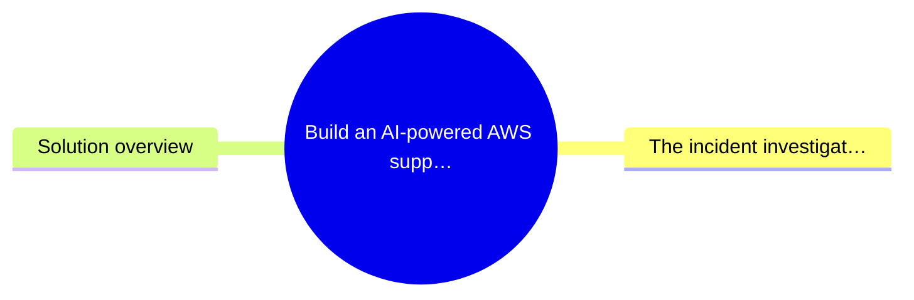
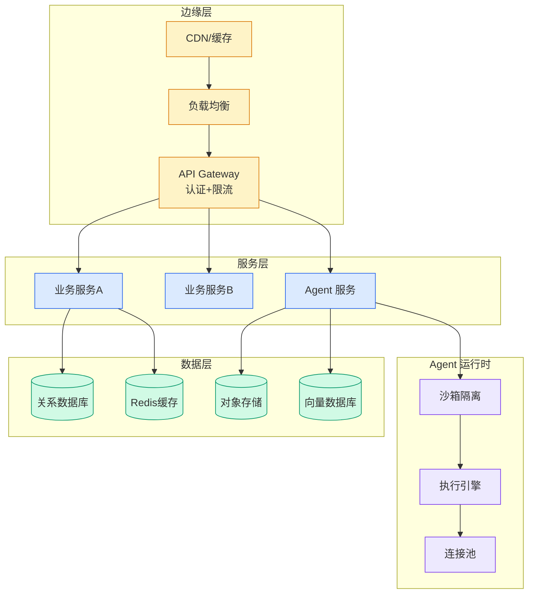

# Build an AI-powered AWS support companion with Amazon Bedrock AgentCore

## Ch11.252 Build an AI-powered AWS support companion with Amazon Bedrock AgentCore

> 📊 Level ⭐⭐ | 4.3KB | `entities/build-an-ai-powered-aws-support-companion-with-amazon-bedroc.md`

# Build an AI-powered AWS support companion with Amazon Bedrock AgentCore

→ [原文存档](https://github.com/QianJinGuo/wiki-book/tree/main/docs/raw/articles/build-an-ai-powered-aws-support-companion-with-amazon-bedroc.md)

# Build an AI-powered AWS support companion with Amazon Bedrock AgentCore

Managing AWS infrastructure often means switching between consoles, searching documentation, and manually creating support cases. For each incident, an engineer opens the AWS Management Console, checks [Amazon CloudWatch](<https://aws.amazon.com/cloudwatch/>), searches AWS documentation, reviews community posts, and files a support case. This context-switching adds up to 30–45 minutes per investigation before resolution work begins.

In this post, you build an AWS Support Companion using [Amazon Bedrock AgentCore](<https://docs.aws.amazon.com/bedrock-agentcore/latest/devguide/agents-tools-runtime.html>). The agent uses [Strands Agents](<https://strandsagents.com/>) as the orchestration framework and connects to AWS services through the [Model Context Protocol (MCP)](<https://modelcontextprotocol.io/>). By the end, you have a working agent that can analyze CloudWatch logs, search AWS documentation, query community knowledge from [AWS re:Post](<https://repost.aws/>), and create support cases, all from a single conversational interface. The solution deploys with a single script using [AWS CloudFormation](<https://aws.amazon.com/cloudformation/>) and includes a web frontend built on [AWS Amplify](<https://aws.amazon.com/amplify/>) for interacting with the agent.

## 概念导图

## The incident investigation bottleneck

AWS support and operations teams follow a repetitive pattern for every incident:

  1. Open the AWS Management Console and navigate to the affected service.
  2. Check CloudWatch logs and metrics for error patterns.
  3. Search AWS documentation for relevant troubleshooting guidance.
  4. Review community posts on AWS re:Post for similar issues.
  5. Compile findings and create a support case with the appropriate severity.
  6. Attach evidence and context to the case.

Each step requires a different tool and interface. Manual investigation limits the speed at which teams can respond, and the context gathered in one tool does not carry over to the next.

## Solution overview

The solution consolidates these steps into a single conversational agent deployed on Amazon Bedrock AgentCore. AgentCore handles the operational complexity of running a production AI agent (session isolation, auto scaling, security, and observability), so you focus on what the agent does rather than how it runs.

The agent connects to the following components:

**Agent runtime –** A Python application using Strands Agents, packaged as a Docker container and deployed to AgentCore Runtime. The agent orchestrates calls to a foundation model (FM) (Amazon Nova Pro through Amazon Bedrock) and tools based on your input. You can swap to supported models without changing the agent code.

**MCP servers –**  Three MCP servers give the agent access to AWS documentation (`aws-documentation-mcp-server`), [AWS Support](<https://aws.amazon.com/premiumsupport/>) APIs (`aws-support-mcp-server`), and AWS service APIs (`aws

---
## 关联
- 相关概念: [Harness Engineering](https://github.com/QianJinGuo/wiki/blob/main/concepts/harness-engineering-framework.md)
- 相关: [Agent 架构](https://github.com/QianJinGuo/wiki/blob/main/concepts/agent-architecture.md)

---

