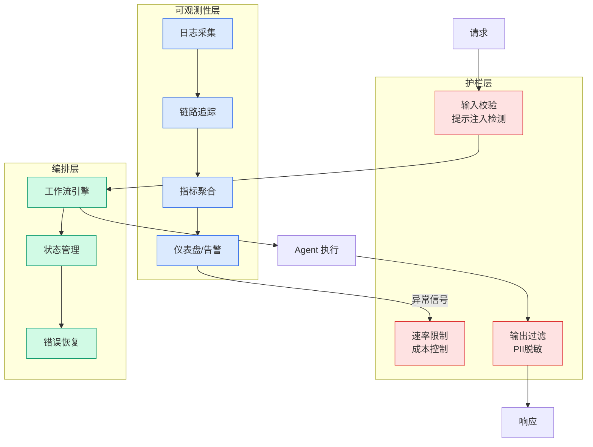

# Claude Opus 5 on AWS：Anthropic 最强 Opus 模型发布

## Ch11.257 Claude Opus 5 on AWS：Anthropic 最强 Opus 模型发布

> 📊 Level ⭐⭐ | 4.1KB | `entities/introducing-claude-opus-5-on-aws-anthropics-most-capable-opus-model.md`

# Claude Opus 5 on AWS：Anthropic 最强 Opus 模型发布

> **vxc score**: 64 | Anthropic 第五代Opus模型发布详情，覆盖Agentic Coding、知识工作、视觉理解、长时间任务等改进
> **发布**: Introducing Claude Opus 5 on AWS: Anthropic's most capable Opus model

## Summary

本文是 AWS 官方博客，宣布 Claude Opus 5 在 Amazon Bedrock 和 Claude Platform on AWS 上正式可用。Claude Opus 5 是 Anthropic 第五代 Opus 模型，在 Agentic Coding、知识工作、视觉理解、长时间运行任务等多个生产工作负载上提供显著改进。它在许多领域匹配 Claude Fable 5 的顶级智能水平，同时保持 Opus 级别的定价，并在 Bedrock 上默认提供零数据保留 (ZDR)。

## Key Points

- Claude Opus 5 是 Anthropic 第五代 Opus 模型，在 Agentic Coding、知识工作、视觉理解方面有显著改进。
- 在许多领域匹配 Claude Fable 5 的顶级智能水平，但保持 Opus 级别的定价。
- 在 Bedrock 上默认提供零数据保留 (ZDR)，满足企业数据治理要求。
- 由 Bedrock 下一代推理引擎驱动，支持企业安全、区域数据驻留和零操作员访问的扩展。
- 同时通过 Claude Platform on AWS 提供，支持请求级别的零数据保留。

## Related Entities

- [Claude Platform on AWS](../ch01/470-introducing-claude-platform-on-aws-anthropic-s-native-platf.html)

→ [原文存档](https://github.com/QianJinGuo/wiki-book/tree/main/docs/raw/articles/introducing-claude-opus-5-on-aws-anthropics-most-capable-opus-model.md)

## 第 2 来源 — 夕小瑶科技说 (2026-07-26)

v×c=49 | 新闻综述文，汇总 Anthropic 官方发布的多源数据，提供 AWS 官方博客未覆盖的补充信息。

互补角度 6 条：

1. **ARC-AGI-3 推理突破**：Opus 5 在 ARC-AGI-3 上得分为第二名的 3 倍（之前最高 7.8% 由 GPT-5.6 Sol 创造），且首次展现将布局转换为代数符号的反射方程能力（"4_center = 2×axis − 5_center"）。
2. **「人类最后的考试」排名**：64.7% 得分，以微弱优势击败 Mythos 5 的 64.5%。
3. **OSWorld 电脑操作性价比**：在 OSWorld 上击败 Fable 5，成本仅为其 1/3，每档成本均优于所有竞品。
4. **生命科学具体提升**：光谱推断有机物结构 +10.2pp、蛋白质序列变异预测 +7.7pp、ArxivMath 无工具 90.8%。
5. **行为变化 7 项**：回答更长、Agent 工作时主动汇报、文件更长、主动扩大任务范围、更爱自行验证、更常用子Agent、更常汇报修正过程。
6. **thoughtful + proactive 深度定义**：检查假设 → 寻根因 → 验证结果 → 迭代，以及主动搭建验证条件的完整示例（机械零件图→三维重建）。

→ [原文存档](https://github.com/QianJinGuo/wiki-book/tree/main/docs/raw/articles/shenhua-xiafang-claude-opus-5-fabu-2026-07-26.md)

---
## 关联
- 相关概念: [Harness Engineering](https://github.com/QianJinGuo/wiki/blob/main/concepts/harness-engineering-framework.md)

---

