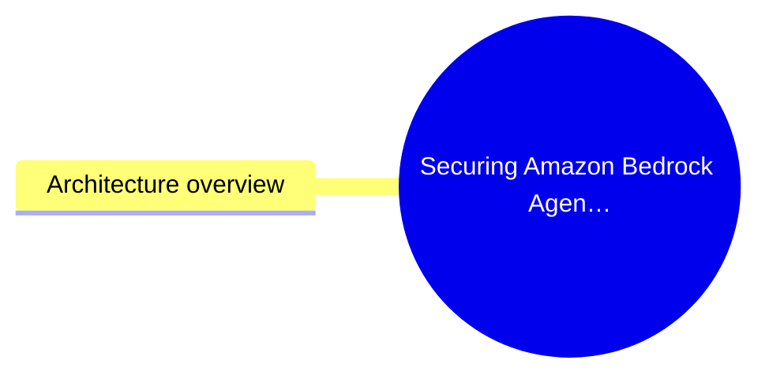
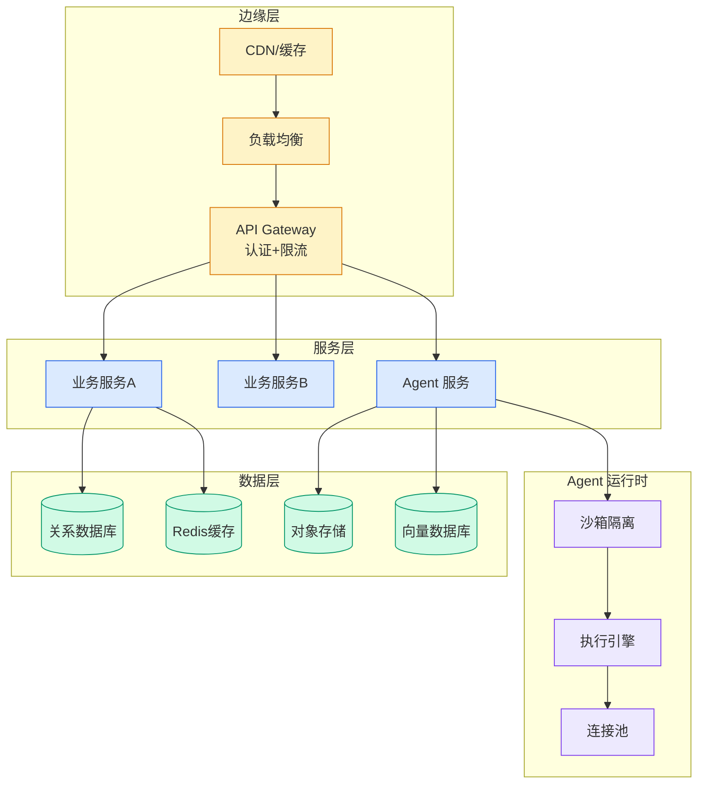

# Securing Amazon Bedrock AgentCore Runtime with AWS WAF

> 📊 Level ⭐⭐ | 4.1KB | `entities/securing-amazon-bedrock-agentcore-runtime-with-aws-waf.md`

# Securing Amazon Bedrock AgentCore Runtime with AWS WAF

→ [原文存档](https://github.com/QianJinGuo/wiki-book/tree/main/docs/raw/articles/securing-amazon-bedrock-agentcore-runtime-with-aws-waf.md)

# Securing Amazon Bedrock AgentCore Runtime with AWS WAF

When you deploy generative AI agents with [Amazon Bedrock AgentCore](<https://aws.amazon.com/bedrock/agentcore/>) as production API endpoints, you might want to enforce web application firewall policies, rate limiting, protection against common web threats, or audit controls via [AWS WAF](<https://aws.amazon.com/waf/>).

AWS WAF integrates with Elastic Load Balancing [Application Load Balancers](<https://aws.amazon.com/elasticloadbalancing/application-load-balancer/>) (ALBs), [Amazon CloudFront](<https://aws.amazon.com/cloudfront/>) distributions, and [Amazon API Gateway](<https://aws.amazon.com/api-gateway/>) REST APIs. Amazon CloudFront is designed for caching and content delivery. Since agent invocations are real-time and dynamic, caching doesn’t apply. Amazon API Gateway adds its own authentication and request transformation layer, which can create a double-authentication problem with the built-in SigV4 and OAuth handling in AgentCore. That leaves an internet-facing ALB as the integration point: It passes headers through transparently, supports VPC-internal routing, and attaches directly to an AWS WAF WebACL. From there, you route traffic to AgentCore through a VPC Interface Endpoint for the Bedrock AgentCore data plane service.

This is where the challenge appears. ALBs require health checks to verify that backend targets are responsive. But AgentCore Runtime requires authentication, SigV4 or OAuth, on API calls, including health check requests. Standard ALB health checks send unauthenticated requests, so they fail out of the box. You need a way to make health checks work without credentials while still passing authenticated production traffic through to AgentCore.

This post shows you two architecture patterns that address this problem. Both use an internet-facing ALB with AWS WAF and route traffic through a VPC Interface Endpoint to AgentCore Runtime. Pattern 1 places an [AWS Lambda](<https://aws.amazon.com/lambda/>) proxy between the ALB and the VPC Endpoint, giving you full control over request transformation. Pattern 2 targets the VPC Endpoint ENI IP addresses directly from the ALB, removing the Lambda hop entirely. You also learn how to close the direct-access backdoor with a resource policy so that traffic flows through AWS WAF only. Both patterns have been tested end-to-end with SigV4 and OAuth (Amazon Cognito JWT) authentication.

## 概念导图

## Architecture overview

The two patterns share a common foundation. A client application sends an authenticated request, either a SigV4 signature or an OAuth Bearer token, to an internet-facing ALB. AWS WAF inspects the request before the ALB forwards it to VPC Endpoint ENIs on HTTPS port 443. AgentCore validates the authentication and routes the request to the runtime container on its internal port 8080. The difference between the patterns is what sits between the ALB and the VPC Endpoint.

High-level architecture, Client → AWS WAF → ALB → VPC En

---
## 关联
- 相关概念: [Harness Engineering](https://github.com/QianJinGuo/wiki/blob/main/concepts/harness-engineering-framework.md)
- 相关: [Agent 架构](https://github.com/QianJinGuo/wiki/blob/main/concepts/agent-architecture.md)

---

