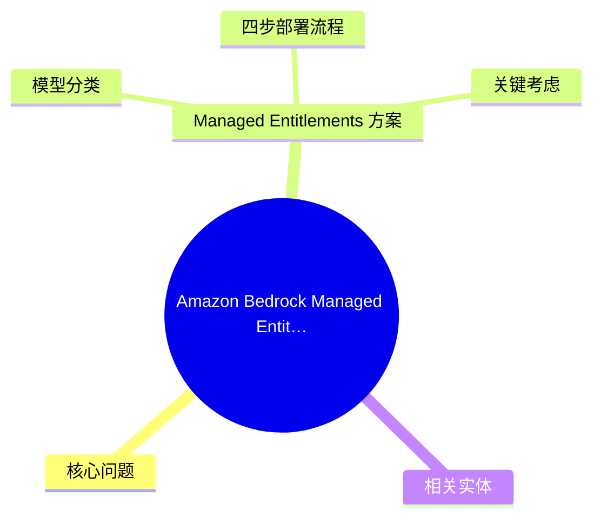
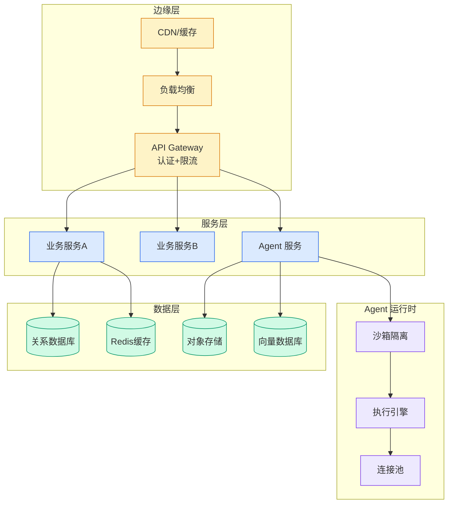

# Amazon Bedrock Managed Entitlements — 多账号模型访问治理

> 📊 Level ⭐⭐ | 3.9KB | `entities/amazon-bedrock-managed-entitlements-multi-account.md`

# Amazon Bedrock Managed Entitlements — 多账号模型访问治理

> **Background**: 本文基于 AWS 官方博客，介绍 Managed Entitlements for Amazon Bedrock 的功能设计、适用场景和部署流程。

## 概念导图

## 核心问题

管理跨数十或数百个 AWS 账号的 AI 模型访问权限面临两难选择：要么广泛授予 AWS Marketplace 权限（治理风险），要么在每个账号手动启用订阅（运营开销）。对于使用 Anthropic Claude、Cohere 等第三方 AWS Marketplace 模型的组织，这一运营开销显著拖慢 AI 采用速度。

## Managed Entitlements 方案

Managed Entitlements for Amazon Bedrock 允许从一个中央账号订阅一次，然后通过 AWS License Manager 将模型访问权限分发到整个组织。工作账号无需 AWS Marketplace 权限。

### 模型分类

| 模型类别 | 示例 | 访问方式 |
|---------|------|---------|
| Amazon 自有模型 | Amazon Nova | 直接可用，仅需 Bedrock 权限 |
| Amazon 代售模型 | Meta, Mistral, DeepSeek | 直接可用，仅需 Bedrock 权限 |
| AWS Marketplace 模型 | Anthropic Claude, Cohere, Stability AI | 需 AWS Marketplace 订阅 |

Managed Entitlements 仅适用于第三类（AWS Marketplace 模型）。

### 四步部署流程

1. **前提条件**：启用 AWS Organizations（全功能）、管理账号访问权限、开通 AWS Marketplace 订阅
2. **创建授权**：在管理账号的 License Manager 中创建 Managed Entitlement，指定模型和授权账号列表
3. **成员账号接受**：成员账号在 Bedrock 控制台接受授权
4. **验证**：确认成员账号可调用模型

### 关键考虑

- **Private Offer 定价**：Private Offer 定价绑定到订阅账号。如果管理账号订阅后分发，所有成员账号使用同一 Private Offer 定价
- **区域行为**：授权按区域管理，需在每个使用区域分别创建
- **不适用场景**：仅使用 Amazon/partner 模型（Nova/Llama/Mistral/DeepSeek）、单账号运营、或各账号自行管理订阅的场景

## 相关实体

- [AWS Budget Bedrock 成本治理](ch11/291-bedrock.html) — Bedrock 用量监控与预算告警
- [Bedrock Inference Profile 成本告警](ch11/161-amazon-bedrock.html) — 按业务单元追踪 Bedrock 成本
- [AWS DevOps Agent MCP 中国区桥接](ch11/276-aws-devops-agent.html) — 多账号场景的 DevOps Agent 部署

→ [原文存档](https://github.com/QianJinGuo/wiki-book/tree/main/docs/raw/articles/simplify-multi-account-access-to-amazon-bedrock-models-with-managed-entitlements.md)

---

