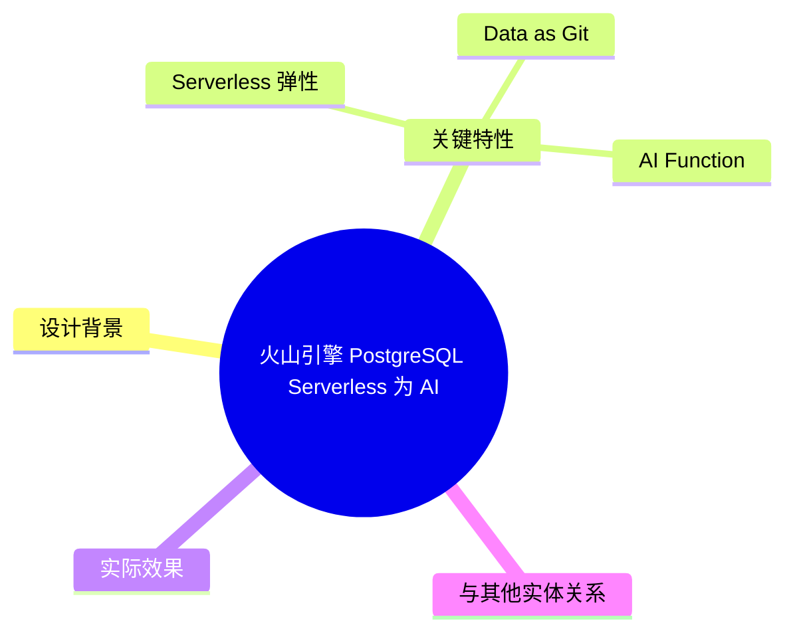
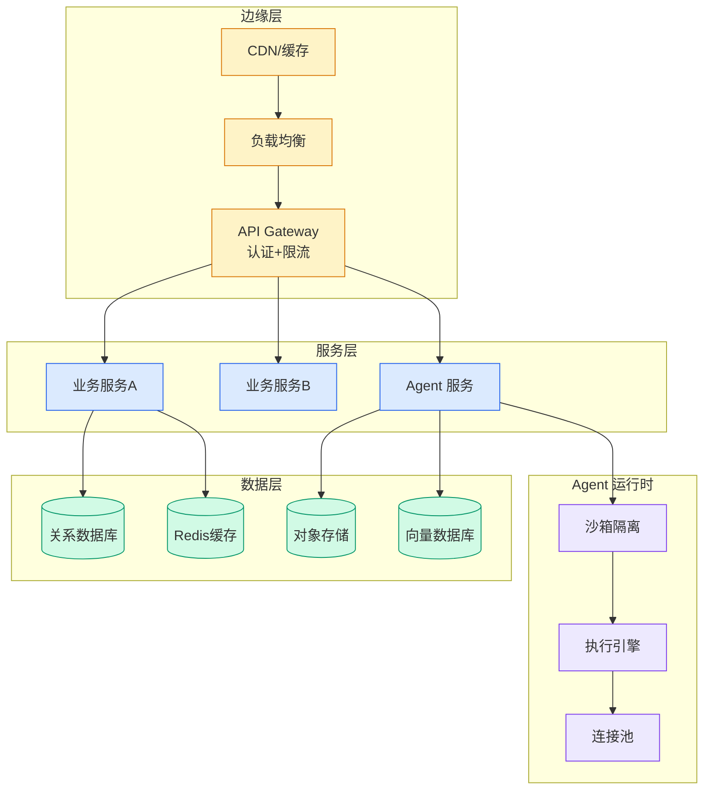

# 火山引擎 PostgreSQL Serverless 为 AI Vibe Coding 重塑数据库底座

## Ch11.259 火山引擎 PostgreSQL Serverless 为 AI Vibe Coding 重塑数据库底座

> 📊 Level ⭐⭐ | 4.0KB | `entities/volcengine-postgresql-serverless-feishu-ai-vibe-coding-2026.md`

# 火山引擎 PostgreSQL Serverless 为 AI Vibe Coding 重塑数据库底座

> **Background**：本文档基于字节跳动技术团队 2026-07-14 公众号文章建立。文章介绍了火山引擎云数据库 PostgreSQL Serverless 版在飞书妙搭（AI 原生系统搭建平台）场景下的架构设计与实践效果。

火山引擎云数据库 PostgreSQL Serverless 版是字节跳动面向 AI 时代重新设计的数据库服务，非传统 RDS 的简单 Serverless 化改造。其核心特点是**数据库随 AI 应用一起生成、一起伸缩、一起演化**，解决 Vibe Coding 场景下"AI 秒级写码、数据库分钟级就绪"的体验断点。

## 概念导图

## 设计背景

在飞书妙搭（Vibe Coding 驱动的 AI 原生应用搭建平台）的使用场景中，传统数据库暴露出三个核心问题：

1. **创建慢**：实例创建需 5-10 分钟，与 AI 生成代码的秒级响应相差 100+ 倍，打断"对话即开发"的心流
2. **价格高**：365×24 全时段计费，闲置资源持续收费，浪费高达 90%
3. **难恢复**：数据恢复需要小时级，开发者与 Agent 无法大胆试错

Vibe Coding 场景的特殊性包括：应用形态跨度大（长期业务系统到临时活动页）、项目规模大迭代快、访问负载峰谷明显。

## 关键特性

火山云数据库 PostgreSQL Serverless 版的核心能力包括：

### Serverless 弹性

计算资源按需伸缩，无请求时 Scale to Zero。对比传统数据库，综合成本降低 90%，节省上亿数据库成本。支持百万级规模实例的企业级管理。

### Data as Git

一个代码分支对应一个数据库分支，秒级创建/删除（对比传统方案提升近 200 倍）。支持 Schema Diff 对比、Schema Merge 安全合并、Time Travel ≤1 秒回退。这种 Git 化的数据管理方式让开发者可以像管理代码一样管理数据结构。

### AI Function

支持向量、图、文本多模态数据检索，一条 SQL 即可进行智能数据分析、语义理解、趋势预测。Agent 接入周期从 2-4 周降至 5 分钟。`ai_query` 函数可直接在 SQL 中调用大模型进行数据分析。

## 实际效果

截至文章发布，通过火山云数据库 PostgreSQL Serverless 版创建的数据库实例已**突破百万**，平台支持**上万活跃实例**的并发操作稳定运行。Vibe Coding 的数据底座从"基础验证可测试"迈向了"规模化高可用"。

关键性能数据：
- 实例创建：10 秒（对比传统 5-10 分钟，提速 40 倍）
- 分支创删：秒级（对比传统方案提升 200 倍）
- 非活跃实例自动 Scale-to-Zero，综合成本降低 99.99%

## 与其他实体关系

- [AI Native 开发工作流](../ch05/019-ai-native.html) — 本实体是 AI Native 开发中**数据基础设施层**的具体实现案例
- 本实体展示了传统数据库在 AI 时代需要"从架构底层重新设计"的理念，与 [Vibe Coding 范式](../ch04/443-vibe-coding-agentic-engineering.html) 互补

→ [原文存档](https://github.com/QianJinGuo/wiki-book/tree/main/docs/raw/articles/volcengine-postgresql-serverless-feishu-ai-vibe-coding-2026.md)

---

