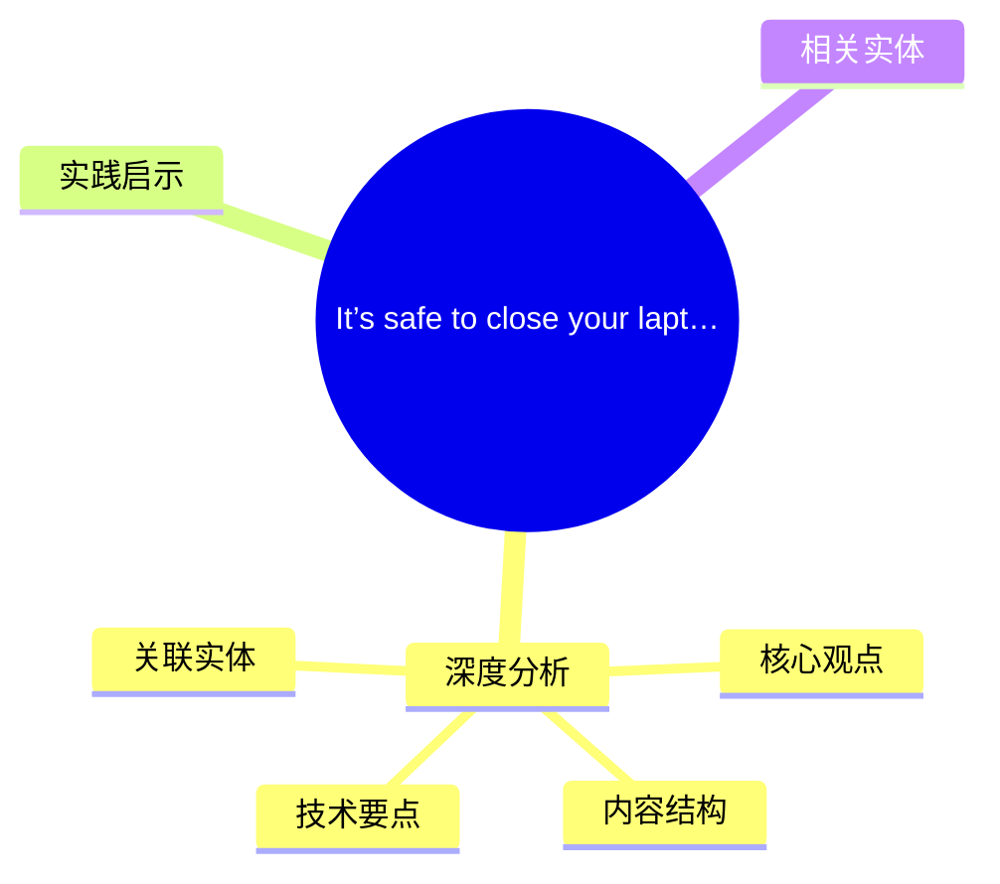
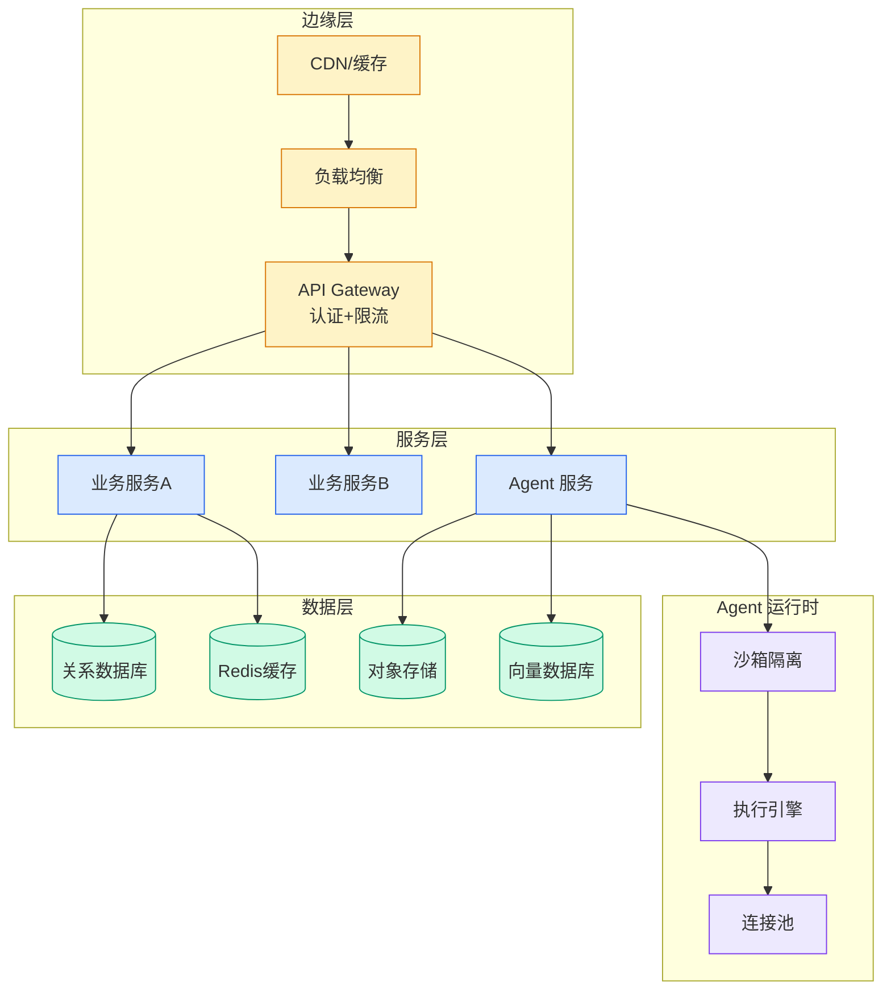

# It’s safe to close your laptop now: Hosting coding agents on Amazon Bedrock AgentCore

> 📊 Level ⭐⭐ | 3.7KB | `entities/its-safe-to-close-your-laptop-now-hosting-coding-agents-on-a.md`

# It’s safe to close your laptop now: Hosting coding agents on Amazon Bedrock AgentCore

→ [原文存档](https://github.com/QianJinGuo/wiki-book/tree/main/docs/raw/articles/its-safe-to-close-your-laptop-now-hosting-coding-agents-on-a.md)

## 概念导图

## 深度分析

It’s safe to close your laptop now: Hosting coding agents on Amazon Bedrock AgentCore 涉及agent领域的核心技术议题。
### 核心观点
1. # It’s safe to close your laptop now: Hosting coding agents on Amazon Bedrock AgentCore
There’s a habit going around.
2. Walking from one meeting to the next with the laptop cradled half-open.
3. Sitting through a 1:1 with the lid propped just enough to keep the screen alive.
4. Riding home while holding your laptop because it must stay running.
5. Anywhere except closed on a desk, because closed on a desk is what kills the coding agent running inside (Claude Code, Codex, Kiro, OpenCode, Gemini CLI, Cursor CLI, or whatever harness the developer pulled together).

### 内容结构
- Why a laptop is the wrong host
- What developers and platform teams want
- Bring any agent. Pick any model. Run them in parallel.
- 1\. A persistent /mnt/workspace that survives stop and resume
- 2\. A real interactive shell
- 3\. Deterministic command execution from the application layer
- 4\. Bring-your-own filesystems for skills, caches, and shared artifacts
- Tools and credentials, the safe way

### 技术要点

- **agent架构**: 本文在agent方向提出的设计理念与实现路径
- **工程挑战**: 实际落地中面临的关键问题与应对策略
- **ai-coding趋势**: 相关技术演进方向与新兴范式
### 关联实体

- [存之有序治之有矩Agent 记忆系统的工程实践与演进](../ch03/046-agent.html)
- [Karpathy 最新访谈从 Vibe Coding 到 Agentic Engineering](../ch04/616-agentic.html)
- [Karpathy Vibe Coding Agentic Engineering](../ch04/134-karpathy-vibe-coding-agentic-engineering.html)
- [两万字详解Claude Code源码核心机制](../ch03/076-claude-code.html)
- [Openclaw 完全指南这可能是全网最新最全的系统化教程了32W字建议收藏](ch11/227-openclaw.html)
- [深入理解 Claude Code 源码中的 Agent Harness 构建之道](../ch05/039-agent-harness.html)

## 实践启示
1. **工程落地**: agent领域方案需关注可观测性、可维护性和成本效率
2. **技术选型**: 根据场景选择合适的技术栈，避免过度设计或盲目追新
3. **持续迭代**: 建立数据驱动的反馈闭环，持续优化系统表现
4. **风险管控**: 引入新技术需评估对现有系统稳定性的影响，做好降级预案

## 相关实体

- [MOC](https://github.com/QianJinGuo/wiki/blob/main/moc/data-infrastructure.md)

---

