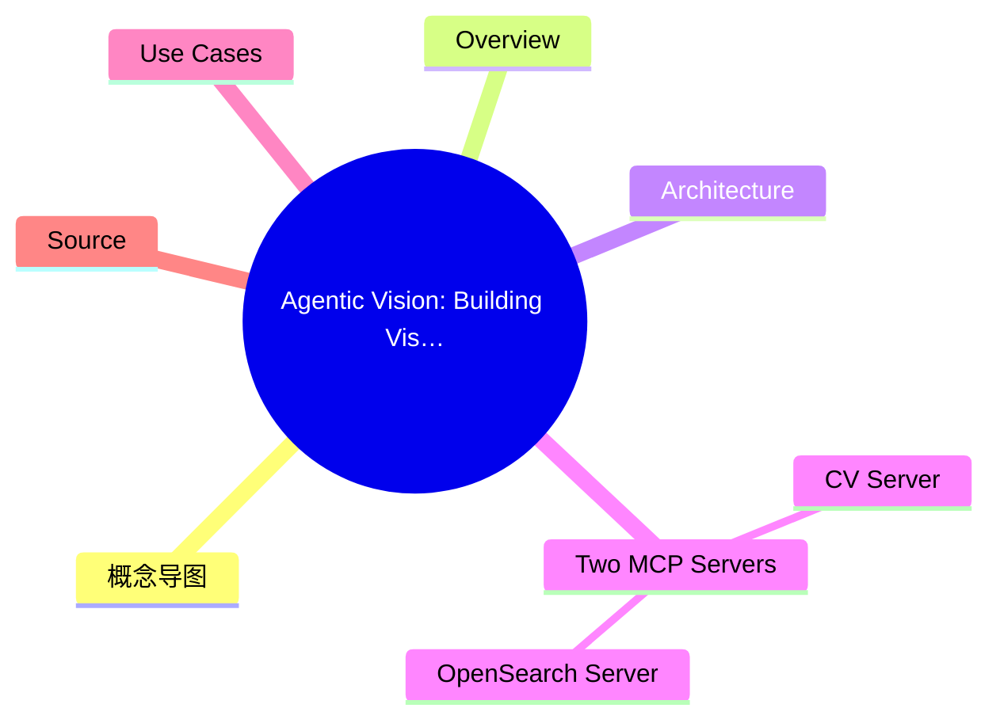
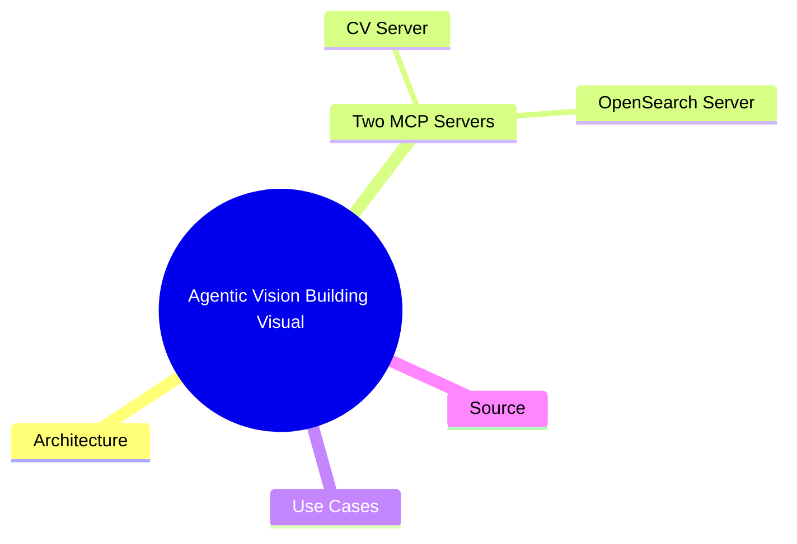
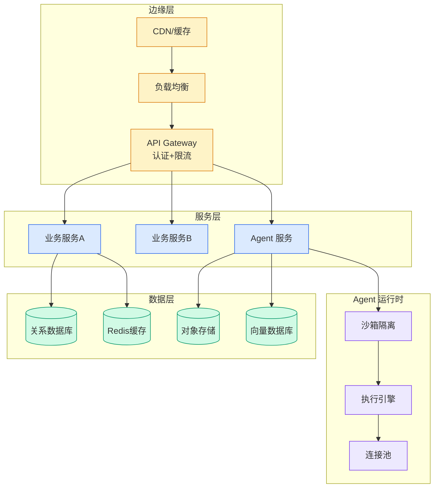

# Agentic Vision: Building Visual Intelligence with Amazon Bedrock and MCP Servers

## Ch11.261 Agentic Vision: Building Visual Intelligence with Amazon Bedrock and MCP Servers

> 📊 Level ⭐⭐ | 4.0KB | `entities/agentic-vision-building-visual-intelligence-bedrock-mcp.md`

# Agentic Vision: Building Visual Intelligence with Amazon Bedrock and MCP Servers

## 概念导图

## 概念导图

## Overview

AWS blog post (2026-07-15) by Kiowa Jackson, Jundong Qiao, Justin Kuskowski, and Nick Biso demonstrating how to converge Computer Vision, Strands Agents, and the Model Context Protocol (MCP) into a unified pipeline. The architecture bridges perception, decision-making, and action through standardized interfaces — allowing AI systems to see, understand, and respond in a coordinated way.

## Architecture

The solution uses a centralized IAM role as a security gateway, with Amazon S3 for object storage, Amazon OpenSearch for search capabilities, Amazon Bedrock for generative AI models, and Amazon Rekognition for image analysis. A Streamlit chat UI provides the user interface with media upload (images/videos up to 200 MB) and model selection (Claude 4 Sonnet, Claude 3.7 Sonnet).

## Two MCP Servers

### CV Server
Provides a unified interface for image and video analysis consolidating three Amazon AI services:
- **describe_image** — uses Claude model in Bedrock for image analysis with specific monitoring instructions; retrieves images from S3 and processes through Claude's multimodal capabilities
- **analyze_video** — uses Amazon Nova video analysis to process video content according to specific instructions
- **detect_labels** — integrates with Amazon Rekognition for label detection and image property analysis, providing bounding box information for spatial localization
- **crop_bounding_box** — uses Rekognition's object detection to identify key elements and provide precise bounding box coordinates for intelligent cropping
- **remove_background** — uses the rembg library for background removal without complex ML setup

### OpenSearch Server
Provides a unified interface for image ingestion and retrieval:
- **generate_image_description** — analyzes images using Bedrock Claude models and generates natural language descriptions
- **generate_multimodal_embedding** — uses Amazon Titan multimodal models to create high-dimensional vector embeddings capturing visual and textual information
- **ingest_image_to_opensearch** — end-to-end pipeline for processing and storing images in OpenSearch with metadata
- **query_images_by_text** — supports natural language search across image collections using multimodal embeddings
- **query_images_by_image** — image-based similarity search
- **bulk_ingest_images** — batch processing for large-scale ingestion

## Use Cases

1. **Infrastructure-less Computer Vision Pipeline** — perform bounding box generation, image descriptions, and video analysis without dedicated servers; pay-per-use model with rapid deployment
2. **Intelligent Image Cataloging with Embeddings** — embedding-based similarity algorithms for semantic understanding of visual content; transcends keyword-based search limitations
3. **Visual Memory Database for Contextual Reasoning** — combines CV pipelines with embedding-based similarity; processes scenes to extract objects and bounding boxes, generates embeddings, and stores with temporal/spatial metadata for multi-camera contextual reasoning

## Source

> [AWS Machine Learning Blog](https://aws.amazon.com/blogs/machine-learning/agentic-vision-building-visual-intelligence-with-amazon-bedrock-and-mcp-servers)

---
## 关联
→ [原文存档](https://github.com/QianJinGuo/wiki-book/tree/main/docs/raw/articles/agentic-vision-building-visual-intelligence-with-amazon-bedr.md)
- 相关概念: [Harness Engineering](https://github.com/QianJinGuo/wiki/blob/main/concepts/harness-engineering-framework.md)

---

