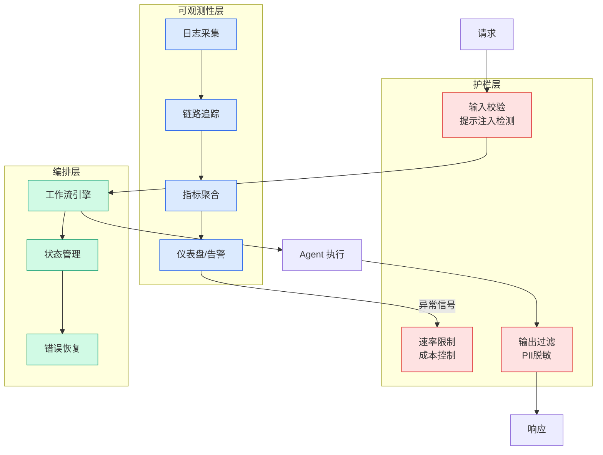

# Data modeling best practices for Amazon Quick Sight multi-dataset relationships

## Ch11.261 Data modeling best practices for Amazon Quick Sight multi-dataset relationships

> 📊 Level ⭐⭐ | 4.1KB | `entities/data-modeling-best-practices-for-amazon-quick-sight-multi-da.md`

# Data modeling best practices for Amazon Quick Sight multi-dataset relationships

→ [原文存档](https://github.com/QianJinGuo/wiki-book/tree/main/docs/raw/articles/data-modeling-best-practices-for-amazon-quick-sight-multi-da.md)

# Data modeling best practices for Amazon Quick Sight multi-dataset relationships

Business intelligence analysts routinely face the same challenge at the start of every analytics project: the data needed to answer a single business question lives across multiple tables. Sales transactions sit in one place, customer demographics and product attributes in another, while returns, forecasts, and operational metrics occupy still others.

Until now, combining these tables in Amazon Quick Sight required pre-joining everything into wide, denormalized datasets before any analysis could begin. That approach works. But it forces data-modeling decisions up front, duplicates measures across different grains, introduces maintenance overhead, and typically produces a different dataset for almost every reporting scenario.

**Today, we are excited to announce[Multi-Dataset Relationships in Amazon Quick Sight](<https://aws.amazon.com/blogs/machine-learning/build-a-unified-semantic-layer-across-datasets-with-multi-dataset-topics-in-amazon-quick/>)**. This new capability lets you define logical relationships between Quick Sight datasets and perform runtime joins at query time. Instead of flattening tables ahead of time, you keep each table as its own Quick Sight dataset and declare how those datasets relate to one another inside a Quick Sight Topic. Quick Sight then assembles precisely the join it needs for visuals, calculated fields, filters, or natural-language Q&A.

This paradigm shift brings several key advantages:

  * **Less upfront data preparation —** Define relationships once. Quick Sight joins only the relevant tables at analysis time.
  * **Preserved native granularity —** Each dataset maintains its own level of detail, avoiding measure duplication across grains.
  * **Reuse across analyses —** A single Topic with defined relationships serves multiple analytical use cases without rebuilding datasets.
  * **Simplified governance —** Manage permissions, transformations, and business logic at the individual dataset level.
  * **Independent refresh schedules —** Ingest data per table at different cadences (hourly, daily, monthly) based on data volatility.
  * **Row-level security at runtime —** Row-level security (RLS) rules are enforced during runtime joins, so data-access policies apply consistently across datasets.

In this post, we cover data modeling concepts, supported patterns, and best practices for designing your multi-dataset data model in Quick Sight. For a deep dive into each schema pattern with SQL examples and advanced workarounds, see the second post in this series: Data Modeling Patterns for Amazon Quick Sight Multi-Dataset Relationships [link].

## Why a runtime, relationship-based model

The traditional single-dataset model has three recurring costs:

  * **Upfront preparation:** You must decide the join shape before you know every question, often pushing logic into custom SQL or database views.
  * **Measure duplication:** When you join

---
## 关联
- 相关概念: [Harness Engineering](https://github.com/QianJinGuo/wiki/blob/main/concepts/harness-engineering-framework.md)

---

