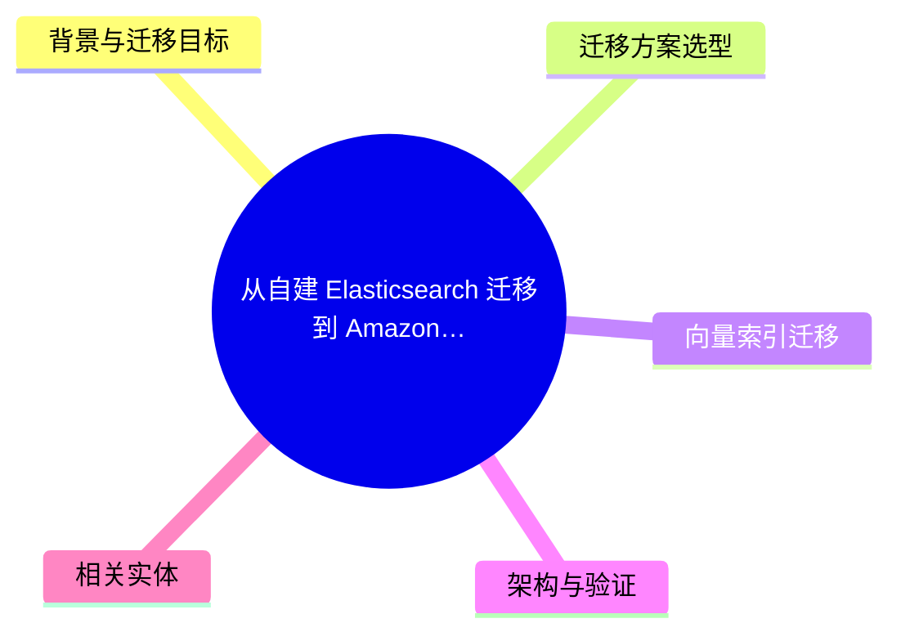
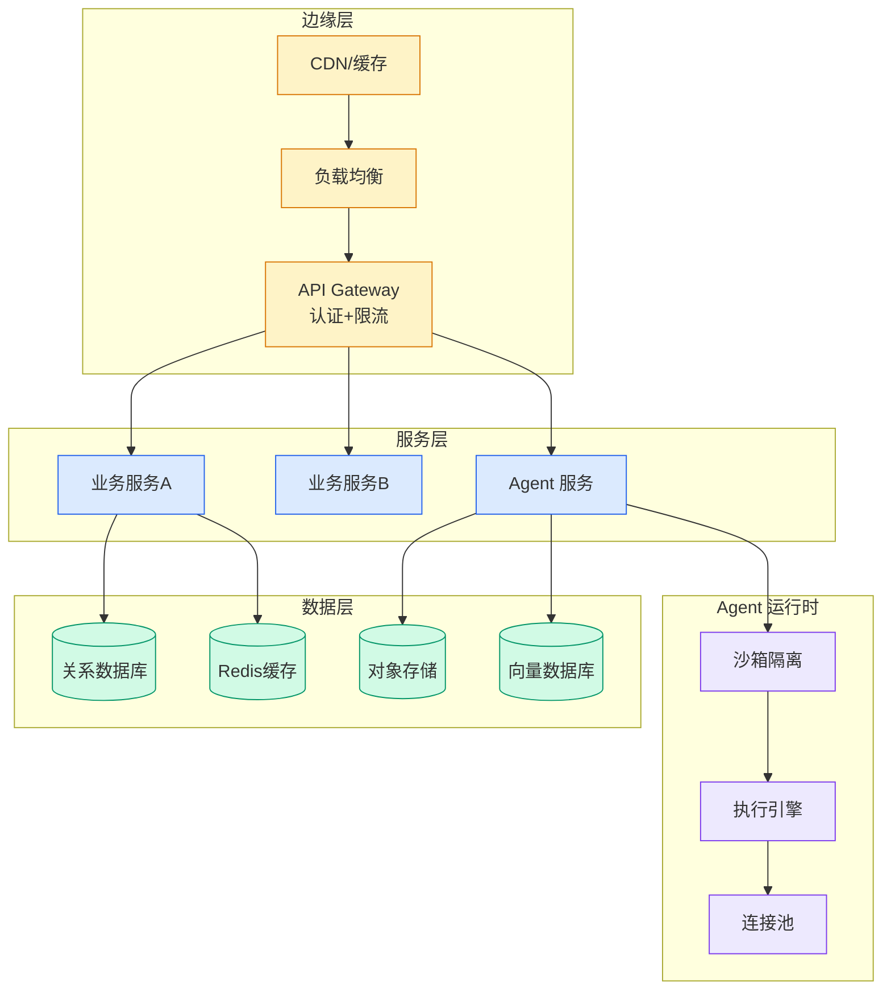

# 从自建 Elasticsearch 迁移到 Amazon OpenSearch Service 实践（一）：数据迁移与同步

## Ch11.262 从自建 Elasticsearch 迁移到 Amazon OpenSearch Service 实践（一）：数据迁移与同步

> 📊 Level ⭐⭐ | 3.8KB | `entities/elasticsearch-migration-amazon-opensearch-service-1.md`

# 从自建 Elasticsearch 迁移到 Amazon OpenSearch Service 实践（一）：数据迁移与同步

> **Background**：本文基于 AWS China Blog 发布的 POC 实践总结，完整介绍从自建 Elasticsearch 8.17 迁移到 Amazon OpenSearch Service 的数据迁移方案选型、全量与增量同步策略，以及数据一致性验证。

## 概念导图

## 背景与迁移目标

自建 Elasticsearch 集群面临版本升级困难、跨云迁移复杂、向量搜索能力受限等挑战。典型案例场景：云上使用 ES 8.17 承载核心搜索业务，数据规模约 1TB，包含 k-NN 向量搜索（1024 维 Embedding），目标是将搜索服务迁移到 Amazon OpenSearch Service，同时将 Embedding 模型切换到 Amazon Bedrock Titan Text Embeddings V2。

迁移面临三个核心挑战：数据同步（ES 8.x snapshot 不能通过 OpenSearch 原生 API 直接恢复）、查询兼容性（k-NN 向量搜索查询语法存在结构性差异）、Embedding 模型切换（向量空间不同，需分阶段切换）。

## 迁移方案选型

针对 ES 8.x 到 AOS 的数据迁移，对比三种方案：

| 方案 | 适用场景 | 优势 |
|------|---------|------|
| Migration Assistant (RFS + Traffic Replayer) | TB 级、零停机 | 高吞吐、支持流量回放、官方推荐 |
| Logstash + opensearch output | 中小数据量、增量同步 | 配置简单、灵活过滤 |
| Reindex-from-Remote | 小数据量、网络直连 | 无需额外组件 |

Migration Assistant for Amazon OpenSearch Service 是 AWS 官方推荐方案，核心组件 RFS 能够直接从 ES 8.x snapshot 解析 Lucene 文件提取文档并重新索引。官方测试：5 TiB 数据在 15 节点集群上约 35 分钟完成。

## 向量索引迁移

向量索引迁移需根据 Embedding 模型策略选择两条路线：

- **路线 A：保留原 Embedding 模型** — 预建 knn_vector mapping，向量数据原样搬运
- **路线 B：迁移时更换 Embedding 模型（如切换到 Bedrock Titan V2）** — 普通索引照搬，向量索引全量重建

## 架构与验证

Migration Assistant 部署在 Amazon EKS 上，通过 Argo Workflows 编排迁移流程。核心组件：Capture Proxy（流量捕获）、Kafka（流量缓存）、RFS Workers（全量回填）、Traffic Replayer（增量重放）。

零停机迁移验证结果：存量数据（500 条）与增量数据（1254 条）均在目标端完全对齐，源端服务全程无中断。1.2 TB 数据 RFS 导入约 73 分钟（replica=0）。

## 相关实体

- [Kiro CLI + OpenSearch MCP](https://github.com/QianJinGuo/wiki/blob/main/entities/from-manual-to-smart-use-kiro-cli-opensearch-mcp-to-make-everyone-an-opensearch-expert.md)
- [elasticpp Elasticsearch 性能优化](https://github.com/QianJinGuo/wiki/blob/main/entities/elasticpp重塑elasticsearch查询性能的c内核引擎.md)
- [ES Agent 记忆层](../ch04/101-agent-memory.html)
- [Amazon Bedrock AgentCore](../ch04/506-amazon-bedrock-agentcore-harness-ga-api-agent.html)

→ [原文存档](https://github.com/QianJinGuo/wiki-book/tree/main/docs/raw/articles/elasticsearch-migration-amazon-opensearch-service-1.md)

---

