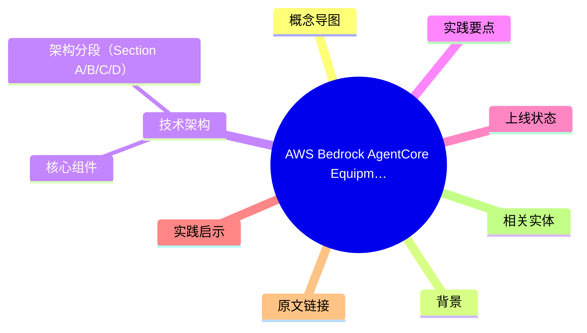
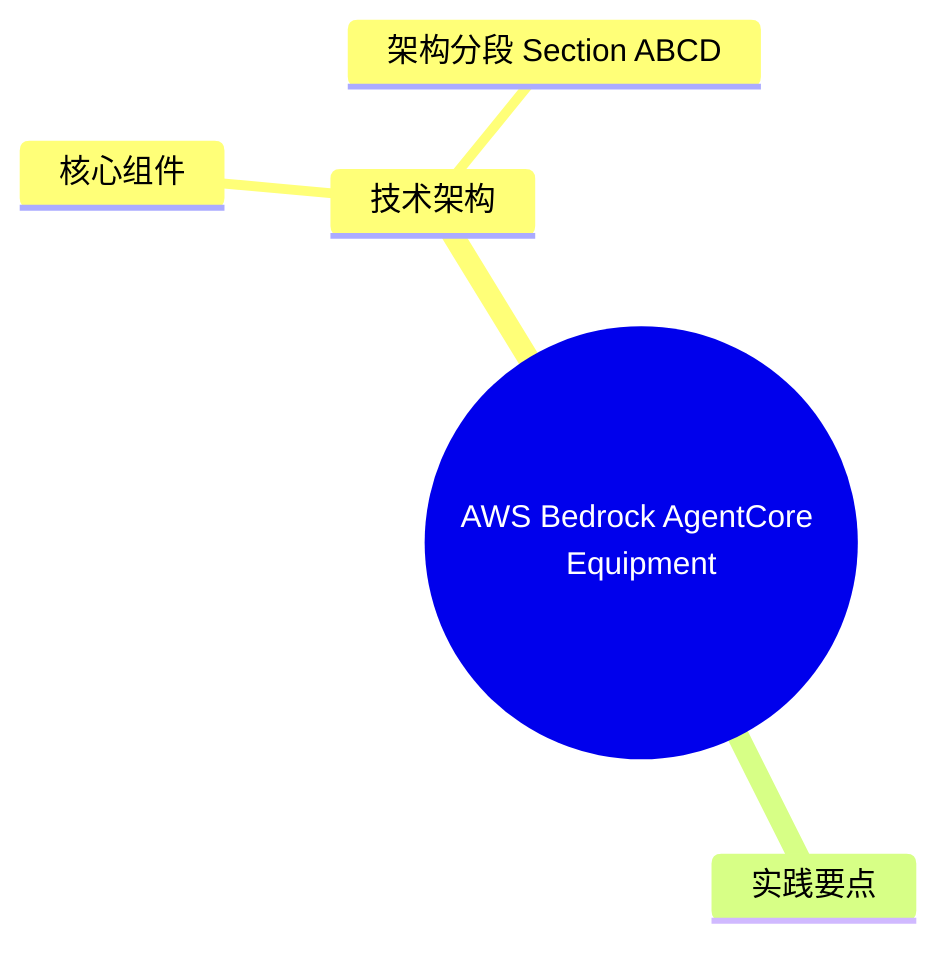
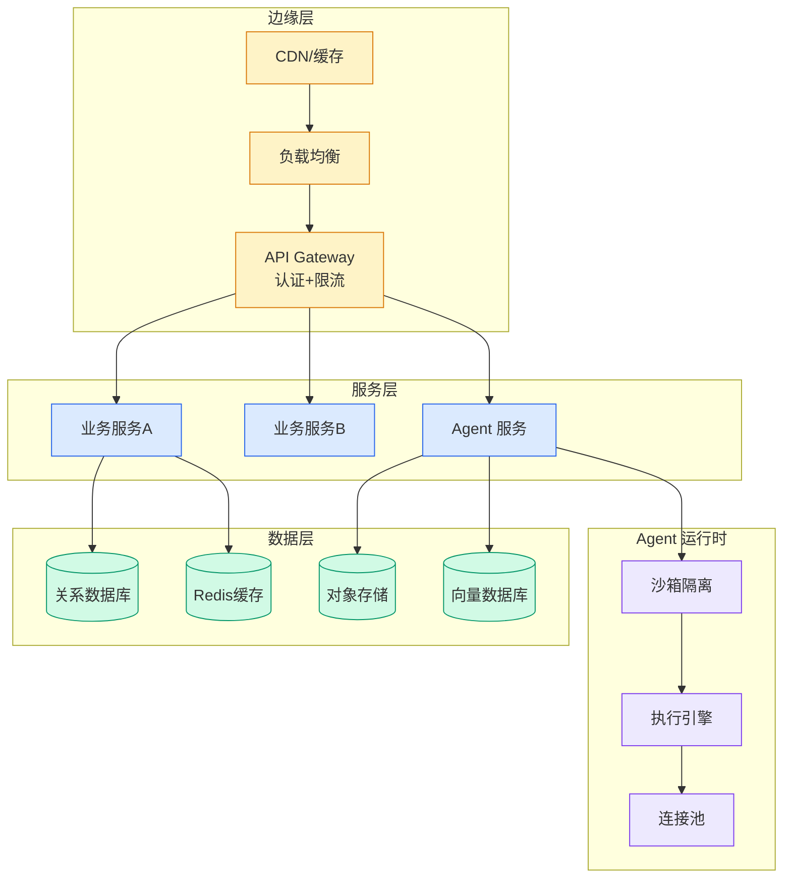

# AWS Bedrock AgentCore Equipment Repair Assistant — 农业机械 AI 诊断助手实战

> 📊 Level ⭐⭐ | 3.8KB | `entities/aws-bedrock-agentcore-equipment-repair-assistant.md`

# AWS Bedrock AgentCore Equipment Repair Assistant — 农业机械 AI 诊断助手实战

> Source: [原文存档](https://github.com/QianJinGuo/wiki-book/tree/main/docs/raw/articles/build-an-ai-powered-equipment-repair-assistant-using-amazon-.md)

## 概念导图

## 概念导图

## 背景

本文是 AWS 官方博客（2026-06-10 发布），介绍如何使用 Amazon Bedrock AgentCore 平台构建一个面向农业机械维修场景的 AI 诊断助手。场景痛点：重型农机维修经常因缺少合适零件导致多次现场访问、长时间停机，特别是在收获季造成巨大经济损失。

## 技术架构

### 核心组件

- **AgentCore Runtime** — 托管 agent 运行平台
- **Strands Agents SDK** — agent 开发框架
- **Amazon Nova 2 Lite** — 基础模型选择
- **Bedrock Knowledge Base** — RAG 检索增强（索引设备手册、零件目录、维修文档）
- **AgentCore Memory** — 跨会话对话历史持久化
- **Amazon Cognito** — 用户认证
- **AWS Amplify** — React Web 应用托管

### 架构分段（Section A/B/C/D）

**Section A — Authentication and Frontend**：Cognito User Pool + Identity Pool + Amplify 部署 React 前端。前端直接与 AgentCore Runtime 端点通信。

## 实践要点

1. **Strands Agents SDK + AgentCore 是 AWS 推荐的 agent 工程栈** — 比裸用 Bedrock Converse API 更适合多轮对话 + 工具调用场景
2. **Memory 必须显式启用** — 默认 AgentCore 不保留会话状态，需要配置 Memory 资源才能让技术员追问"刚才那个零件替代品有现货吗"时不需要重复上下文
3. **Knowledge Base 是 RAG 的官方实现** — 把设备手册 S3 同步到 KB，agent 通过 retrieve API 拿到相关章节
4. **Nova 2 Lite 是轻量级选择** — 设备维修场景不需要顶级模型，Lite 级别的延迟和成本更适合

## 上线状态

- 官方博客已发布（2026-06-10）
- 完整 CloudFormation 模板可下载
- 截稿时文章末尾 cost estimate 部分未完，但从架构和代码片段可推断成本主要来自 KB（按 query 计费）+ AgentCore Runtime（按执行时长）

## 实践启示

- AgentCore 适合"明确业务场景 + RAG + 多轮"的企业级 agent 部署
- 与 strands-agents 生态深度集成，开发者用熟悉的 SDK 即可部署到托管平台
- 适合作为 Strands Agents 在生产环境部署的参考实现

## 原文链接

## 相关实体
- [agentops: operationalize agentic ai at scale with amazon bed](../ch04/297-agentops-operationalize-agentic-ai-at-scale-with-amazon-bed.html)
- [how baz improved its ai agent code review accuracy using ama](../ch09/165-how-baz-improved-its-ai-agent-code-review-accuracy-using-ama.html)
- [extending mcp support for amazon bedrock agentcore gateway](../ch04/548-amazon-bedrock-agentcore.html)

→ [原文存档](https://github.com/QianJinGuo/wiki-book/tree/main/docs/raw/articles/build-an-ai-powered-equipment-repair-assistant-using-amazon-.md)

---

