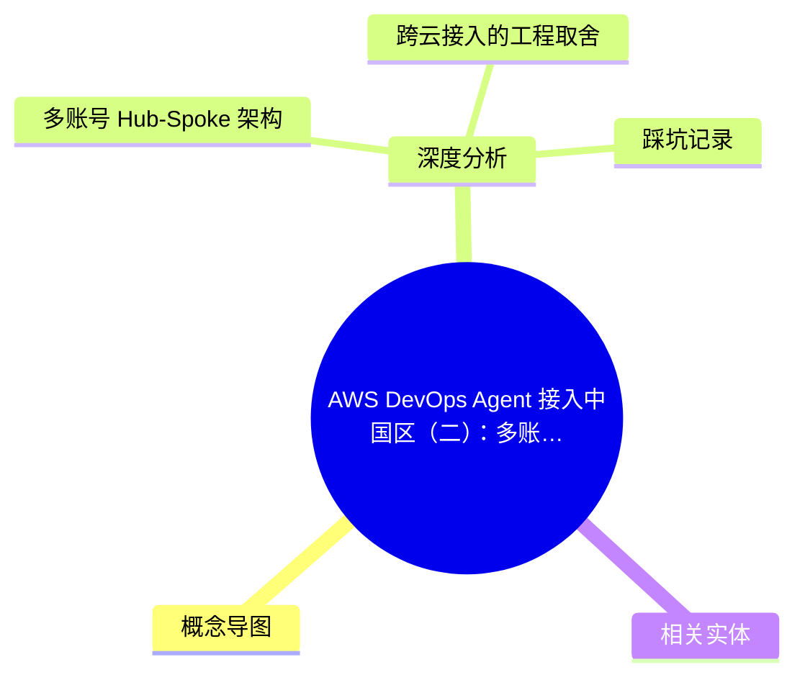
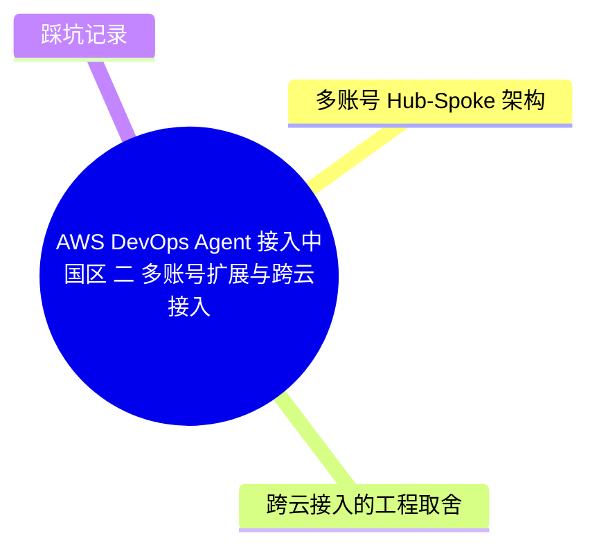
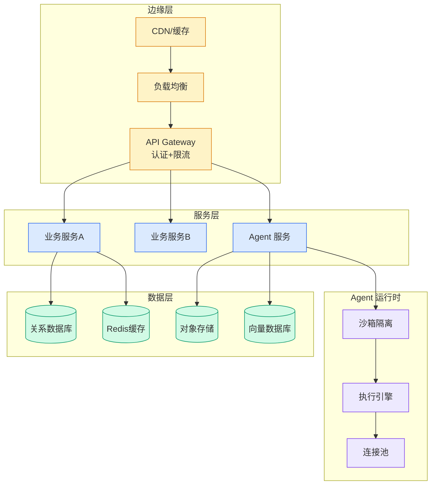

# AWS DevOps Agent 接入中国区（二）：多账号扩展与跨云接入

## Ch11.268 AWS DevOps Agent 接入中国区（二）：多账号扩展与跨云接入

> 📊 Level ⭐⭐ | 3.3KB | `entities/aws-devops-agent-接入-aws-中国区二多账号扩展跨云接入与无长期-aksk-认证.md`

# AWS DevOps Agent 接入中国区（二）：多账号扩展、跨云接入与无长期 AK/SK 认证

> **背景**：本文基于 AWS China Blog 的系列文章第二篇，聚焦 DevOps Agent 在中国区的多账号 Hub-Spoke 架构部署、跨云接入（阿里云）的工程取舍，以及 IAM Roles Anywhere 凭证治理实践。

## 概念导图

## 概念导图

## 深度分析

本文是 AWS DevOps Agent 接入中国区系列的第二篇，在第一篇 MCP 桥接架构的基础上，进一步解决了三个关键工程问题：多账号扩展、跨云接入、长期凭证治理。

### 多账号 Hub-Spoke 架构

文章提出了 Hub-Spoke 扇出模型，通过一个 Helm Chart 管理 N 个 AWS 中国区账号。核心设计是 Hub 账号部署 DevOps Agent + MCP Server，Spoke 账号通过 IAM Roles Anywhere 以证书换取临时凭证。这一架构的关键决策点包括：

- **证书分发**：Hub 通过 ACM PCA 签发设备证书，Spoke 账号信任 Hub CA 签发的证书
- **跨账号信任链**：每个 Spoke 账号建立一个 IAM Role（信任 Hub CA 证书），Hub 通过 AssumeRole 切换身份
- **0 长期 AK/SK**：所有认证基于短期临时凭证（最长 1 小时有效），凭证泄露风险从 AK/SK 的 90 天窗口缩减到 1 小时

### 跨云接入的工程取舍

针对阿里云等非 AWS 平台的接入，文章提出了现实的工程方案：

- **阿里云仍然是 AK/SK**：Iam Roles Anywhere 只适用于 AWS 内部，跨云场景无法完全消除长期凭证
- **最小权限原则**：为阿里云 AK 设置仅覆盖目标资源的精细权限策略，降低泄露影响面
- **凭证轮换自动化**：通过 AWS Secrets Manager + Lambda 实现阿里云 AK/SK 的 90 天自动轮换

### 踩坑记录

文章还记录了实际部署中的关键踩坑：

- **RequestExpired**：STS 临时凭证 1 小时后全部失效，跨账号操作未正确处理 AssumeRole 刷新导致批量失败
- **证书续期**：ACM PCA 的 CA 证书过期会导致所有基于该 CA 签发的设备证书失效，需要提前 30 天规划续期

## 相关实体

- [AWS DevOps Agent 接入中国区（一）](ch11/268-aws-devops-agent.html) — 前篇：单账号部署与 MCP 桥接
- [FinOps 与 DevOps 双 Agent 成本优化](../ch03/046-agent.html) — 相关的 Agent 成本治理实践
- [AgentCore Harness](../ch04/660-agentcore-harness.html) — Agent 基础设施框架

→ [原文存档](https://github.com/QianJinGuo/wiki-book/tree/main/docs/raw/articles/aws-devops-agent-接入-aws-中国区二多账号扩展跨云接入与无长期-aksk-认证.md)

---

