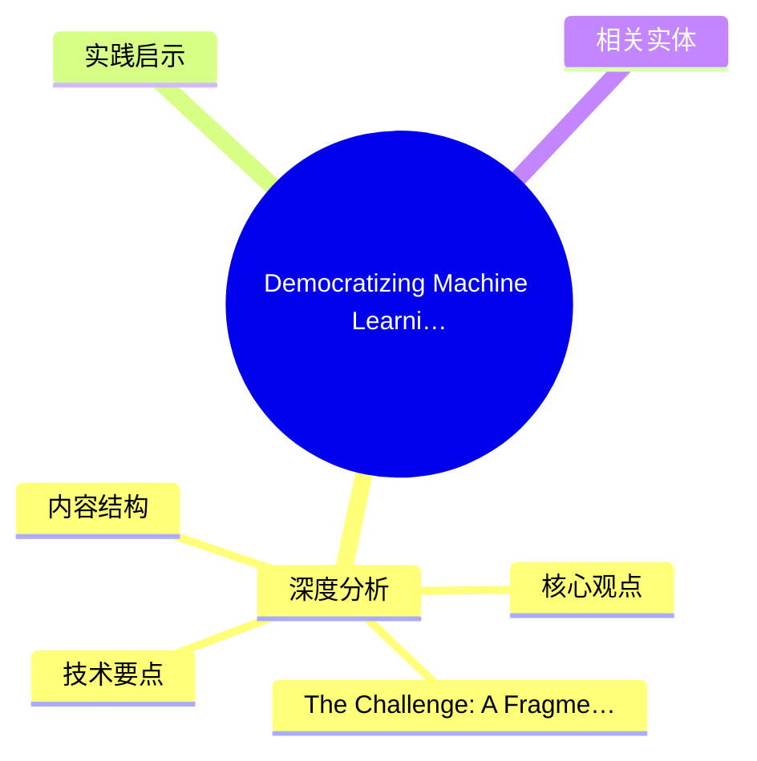
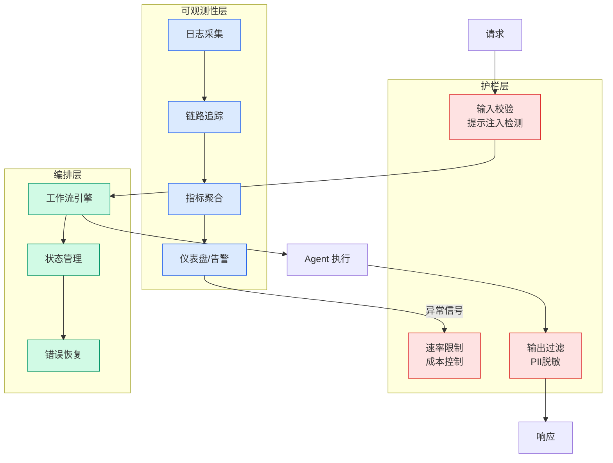

# Democratizing Machine Learning at Netflix: Building the Model Lifecycle Graph

## Ch11.271 Democratizing Machine Learning at Netflix: Building the Model Lifecycle Graph

> 📊 Level ⭐⭐ | 3.1KB | `entities/democratizing-machine-learning-at-netflix-building-the-model.md`

# Democratizing Machine Learning at Netflix: Building the Model Lifecycle Graph

→ [原文存档](https://github.com/QianJinGuo/wiki-book/tree/main/docs/raw/articles/democratizing-machine-learning-at-netflix-building-the-model.md)

## 概念导图

## 深度分析

Democratizing Machine Learning at Netflix: Building the Model Lifecycle Graph 涉及code领域的核心技术议题。
### 核心观点
1. When Netflix began investing in machine learning over a decade ago, it was primarily focused on a single domain: personalization.
2. Scala was the industry standard, our ML teams were relatively small, and optimizing member engagement was our primary use case.
3. Fast forward to today, and machine learning has become the backbone of Netflix’s business transformation.
4. While this diversity is a testament to how machine learning has evolved to drive value across many verticals at Netflix, this growth introduces a new challenge: **enabling cross-pollination of models and data across domains.
5. **
### The Challenge: A Fragmented ML Landscape
As our ML investments scaled across these domains, a critical problem emerged: the models produced largely became black boxes.

### 内容结构
- Democratizing Machine Learning at Netflix: Building the Model Lifecycle Graph
- Introduction
- The Challenge: A Fragmented ML Landscape
- The Hard Problem: Connecting everything
- Core Abstractions: The Vocabulary of the System
- **From Events to Entities to Graph**
- Enabling Exploration, Not Just Search
- The Road Ahead: Open Challenges

### 技术要点

- **code架构**: 本文在code方向提出的设计理念与实现路径
- **工程挑战**: 实际落地中面临的关键问题与应对策略
- **data趋势**: 相关技术演进方向与新兴范式
### 关联实体

- [Karpathy 最新访谈从 Vibe Coding 到 Agentic Engineering](../ch04/234-agentic.html)
- [Openclaw 完全指南这可能是全网最新最全的系统化教程了32W字建议收藏](ch11/228-openclaw.html)
- [Karpathy Vibe Coding Agentic Engineering](../ch04/134-karpathy-vibe-coding-agentic-engineering.html)
- [Scale Robot Reinforcement Learning With Nvidia Isaac Lab On ](../ch01/1138-scale-robot-reinforcement-learning-with-nvidia-isaac-lab-on.html)
- [Nvidia Isaac Lab Sagemaker Robot Rl Humanoid](https://github.com/QianJinGuo/wiki/blob/main/entities/nvidia-isaac-lab-sagemaker-robot-rl-humanoid.md)
- [Openclaw 完全指南这可能是全网最新最全的系统化教程了32W字建议收藏 V2](ch11/228-openclaw.html)

## 实践启示
1. **工程落地**: code领域方案需关注可观测性、可维护性和成本效率
2. **技术选型**: 根据场景选择合适的技术栈，避免过度设计或盲目追新
3. **持续迭代**: 建立数据驱动的反馈闭环，持续优化系统表现
4. **风险管控**: 引入新技术需评估对现有系统稳定性的影响，做好降级预案

## 相关实体

- [MOC](https://github.com/QianJinGuo/wiki/blob/main/moc/observability-monitoring.md)

---

